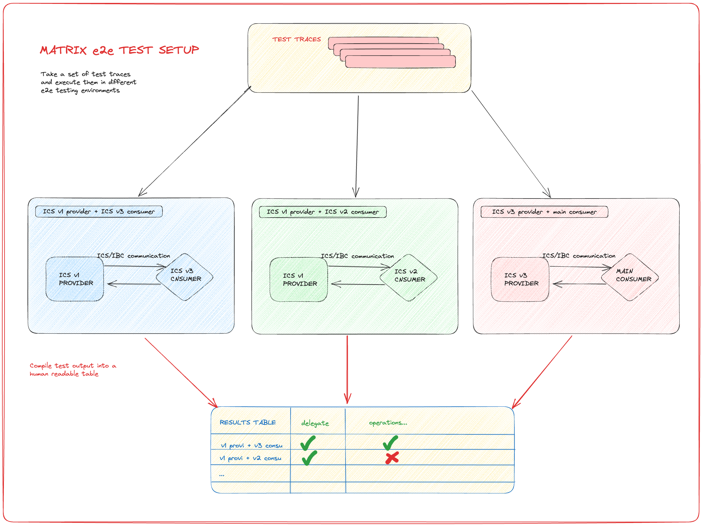
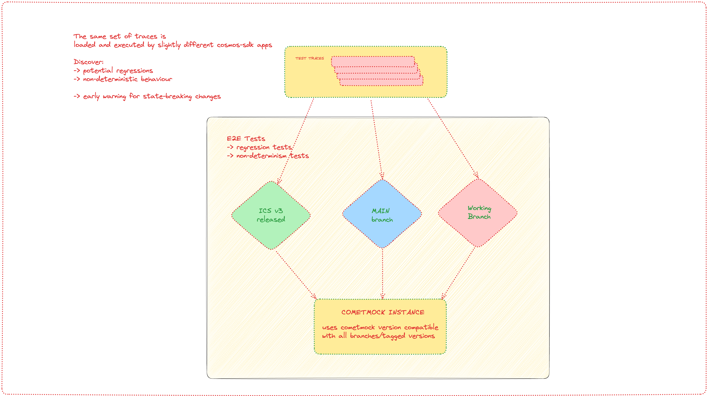

# ADR 11: Improving testing and increasing confidence

## Changelog
* 2023-08-11: Proposed, first draft of ADR.

## Status

Proposed

## Context

Testing, QA, and maintenance of interchain-security libraries is an ever-evolving area of software engineering we have to keep incrementally improving.

The purpose of the QA process is to catch bugs as early as possible. In an ideal development workflow a bug should never reach production.

A bug found in the specification stage is a lot cheaper to resolve than a bug discovered in production (or even in testnet).

Ideally, all bugs should be found during the CI execution, and we hope that no bugs will ever even reach the testnet (although nothing can replace actual system stress test under load interacting with users).

During development and testnet operation the most commonly found types of bugs are listed below.
- improper iterator usage
- unbounded array access/iteration
- improper input handling and validation
- improper cached context usage
- non-determinism check (improper use of maps in go, relying on random values)
- KV store management and/or how keys are defined
- deserialization issues arising from consumer/provider versioning mismatch

Such bugs can be discovered earlier with better tooling. Some of these bugs can induce increases in block times, chain halts or introduce an attack surface which is difficult to remove if other systems have started depending on that behavior.

#### Current state of testing
Our testing suites consist of multiple parts, each with their own trade-offs and benefits with regards to code coverage, complexity and confidence they provide.

## Unit testing
Unit testing is employed mostly for testing single-module functionality. It is the first step in testing and often the most practical. While highly important, unit tests often **test a single piece of code** and don't test relationships between different moving parts, this makes them less valuable when dealing with multi-module interactions.

Unit tests often employ mocks to abstract parts of the system that are not under test. Mocks are not equivalent to actual models and should not be treated as such.

Out of all the approaches used, unit testing has the most tools available and the coverage can simply be displayed as % of code lines tested. Although this is a very nice and very easy to understand metric, it does not speak about the quality of the test coverage.

Since distributed systems testing is a lot more involved, our reliance on simple unit testing tools should be minimized due to lack of useful feedback. Of course, sometimes unit tests are still necessary and helpful, but in some cases where unit tests are not helpful, we should use e2e or integration tests as appropriate rather than taking pains to add unit tests only to artificially increase coverage.

## Integration testing
With integration testing we **test the multi-module interactions** while isolating them from the remainder of the system.
Integration tests can uncover bugs that are often missed by unit tests.

It is very difficult to gauge the actual test coverage imparted by integration tests and the available tooling is limited.
In interchain-security we employ the `ibc-go/testing` framework to test interactions in-memory.

At present, integration testing does not involve the consensus layer - it is only concerned with application level state and logic.

## End-to-end testing
In our context end-to-end testing comprises of tests that use the actual application binaries in an isolated environment (e.g. docker container). During test execution the inputs are meant to simulate actual user interaction, either by submitting transactions/queries using the command line or using gRPC/REST APIs and checking for state changes after an action has been performed. With this testing strategy we also include the consensus layer in all of our runs. This is the closest we can get to testing user interactions without starting a full testnet.

End-to-end testing strategies vary between different teams and projects and we strive to unify our approach to the best of our ability (at least for ICS and gaia).

The available tooling does not give us significant (or relevant) line of code coverage information since most of the tools are geared towards analyzing unit tests and simple code branch evaluation.

We aim to adapt our best practices by learning from other similar systems and projects such as cosmos-sdk, ibc-go and CometBFT.

## Decision

### 1. Connect specifications to code and tooling
Oftentimes, specifications are disconnected from the development and QA processes. This gives rise to problems where the specification does not reflect the actual state of the system and vice-versa. 
Usually usually specifications are just text files that are rarely used and go unmaintained after a while, resulting in consistency issues and misleading instructions/expectations about system behavior.

#### Decision context and hypothesis
Specifications written in a dedicated and executable specification language are easier to maintain than the ones written entirely entirely in text.
Additionally, we can create models based on the specification OR make the model equivalent to a specification.

Models do not care about the intricacies of implementation and neither do specifications. Since both models and specifications care about concisely and accurately describing a system (such as a finite state machine), we see a benefit of adding model based tools (such as [quint](https://github.com/informalsystems/quint)) to our testing and development workflows.

#### Main benefit
MBT tooling can be used to generate test traces that can be executed by multiple different testing setups.

### 2. Improve e2e tooling

#### Matrix tests
Instead of only running tests against current `main` branch we should adopt an approach where we also:
- **run regression tests against released software versions** (`ICS v1/v2/v3`)
- **run non-determinism tests to uncover issues quickly**

Matrix tests can be implemented using [CometMock](https://github.com/informalsystems/CometMock) and refactoring our current e2e CI setup.

##### Introducing e2e regression testing

This e2e test suite would execute using a cronjob in our CI (nightly, multiple times a day etc.)

Briefly, the same set of traces is run against different **maintained** versions of the software and the `main` branch.
This would allow us to discover potential issues during development instead of in a testnet scenarios.

The most valuable issues that can be discovered in this way are **state breaking changes**, **regressions** and **version incompatibilities**.

The setup is illustrated by the image below.

This table explains which versions are tested against each other for the same set of test traces:
* ✅ marks a passing test
* ❌ marks a failing test

| **USES: ICS v1 PROVIDER**       | **start chain** | **add key** | **delegate** | **undelegate** | **redelegate** | **downtime** | **equivocation** | **stop chain** |
|---------------------------------|-----------------|-------------|--------------|----------------|----------------|--------------|------------------|----------------|
| **v1 consumer (sdk45,ibc4.3)**  | ✅               | ✅           | ✅            | ✅              | ✅              | ✅            | ✅                | ✅              |
| **v2 consumer (sdk45, ibc4.4)** | ✅               | ✅           | ✅            | ✅              | ✅              | ✅            | ✅                | ✅              |
| **v3 consumer (sdk47, ibc7)**   | ✅               | ✅           | ✅            | ✅              | ✅              | ✅            | ✅                | ✅              |
| **main consumer**               | ❌               | ❌           | ❌            | ❌              | ❌              | ❌            | ❌                | ❌              |
| **neutron**                     | ✅               | ✅           | ✅            | ✅              | ✅              | ✅            | ✅                | ❌              |
| **stride**                      | ✅               | ✅           | ✅            | ✅              | ✅              | ✅            | ✅                | ❌              |

##### Introducing e2e CometMock tests

CometMock is a simplified version of the [CometBFT](https://github.com/cometbft/cometbft) consensus engine. It supports most operations performed by CometBFT while also being lightweight and relatively easy to use.

CometMock tests allow more nuanced control of test scenarios because CometMock can "fool" the blockchain app into thinking that a certain number of blocks had passed.
**This allows us to test very nuanced scenarios, difficult edge cases and long-running operations (such as unbonding operations).**

Examples of tests made easier with CometMock are listed below:
- regression tests
- non-determinism tests
- upgrade tests
- state-breaking changes

With CometMock, the **matrix test** approach can also be used. The image below illustrates a CometMock setup that can be used to discover non-deterministic behavior and state-breaking changes.

This table explains which versions are tested against each other for the same set of test traces:
* ✅ marks a passing test
* ❌ marks a failing test

| **SCENARIO**                    | **start chain** | **add key** | **delegate** | **undelegate** | **redelegate** | **downtime** | **equivocation** | **stop chain** |
|---------------------------------|-----------------|-------------|--------------|----------------|----------------|--------------|------------------|----------------|
| **v3 provi + v3 consu**         | ✅               | ✅           | ✅            | ✅              | ✅              | ✅            | ✅                | ✅              |
| **main provi + main consu**     | ✅               | ✅           | ✅            | ✅              | ✅              | ✅            | ✅                | ✅              |
| **commit provi + commit consu** | ✅               | ❌           | ✅            | ❌              | ✅              | ✅            | ❌                | ❌              |

Briefly; multiple versions of the application are run against the same CometMock instance and any deviations in app behavior would result in `app hash` errors (the apps would be in different states after performing the same set of actions).

#### 3. Introduce innovative testing approaches

When discussing e2e testing, some very important patterns emerge - especially if test traces are used instead of ad-hoc tests written by hand.

We see a unique opportunity to clearly identify concerns and modularize the testing architecture. 

The e2e testing frameworks can be split into a **pipeline consisting of 3 parts: model, driver and harness**.

##### Model

Model is the part of the system that can emulate the behavior of the system under test.
Ideally, it is very close to the specification and is written in a specification language such as quint, TLA+ or similar.
One of the purposes of the model is that it can be used to generate test traces. 

##### Driver

The purpose of the driver is to accept test traces (generated by the model or written by hand), process them and provide inputs to the next part of the pipeline.

Basically, the driver sits between the model and the actual infrastructure on which the test traces are being executed on.

##### Harness

Harness is the infrastructure layer of the pipeline that accepts inputs from the driver.

There can be multiple harnesses as long as they can perform 3 things:
* bootstrap a test execution environment (local, docker, k8s…)
* accept inputs from drivers
* perform the action specified by the driver
* report results after performing actions

## Consequences

### Positive

1. introduction of maintainable MBT solutions
* improvement over the current "difftest" setup that relies on an opinionated typescript model and go driver

2. increased code coverage and confidence
* using CometMock allows us to run more tests in less time
* adding matrix e2e tests allows us to quickly pinpoint differences between code versions

### Negative
It might be easier to forgo the MBT tooling and instead focus on pure property based testing

- [PBT proof of concept](https://github.com/cosmos/interchain-security/pull/667)
- [property based testing in go](https://github.com/flyingmutant/rapid)

The solutions are potentially expensive if we increase usage of the CI pipeline - this is fixed by running "expensive" tests using a cronjob, instead of running them on every commit.

### Neutral
The process of changing development and testing process is not something that can be thought of and delivered quickly. Luckily, the changes can be rolled out incrementally without impacting existing workflows.

## References

> Are there any relevant PR comments, issues that led up to this, or articles referenced for why we made the given design choice? If so link them here!

* https://github.com/cosmos/gaia/issues/2427
* https://github.com/cosmos/gaia/issues/2420
* [ibc-go e2e tests](https://github.com/cosmos/ibc-go/tree/main/e2e)
