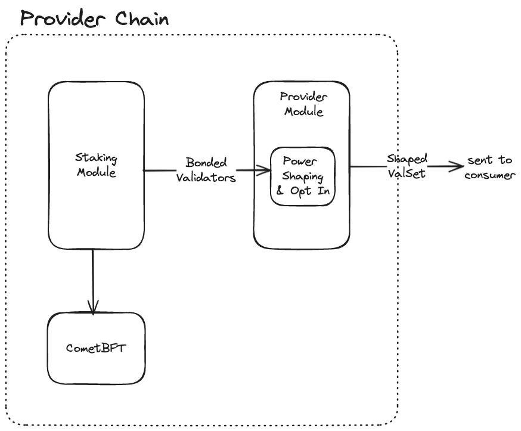
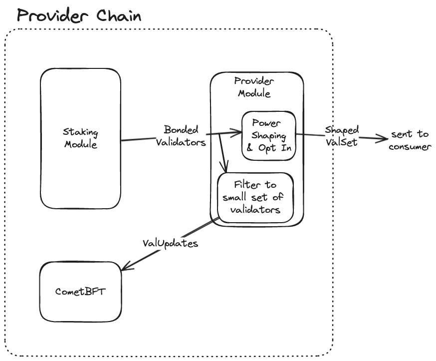

# ADR 017: ICS with Inactive Provider Validators

## Changelog
* 15th May 2024: Initial draft

## Status

Proposed

## Context

Currently, only validators in the active set on the provider can validate on consumer chains, which limits the number of validators that can participate in Interchain Security (ICS). 
Validators outside of the active set might be willing
to validate on consumer chains, but we might not want to make the provider validator set larger, e.g. to not put more strain on the consensus engine.
This runs the risk of leaving consumer chains with too few validators.

The purpose of this ADR is to allow validators that are *not* part of the consensus process on the provider chain (because they are inactive)
to validate on consumer chains.

In the context of this ADR, "consensus validator set" is the set of validators participating in the consensus protocol, and "staking validator set" is the set of validators viewed as active by the staking module.

Currently, the staking module, provider module, and CometBFT interact in this way:

The staking module keeps a list of validators. The `MaxValidators` validators with the largest amount of stake are "active" validators. `MaxValidators` is a parameter of the staking module. The staking module sends these validators to CometBFT to inform which validators make up the next consensus validators, that is, the set of validators participating in the consensus process. Separately, the provider module reads the list of bonded validators and sends this to the consumer chain, after shaping it according to which validators are opted in and the parameters set by the consumer chain for allowlist, denylist, etc.

## Decision

The proposed solution to allow validators that are not participating in the consensus process on the provider (inactive validators) is to change 3 main things:

a) increase the `MaxValidators` parameter of the staking module

b) do *not* take the updates for CometBFT directly from the bonded validators in the staking module, by wrapping the staking modules `EndBlocker` with a dummy EndBlocker that doesn't return any validator updates. Instead, we adjust the provider module to return validator updates on its EndBlocker. These validator updates are obtained by *filtering* the bonded validators to send only the first `MaxProviderConsensusValidators` (sorted by largest amount of stake first) many validators to CometBFT

c) use the enlarged list of bonded validators from the staking module as basis for the validator set that the provider module sends to consumer chains (again after applying power shaping and filtering out validatiors that are not opted in).

In consequence, the provider chain can keep a reasonably-sized consensus validator set, while giving consumer chains a much larger pool of potential validators.

Some additional considerations:

* Migration: In the migration, the last consensus validator set will be set to the last active validator set from the view of the staking module. Existing consumer chains are migrated to have a validator set size cap (otherwise, they could end up with a huge validator set including all the staking-but-not-consensus-active validators from the provider chain)
* Slashing: Validators that are not part of the active set on the provider chain can still be jailed for downtime on a consumer chain (via an Interchain Security SlashPacket sent to the provider, who will then jail the validator), but they *are not* slashed for downtime on the provider chain.
This is achieved without any additional changes to the slashing module, because the slashing module checks for downtime by looking at the consensus participants reported by CometBFT, and thus with the proposed solution, validators that are not part of the consensus validators on the provider chain are not considered for downtime slashing (see https://github.com/cosmos/cosmos-sdk/blob/v0.47.11/x/slashing/abci.go#L22).
* Rewards: Validators that are not part of the active set on the provider chain can still receive rewards on the consumer chain, but they *do not* receive rewards from the provider chain. This change is
achieved without further changes to staking or reward distributions, because similar to downtime, rewards are based on the consensus validator set (see https://github.com/cosmos/cosmos-sdk/blob/v0.47.11/x/distribution/abci.go#L28)

### Changes to the state

The following changes to the state are required:

* Introduce the `MaxProviderConsensusValidators` parameter to the provider module, which is the number of validators that the provider module will send to consumer chains.
* Store the provider consensus validator set in the provider module state under the `LastProviderConsensusValsPrefix` key. This is the last set of validators that the provider sent to the consensus engine. This is needed to compute the ValUpdates to send to the consensus engine (by diffing the current set with this last sent set).
* Increase the `MaxValidators` parameter of the staking module to the desired size of the potential validator
set of consumer chains.
* Introduce two extra per-consumer-chain parameters: `MinStake` and `MaxValidatorRank`. `MinStake` is the minimum amount of stake a validator must have to be considered for validation on the consumer chain. `MaxValidatorRank` is the maximum rank of a validator that can validate on the consumer chain. The provider module will only consider the first `MaxValidatorRank` validators that have at least `MinStake` stake as potential validators for the consumer chain.

## Risk Mitigations

To mitigate risks from validators with little stake, we introduce a minimum stake requirement for validators to be able to validate on consumer chains, which can be set by each consumer chain independently, with a default value set by the provider chain.

Additionally, we independently allow individual consumer chains to set a maximum rank for validators.
This means that validators above a certain position in the validator set cannot validate on the consumer chain.
Setting this to be equal to `MaxProviderConsensusValidators` effectively disables this feature,
which will disallow validators from outside the provider active set from validating on the consumer chain and revert them to the previous behaviour of only considering validators of the provider that are part of the active consensus validator set.

Additional risk mitigations are to increase the active set size slowly, and to monitor the effects on the network closely. For the first iteration, we propose to increase the active set size to 200 validators (while keeping the consensus validators to 180), thus letting the 20 validators with the most stake outside of the active set validate on consumer chains.

## Consequences

### Positive

* Validators outside of the active set can validate on consumer chains without having an impact on the consensus engine of the provider chain
* Consumer chains can have a much larger validator set than the provider chain if they prefer this e.g. for decentralization reasons
* Consumer chain teams can, with much less cost than today, start up their own consumer chain node to keep the chain running (in a centralized manner) even if no hub validators have opted in to validate on the chain. This is useful to stop the chain from ending up with an empty validator set and becoming recoverable only with a hardfork

### Negative

Allowing validators from the inactive set brings with it some additional risks.
In general, consumer chains will now face some of the problems also faced by standalone chains. It’s reasonable to assume that the validator set on the hub has a minimum amount of operational quality due to being battle tested and decentralized, and consumer chains with validators from outside the hub active set cannot rely on this as much anymore.

#### Sybil attacks

With the restricted size of the active set today, it’s clear that the set is at least minimally competitive and it is not trivial to spin up multiple nodes as a validator.

When we make the “potential validator set” much larger, we should assume that it becomes much less competitive to be part of that set, and thus trivial for single entities to control many of those validators.

#### Reputational damage is not a deterrent

For validators in the active set, we typically assume that if they would misbehave, they pay a large reputational cost. This represents delegators deciding to switch validators (potentially even on chains other than the one the misbehaviour happened on), and loss of credibility in the ecosystem. With the much larger active set, it seems prudent to assume that reputational damage is not a deterrent for many validators. They might only have minimal amounts of delegated stake and control most of it themselves, so they might not be deterred from performing actions that would usually bring reputational damage.

#### Additional negative consequences
* The provider keeper will need to implement the staking keeper interface, and modules need to be wired up to either the staking or provider keeper, depending on whether they need the consensus or staking validator set
* This will impact how future modules are integrated, since we will need to consider whether those modules should consider the consensus validators or the bonded validators (which other modules might assume to be the same)

### Neutral

* There might be validators that are bonded, but not validating on any chain at all. This is not a problem, but it might be a bit confusing.

## Alternative considerations

### Modifying the staking module

We could instead adapt the *staking module* with a similar change.
This might be better if it turns out that the staking module active set is used in many other places.

### Allowing unbonding validators to validate

Instead of increasing the active set size, we could allow validators that are unbonded (but still exist on the provider) to validate consumer chains.
For this, we would need to:
* Modify the VSC updates to consider the set of all validators, even unbonded ones, instead of just active ones
* Adjust our downtime jailing/equivocation slashing logic to work correctly with unbonded validators. This is very hard, because redelegations are not usually tracked for unbonded validators.

## References

* [Security Aggregation](./adr-016-securityaggregation.md) has similar concerns where the staking validator set will differ from the consensus validator set
