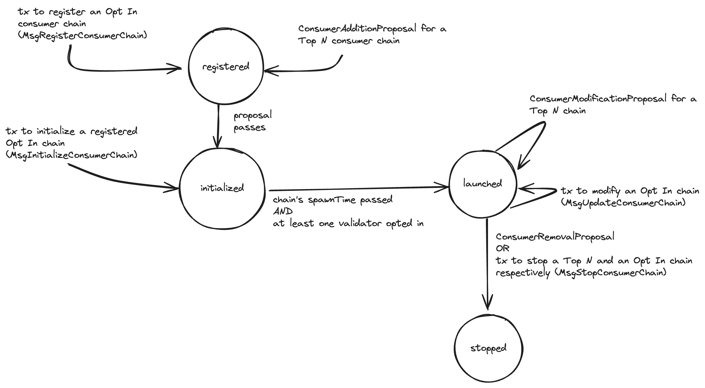

# ADR 18: Permissionless Interchain Security

## Changelog
* 27th of June, 2024: Initial draft

## Status

Proposed

## Context
Currently, a consumer chain can join _Interchain Security_ (ICS) only through a [governance proposal](../features/proposals.md).
A governance proposal was needed before the introduction of [Partial Set Security](../features/partial-set-security.md) (PSS)
because validators were required to validate a consumer chain. However, after the introduction of PSS, a consumer chain can
be either _Top N_ or _Opt In_. If a chain is an Opt In chain, then no validator is required to validate this chain unless they choose to.
Because of this, we can launch an Opt In consumer chain without going through a governance proposal.

This ADR presents _Permissionless_ ICS, a way in which an [_Opt In_](adr-015-partial-set-security.md) consumer chain can join
ICS without needing a governance proposal but by simply issuing a transaction.

## Decision

### The Phases of a Consumer Chain
In Permissionless ICS, launching an Opt In chain is **only** possible through a transaction and not through a [`MsgConsumerAddition`](https://github.com/cosmos/interchain-security/blob/v5.1.0/proto/interchain_security/ccv/provider/v1/tx.proto#L111).
Nevertheless, ICS does not eliminate the `MsgConsumerAddition` governance proposal, as proposals are still necessary
for Top N chains. Because of this, this ADR outlines a solution that attempts to preserve as much of the governance proposal code
as possible.
Additionally, to make the distinction between governance-proposed versus transaction-launched chains clearer, in Permissionless ICS,
we can only add, modify, or remove Top N chains with governance proposals (i.e., `MsgConsumerAddition`, `MsgConsumerModification`,
and `MsgConsumerRemoval`) and we can only add, modify, or remove Opt In chains with transactions.
Note however that a Top N chain can transform to an Opt In Chain through a `MsgConsumerModification` that sets `top_N == 0` but not vice versa.
In what follows, what we describe applies mostly for transaction-based (i.e., Opt In) consumer chains, unless stated otherwise.

A consumer chain can reside in four phases: i) waiting, ii) _prelaunched_, iii) _launched_, and iv) _stopped_ phase as seen
in the diagram below:



When a Top N chain is first proposed through a `MsgConsumerAddition` proposal or an Opt In chain is registered (more on this later) using the `MsgRegisterConsumerChain` transaction,
the consumer chain resides in the _waiting_ phase. A consumer chain in the waiting phase might not launch (i.e., the `MsgConsumerAddition` proposal does not pass or the registered Opt In chain is not set to launch) and hence is "waiting."
At this phase, as well as in the prelaunched and launched phases, validators can choose to opt in on the consumer chain.
If the `MsgConsumerAddition` of a Top N chain passes or a registered Opt In chain is set to launch with the `MsgInitializeConsumerChain` transaction, then the chain moves to the _prelaunched_ phase.
In the prelaunched phase, an Opt In chain can choose to change the consumer chain parameters, such as `spawnTime`, etc. by issuing anew `MsgInitiateConsumerChain`.
This is not the case for Top N chains, where a `MsgConsumerModification` can only be issued after a consumer
chain [has started](https://github.com/cosmos/interchain-security/blob/v5.1.0/x/ccv/provider/keeper/legacy_proposal.go#L89).

When the [`spawnTime`](https://github.com/cosmos/interchain-security/blob/v5.1.0/proto/interchain_security/ccv/provider/v1/provider.proto#L57)
passes and [at least one validator has opted in](https://github.com/cosmos/interchain-security/blob/v5.1.0/x/ccv/provider/keeper/proposal.go#L430)
the chain can launch and moves to the _launched_ phase. While in launched phase, a Top N consumer chain can choose to modify
its parameters through a `MsgConsumerModification` and an Opt In chain can change its parameters by issuing the `MsgUpdateConsumerChain` transaction.

Lastly, a Top N chain can choose to exit ICS by issuing a `MsgConsumerRemoval` and an Opt In chain can issue a transaction to stop the chain.
After some period of time (e.g., provider's unbonding period), all state related to the stopped consumer chain can be removed. We
keep track of the consumer chain's state for some period, so that we are able to punish validators for misbehaviours that occurred before the consumer chain stopped.

Note that everything described so far and everything that follows applies to consumer chains that transition from standalone chains as well.

### From `chainId` to `consumerId`
A hindrance in moving to Permissionless ICS is [chain-id squatting](https://forum.cosmos.network/t/pss-permissionless-vs-premissioned-lite-opt-in-consumer-chains/12984/17).
In a permissionless setting, anyone could issue a transaction to launch a consumer chain with a `chainId` that might already be used by some other consumer chain. This is a problem
because in the current design the majority of stored state for a consumer chain is indexed using the `chainId` as the key (e.g.,
see [key used to store client ids](https://github.com/cosmos/interchain-security/blob/v5.1.0/x/ccv/provider/types/keys.go#L245)).
To tackle this problem, in Permissionless ICS, we introduce the `consumerId` that defines a consumer chain and is simply
an increasing counter (i.e., `counter`), thus we can support multiple consumer chains with the same `chainId`.
Another way to understand this is with an analogy between consumer chains and IBC clients: Imagine having multiple IBC clients
that each point to different consumer chains, but all share the exact same `chainId`. It is then up to the user to select the
appropriate client (i.e., `clientID`) based on the actual chain they want to communicate with. Similarly, there can be multiple
consumer chains with the exact same `chainId`, and it is the responsibility of the validators to choose the one they wish
to interact with by providing the right `consumerId`.

Although a `counter`, we store it as a `string` and not as an integer (e.g., `uint64`) for three reasons:
i) avoid extensive refactorings when moving from `chainId` that is of type `string` to `consumerId`,
ii) simplify migrations because we do not need to keep different methods at the same time (e.g., `ChainToClientKey(string)`
and `ChainToClientKeyV2(uint64)` to do something like `client := Get(ChainToClientKey("currentConsumerChain))` and
`Set(ChainToClientKeyV2(1234), client)`, and iii) allow for easy ways to incorporate more data to a `consumerId` if needed in the future.


Note that with Permissionless ICS, all interactions on a consumer chain have to use the `consumerId` instead of the `chainId`.
For example, if a validator opts in on a chain using `MsgOptIn`, the validator has to provide the `consumerId`. To also
provide the `consumerId` for Top N consumers chains, we store a mapping between `proposalID` to `consumerId`. This storing
takes place in the [`AfterProposalSubmission`](https://github.com/cosmos/cosmos-sdk/blob/v0.50.8/x/gov/types/hooks.go#L19) hook.
Note that in some cases, we still have to use the actual `chainId`, when, for example, we [verify equivocation evidence](https://github.com/cosmos/interchain-security/blob/v5.1.0/x/ccv/provider/keeper/consumer_equivocation.go#L143).
Specifically, for the equivocation evidence, we update the `MsgSubmitConsumerMisbehaviour` and `MsgSubmitConsumerDoubleVoting` messages to include the `consumerId`,
and change [Hermes](https://github.com/informalsystems/hermes) to include `consumerId` in those constructed messages as well.
Hermes can find out the `consumerId` by querying the provider's `clientId` for some consumer chain (i.e., `query ccvconsumer provider-info`)
and then asking the provider chain for the `consumerId` that corresponds to this `clientId`. To do this, we need to store
the `clientId` to `consumerId` association on the provider and introduce a query to retrieve the `clientId`
given the `consumerId`.

#### State
As a result of using `consumerId`, we have to migrate a substantial chunk of state to re-index it using `consumerId` as the key.
To move from using the `chainId` to the new `consumerId`, we need to revamp the consumer chains' stored state in ICS. Currently, in
ICS we have state that is indexed by a multitude of [keys](https://github.com/cosmos/interchain-security/blob/v5.1.0/x/ccv/provider/types/keys.go#L40).
In the table below, we see which ones are associated with a `chainId` and how often state under those keys gets updated.

| Key                                     | Description                                                                                                                                                                   |Associated with `chainId`?| How often are `chainId`-associated keys updated?                                                         |
|-----------------------------------------|-------------------------------------------------------------------------------------------------------------------------------------------------------------------------------|--------------------------|----------------------------------------------------------------------------------------------------------|
| `PortByteKey`                           | Global `portID`                                                                                                                                                               |NO                        |                                                                                                          |
| `MaturedUnbondingOpsByteKey`            | Deprecated together with `VSCMaturedPacket`s                                                                                                                                  |-                         |                                                                                                          |
| `ValidatorSetUpdateIdByteKey`           | Global for all consumer chains                                                                                                                                                |NO                        |                                                                                                          |
| `SlashMeterByteKey`                     | Global for the provider                                                                                                                                                       |NO                        |                                                                                                          |
| `SlashMeterReplenishTimeCandidateByteKey`| Global for the provider                                                                                                                                                       |NO                        |                                                                                                          |
| `ChainToChannelBytePrefix`              | Stores the CCV `channelID` for a specific chain                                                                                                                               |**YES**                   | Only once (during set up)                                                                                |
| `ChannelToChainBytePrefix`              | Stores `chainId` for a specific channel                                                                                                                                       |**YES**                   | Only once (during set up)                                                                                |
| `ChainToClientBytePrefix`                | Stores the `clientID` for a specific chain                                                                                                                                    |**YES**                   | Only once (during set up)                                                                                |
| `InitTimeoutTimestampBytePrefix`         | Deprecated together with `VSCMaturedPacket`s                                                                                                                                  |-                         |                                                                                                          |
| `PendingCAPBytePrefix`                   | Stores pending consumer addition proposals                                                                                                                                    |**YES**                   | Only once (for successful proposal)                                                                      |
| `PendingCRPBytePrefix`                   | Stores pending consumer removal proposals                                                                                                                                     |**YES**                   | Only once (for successful proposal)                                                                      |
| `UnbondingOpBytePrefix`                  | Deprecated together with `VSCMaturedPacket`s                                                                                                                                  |-                         |                                                                                                          |
| `UnbondingOpIndexBytePrefix`             | Deprecated together with `VSCMaturedPacket`s                                                                                                                                  |-                         |                                                                                                          |
| `ValsetUpdateBlockHeightBytePrefix`      | Not needed anymore. Used to keep track of the infraction height.                                                                                                              |NO                        |                                                                                                          |
| `ConsumerGenesisBytePrefix`              | Stores the consumer genesis for a specific chain                                                                                                                              |**YES**                   | Only once (during set up)                                                                                |
| `SlashAcksBytePrefix`                    | Stores slash acks for a specific consumer chain                                                                                                                               |**YES**                   | Every time we receive a Slash packet                                                                     |
| `InitChainHeightBytePrefix`              | Not needed anymore. Used to keep track of the infraction height.                                                                                                              |-                         |                                                                                                          |
| `PendingVSCsBytePrefix`                  | Stores `VSCPacket`s for a specific consumer chian                                                                                                                             |**YES**                   | Every [epoch](https://github.com/cosmos/interchain-security/blob/v5.1.0/docs/docs/adrs/adr-014-epochs.md)  |
| `VscSendTimestampBytePrefix`             | Deprecated together with `VSCMaturedPacket`s                                                                                                                                  |-                         |                                                                                                          |
| `ThrottledPacketDataSizeBytePrefix`      | Deprecated                                                                                                                                                                    |-                         |                                                                                                          |
| `ThrottledPacketDataBytePrefix`          | Deprecated                                                                                                                                                                    |-                         |                                                                                                          |
| `GlobalSlashEntryBytePrefix`             | Deprecated                                                                                                                                                                    |-                         |                                                                                                          |
| `ConsumerValidatorsBytePrefix`           | Stores consumer key per validator per consumer chain                                                                                                                          |**YES**                   | Every `MsgAssignConsumerKey` or `MsgOptIn`                                                               |
| `ValidatorsByConsumerAddrBytePrefix`     | Stores consumer to provider validator address                                                                                                                                 |**YES**                   | Every `MsgAssignConsumerKey` or `MsgOptIn`                                                               |
| `KeyAssignmentReplacementsBytePrefix`    | Deprecated                                                                                                                                                                    |-                         |                                                                                                          |
| `ConsumerAddrsToPruneBytePrefix`         | Deprecated together with `VSCMaturedPacket`s                                                                                                                                  |-                         |                                                                                                          |
| `SlashLogBytePrefix`                     | Not used (its [getter](https://github.com/cosmos/interchain-security/blob/v5.1.0/tests/integration/throttle.go#L454) is only used in an integration test). Can be deprecated. |-                         |                                                                                                          |
| `ConsumerRewardDenomsBytePrefix`         | Global for all consumer chains                                                                                                                                                |NO                        |                                                                                                          |
| `VSCMaturedHandledThisBlockBytePrefix`   | Deprecated together with `VSCMaturedPacket`s                                                                                                                                  |-                         |                                                                                                          |
| `EquivocationEvidenceMinHeightBytePrefix` | Stores min height for a consumer chain                                                                                                                                        |**YES**                   | Only once (during set up)                                                                                |
| `ProposedConsumerChainByteKey`           | Stores `proposalID`s for consumer chains with proposals in the voting period                                                                                                  |**YES**                   | Created when the proposal is submitted and deleted when the proposal's voting period ends                                                                                                           |
| `ConsumerValidatorBytePrefix`            | Stores consumer validators for a specific chain                                                                                                                               |**YES**                   | Potentially at every epoch                                                                               |
| `OptedInBytePrefix`                      | Stores opted-in validators for a specific chain                                                                                                                               |**YES**                   | Potentially at every block                                                                               |
| `TopNBytePrefix`                         | Stores whether a consumer chain is Top N or not                                                                                                                               |**YES**                   | Every parameter update                                                                                   |
| `ValidatorsPowerCapPrefix`               | Stores ther power cap of a chain                                                                                                                                              |**YES**                   | Every parameter update                                                                                   |
| `ValidatorSetCapPrefix`                  | Stores the set cap of a chain                                                                                                                                                 |**YES**                   | Every parameter update                                                                                   |
| `AllowlistPrefix`                        | Stores the allowlist of a chain                                                                                                                                               |**YES**                   | Every parameter update                                                                                   |
| `DenylistPrefix`                         | Stores the denylist of a chain                                                                                                                                                |**YES**                   | Every parameter update                                                                                   |
| `ConsumerRewardsAllocationBytePrefix`    | Stores the ICS rewards per chain                                                                                                                                              |**YES**                   | Every IBC transfer packet that sends rewards to the provider                                             |
| `ConsumerCommissionRatePrefix`           | Comission rate per chain per validator                                                                                                                                        |**YES**                   | Every `MsgSetConsumerCommissionRate` message                                                             |
| `MinimumPowerInTopNBytePrefix`           | Stores the minimum power needed to opt in for a chain                                                                                                                         |**YES**                   | Every epoch                                                                                              |
| `ConsumerAddrsToPruneV2BytePrefix`       | Stores consumer addresses to be pruned (as part of `VSCMaturedPacket`s deprecation)                                                                                           |**YES**                   | Every `MsgAssignConsumerKey` or `MsgOptIn` and later during actual pruning                               |

Everything stored under a key associated with a `chainId` needs to be migrated to new state under `consumerId`.

### New Messages
In what follows, we describe the new messages (i.e., `MsgRegisterConsumerChain`, `MsgInitiateConsumerChain`, and `MsgUpdateConsumerChain`)
that Permissionless ICS introduces, and on how those can be used.
Then, we describe how to utilize these messages with our existing codebase.

#### Register a Consumer Chain
We first have to register an Opt In chain before launching it. This is done through the following message.
```protobuf
message MsgRegisterConsumerChain {
  // the title of this launch 
  string title;
  // the description of this consumer chain
  string description;
  // the chain id of the new consumer chain
  string chain_id;
  // the owner of this consumer chain
  string owner_address;
}
```

This response of this message contains a single `string`, that is the `consumerId` for this registered consumer chain and initiates
a consumer chain in its waiting phase. With the returned `consumerId`, validators can already opt in on the consumer
chain to show their potential interest on the chain. Additionally, a front-end ICS launchpad can also present
this chain. Additionally, this allows consumer chains to show that they are interested in joining ICS even though,
they might not yet know the specific ICS parameters they would like to use (see `MsgInitiateConsumerChain`). 

This message contains the `owner_address` that corresponds to the address that would be able to initiate or later update this consumer chain.
We store the owner address of each Opt In consumer chain by creating an association between `consumerId`s and `owner_address`es.
Top N chains do not have an `onwer_address` because they can only be modified through governance proposals. 

To prevent an attacker spamming the system by creating bogus consumer chains, we set a fixed cost for sending a `MsgRegisterConsumerChain` (configurable via a parameter).

#### Launch a Consumer Chain
To move a consumer chain to its prelaunched phase, we issue a `MsgInitiateConsumerChain` message that is as follows:

```protobuf
message MsgInitiateConsumerChain {
  // tx signer address
  string signer;
  // consumer id of the to-be-updated consumer chain
  string consumer_id;
  // the prelaunch record that contains more specific parameters for the upcoming chain
  provider.v1.PrelaunchConsumerChainRecord record;
}
```

where `PrelaunchConsumerChainRecord` contains the following:
```protobuf
message PrelaunchConsumerChainRecord {
  // the title of the chain to-be-launched 
  string title;
  // the description of the chain to-be-launched
  string description;
  // the chain id of the new consumer chain
  string chain_id;
  // consumer id of the to-be-launched chain
  string consumer_id;
  // the owner of this consumer chain
  string owner_address;
  // the proposed initial height of new consumer chain.
  // For a completely new chain, this will be {0,1}. However, it may be
  // different if this is a chain that is converting to a consumer chain.
  ibc.core.client.v1.Height initial_height;
  // The hash of the consumer chain genesis state without the consumer CCV
  // module genesis params. It is used for off-chain confirmation of
  // genesis.json validity by validators and other parties.
  bytes genesis_hash;
  // The hash of the consumer chain binary that should be run by validators on
  // chain initialization. It is used for off-chain confirmation of binary
  // validity by validators and other parties.
  bytes binary_hash;
  // spawn time is the time on the provider chain at which the consumer chain
  // genesis is finalized and all validators will be responsible for starting
  // their consumer chain validator node.
  google.protobuf.Timestamp spawn_time;
  // Unbonding period for the consumer,
  // which should be smaller than that of the provider in general.
  google.protobuf.Duration unbonding_period;
  // Sent CCV related IBC packets will timeout after this duration
  google.protobuf.Duration ccv_timeout_period ;
  // Sent transfer related IBC packets will timeout after this duration
  google.protobuf.Duration transfer_timeout_period;
  // The fraction of tokens allocated to the consumer redistribution address
  // during distribution events. The fraction is a string representing a
  // decimal number. For example "0.75" would represent 75%.
  string consumer_redistribution_fraction;
  // BlocksPerDistributionTransmission is the number of blocks between
  // ibc-token-transfers from the consumer chain to the provider chain. On
  // sending transmission event, `consumer_redistribution_fraction` of the
  // accumulated tokens are sent to the consumer redistribution address.
  int64 blocks_per_distribution_transmission;
  // The number of historical info entries to persist in store.
  // This param is a part of the cosmos sdk staking module. In the case of
  // a ccv enabled consumer chain, the ccv module acts as the staking module.
  int64 historical_entries;
  // The ID of a token transfer channel used for the Reward Distribution
  // sub-protocol. If DistributionTransmissionChannel == "", a new transfer
  // channel is created on top of the same connection as the CCV channel.
  // Note that transfer_channel_id is the ID of the channel end on the consumer
  // chain. it is most relevant for chains performing a sovereign to consumer
  // changeover in order to maintain the existing ibc transfer channel
  string distribution_transmission_channel;
  // Corresponds to the percentage of validators that have to validate the chain under the Top N case.
  // For example, 53 corresponds to a Top 53% chain, meaning that the top 53% provider validators by voting power
  // have to validate the proposed consumer chain. top_N can either be 0 or any value in [50, 100].
  // A chain can join with top_N == 0 as an Opt In chain, or with top_N ∈ [50, 100] as a Top N chain.
  uint32 top_N ;
  // Corresponds to the maximum power (percentage-wise) a validator can have on the consumer chain. For instance, if
  // `validators_power_cap` is set to 32, it means that no validator can have more than 32% of the voting power on the
  // consumer chain. Note that this might not be feasible. For example, think of a consumer chain with only
  // 5 validators and with `validators_power_cap` set to 10%. In such a scenario, at least one validator would need
  // to have more than 20% of the total voting power. Therefore, `validators_power_cap` operates on a best-effort basis.
  uint32 validators_power_cap;
  // Corresponds to the maximum number of validators that can validate a consumer chain.
  // Only applicable to Opt In chains. Setting `validator_set_cap` on a Top N chain is a no-op.
  uint32 validator_set_cap ;
  // Corresponds to a list of provider consensus addresses of validators that are the ONLY ones that can validate
  // the consumer chain.
  repeated string allowlist;
  // Corresponds to a list of provider consensus addresses of validators that CANNOT validate the consumer chain.
  repeated string denylist;
}
```

`PrelaunchConsumerChainRecord` contains _almost_ everything that is contained in [`ConsumerAdditionProposal`](https://github.com/cosmos/interchain-security/blob/v5.1.0/proto/interchain_security/ccv/provider/v1/provider.proto#L30)
but we create it to be able to use it across both Top N chains (where we used `ConsumerAdditionProposal`s before), as
well as in Opt In chains. As a result, we deprecate `ConsumerAdditionProposal`.

For each `consumerId`, we store its corresponding `PrelaunchConsumerChainRecord`. For Top N chains, we can perform this
store by using the [`AfterProposalVotingPeriodEnded`](https://github.com/cosmos/cosmos-sdk/blob/v0.50.8/x/gov/types/hooks.go#L52).

To execute a `MsgInitiateConsumerChain`, we use the `PrelaunchConsumerChainRecord` under the hoods, with the `top_N` set to 0.
We need to extensively check the fields of the provided `PrelaunchConsumerChainRecord` to guarantee that no consumer
chain launches with problematic parameters (e.g., we need to have maximum length for the `chainId`, etc.).
As a starter we look into the [usual validity conditions](https://github.com/cosmos/interchain-security/blob/v5.1.0/x/ccv/provider/types/msg.go#L244).

For all chains in the prelaunch phase, we keep a mapping between `consumerId` and the underlying `PrelaunchConsumerChainRecord`.
This way, we can respond to queries that ask for all the consumer chain's parameters. For example, retrieving the
`spawn_time` of consumer chain with a given `consumerId`.

`MsgInitiateConsumerChain` can be executed multiple times for the same consumer chain during its prelaunch phase
to potentially change its to-be-launched parameters (e.g., `spawnTime`).

#### Update a Consumer Chain
After an Opt In consumer chain has started, we can use the `MsgUpdateConsumerChain` message so that the owner of a consumer
chain can change its parameters (e.g., `validators_power_cap`, `allowlist`, etc.) This message can only be executed by the
owner of a consumer chain (see `owner_address`).


```protobuf
message MsgUpdateConsumerChain {
  // consumer id of the chain we would like to update its params
  string consumer_id;
  string owner_address;
  uint32 validators_power_cap;
  uint32 validator_set_cap;
  repeated string allowlist;
  repeated string denylist;
}
```

The `owner_address` is provided as well and hence a consumer chain can change the current owner.

#### Stop a Consumer Chain
With the `MsgStopConsumerChain` we can stop any Opt In chain at any point in time. Note that all relevant state for this consumer chain
remains on the provider's state before getting removed after one unbonding period (of the provider). This is to enable
potential slashing for any infraction that might have been caused until now.
Note however that we never recycle previously-used `consumerId`s. Naturally, this message can only be issued by the owner
of the consumer chain. Also, note that, any remaining IBC rewards that were to be sent to the provider chain are lost.

```protobuf
message MsgStopConsumerChain {
  // the consumerId as returned by `MsgLaunchConsumerChain`
  string consumer_id;
}
```

### Additional Modifications
We need to perform multiple migrations. All state needs to be reindex based on a `consumerId` instead of the `chainId`.
Because we only have two consumer chains at the moment, this is not going to be an expensive migration even if we have some live
consumer chains that are being voted upon. Similarly, all the messages, queries, etc. would need to be changed to operate on a `consumerId`
instead of a `chainId`.

Note that we also need to modify `MsgConsumerModification` to contain `owner_address` if and only if `top_N` is set to 0.

## Consequences

### Positive
- Easier to launch an Opt In consumer chain because no governance is required.

### Negative
- Extensive migration and overhaul of existing code base (as part of API-breaking changes) that could lead to bugs and more work in auditing this.


## References
[CHIPs Discussion phase: Permissionless ICS](https://forum.cosmos.network/t/chips-discussion-phase-permissionless-ics/13955)
[Chain-id squatting](https://forum.cosmos.network/t/pss-permissionless-vs-premissioned-lite-opt-in-consumer-chains/12984/17)