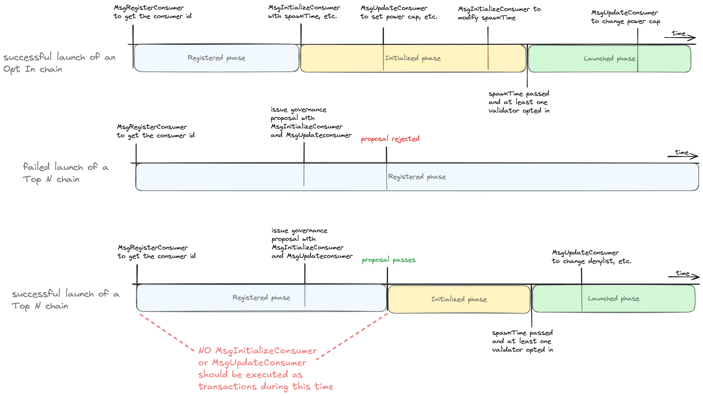

# ADR 18: Permissionless Interchain Security

## Changelog
* 27th of June, 2024: Initial draft

## Status

Proposed

## Context
Currently, a consumer chain can join _Interchain Security_ (ICS) only through a [governance proposal](../features/proposals.md).
A governance proposal was needed before the introduction of [Partial Set Security](../features/partial-set-security.md) (PSS)
because validators were required to validate a consumer chain. However, after the introduction of PSS, a consumer chain can
be either _Top N_ or _Opt In_. If a chain is an Opt In chain, then no validator is required to validate this chain unless they choose to.
Because of this, we can launch an Opt In consumer chain without going through a governance proposal.

This ADR presents _Permissionless_ ICS, a way in which an [_Opt In_](adr-015-partial-set-security.md) consumer chain can join
ICS without needing a governance proposal but by simply issuing a transaction.

## Decision
In Permissionless ICS, launching an Opt In chain is **only** possible through a transaction and not through a [`MsgConsumerAddition`](https://github.com/cosmos/interchain-security/blob/v5.1.0/proto/interchain_security/ccv/provider/v1/tx.proto#L111)
proposal. Naturally, Permissionless ICS does not eliminate governance proposals, as proposals are still necessary for Top N chains.
Because of this, this ADR outlines a solution that also refactors governance proposals (i.e., `MsgConsumerAddition`, `MsgConsumerModification`, and `MsgConsumerRemoval`)
so that Top N and Opt In chains can share as much functionality as possible.
Note, that to make the distinction between governance-proposed versus transaction-launched chains clearer, in Permissionless ICS,
we can only launch, update, or stop Top N chains with governance proposals, and we can only launch, update, or stop Opt In chains with transactions.
Additionally, a Top N chain can transform to an Opt In chain through a gov proposal, but for simplicity, in this first
iteration of Permissionless, an Opt In chain cannot transform to a Top N chain.

### The Phases of a Consumer Chain

We first present the notion of an _owner_ of a consumer chain before showing the specific phases of a consumer chain.

**Owner.** A consumer chain has an _owner_, which is simply an address. Only the owner can interact (i.e., launch, update, or stop)
with the chain. The owner of an Opt In chain is the one who signed the initial transaction to register a consumer chain (more on this later).
Naturally, an Opt In chain can change its owner at any point. The owner of a Top N chain is the account of the governance module.
Therefore, any changes on a Top N chain have to go through governance proposals.

A consumer chain can reside in four phases: i) _registered_, ii) _initialized_, iii) _launched_, and iv) _stopped_ phase as seen
in the diagram below:


**Registered phase.** In the _registered phase_, a consumer chain is assigned a unique identifier that identifies a consumer chain
that can later be used to interact with the specific consumer chain (e.g., when a validator opts in on a chain).
After a chain has been registered, it can later be initialized and then launched. Specifically, Permissionless ICS introduces
a `MsgRegisterConsumer` message that can be used to register **both** Top N and Opt In consumer chains.
In the registered phase, it is not yet known if the consumer chain would end up being a Top N or an Opt In chain and hence
the owner of the consumer chain at this phase is the one that signed the `MsgRegisterConsumer`.
Note that currently, a consumer chain is registered when first proposed through a `MsgConsumerAddition` proposal
message but with Permissionless ICS, the `MsgConsumerAddition` is deprecated and chains have to issue a `MsgRegisterConsumer` message instead.
A consumer chain in the registered phase might not launch, e.g., a later governance proposal might not pass or
the Opt In chain might never be initialized.

**Initialized phase.** The _initialized phase_ means that the chain has set all the needed parameters to launch but has
not yet launched. To initialize an Opt In chain, the owner of the chain has to issue a `MsgInitializeConsumer` message
and potentially a `MsgUpdateConsumer` if they want to set up specific parameters (e.g., [power-shaping features](https://cosmos.github.io/interchain-security/features/power-shaping)).
Similarly, a Top N chain has to issue the same two messages (i.e, `MsgInitializeConsumer`, `MsgUpdateConsumer`) as part of a
governance proposal and if the governance proposal passes, the consumer chain is considered to be initialized. The moment
a governance proposal is proposed for a Top N chain, the owner changes to be the account of the governance module.
While in the initialized phase, an Opt In chain can choose to change the consumer chain parameters, such as `spawnTime`, etc.
by issuing a new `MsgInitializeConsumer` or `MsgUpdateConsumer` messages.
This is not the case for Top N chains, where a `MsgUpdateConsumer` can only be issued after a consumer
chain [has launched](https://github.com/cosmos/interchain-security/blob/v5.1.0/x/ccv/provider/keeper/legacy_proposal.go#L89).

**Launched phase.** In the _launched phase_ the consumer chain is running and is consuming a subset of the validator set
of the provider. When the [`spawnTime`](https://github.com/cosmos/interchain-security/blob/v5.1.0/proto/interchain_security/ccv/provider/v1/provider.proto#L57)
passes and [at least one validator has opted in](https://github.com/cosmos/interchain-security/blob/v5.1.0/x/ccv/provider/keeper/proposal.go#L430)
the chain can launch and moves to the launched phase. Note that a Top N chain can launch if and only if the `spawnTime` has passed and
the initialization proposal has successfully passed. While in launched phase, a consumer chain can choose to modify
its parameters through `MsgUpdateConsumer`. Naturally, only the owner of the chain can issue `MsgUpdateConsumer`, thus
for Top N chains, the chain can be updated only through a governance proposal that contains a `MsgUpdateConsumer`.

**Stopped phase.** Lastly, the owner of a chain can choose to exit ICS by executing a `MsgRemoveConsumer`.
After some period of time (e.g., provider's unbonding period), all state related to the stopped consumer chain can be removed.
We keep track of the state of the consumer chain for some period, so that we are able to punish validators for misbehaviours
that occurred before the consumer chain stopped.

Note that everything described so far and everything that follows applies to consumer chains that transition from standalone chains as well.

### From `chainId` to `consumerId`
A hindrance in moving to Permissionless ICS is [chain-id squatting](https://forum.cosmos.network/t/pss-permissionless-vs-premissioned-lite-opt-in-consumer-chains/12984/17).
In a permissionless setting, anyone could issue a transaction to launch a consumer chain with a `chainId` that might already be used by some other consumer chain. This is a problem
because in the current design the majority of stored state for a consumer chain is indexed using the `chainId` as the key (e.g.,
see [key used to store client ids](https://github.com/cosmos/interchain-security/blob/v5.1.0/x/ccv/provider/types/keys.go#L245)).
To tackle this problem, in Permissionless ICS, we introduce the `consumerId` that defines a consumer chain and is simply
an increasing counter (i.e., `counter`), thus we can support multiple consumer chains with the same `chainId`.
Another way to understand this is with an analogy between consumer chains and IBC clients: Imagine having multiple IBC clients
that each point to different consumer chains, but all share the exact same `chainId`. It is then up to the user to select the
appropriate client (i.e., `clientId`) based on the actual chain they want to communicate with. Similarly, there can be multiple
consumer chains with the exact same `chainId`, and it is the responsibility of the validators to choose the one they wish
to interact with by providing the right `consumerId`.

Note that with Permissionless ICS, all interactions on a consumer chain have to use the `consumerId` instead of the `chainId`.
For example, if a validator opts in on a chain using `MsgOptIn`, the validator has to provide the `consumerId`. To also
provide the `consumerId` for Top N consumers chains, we store a mapping between `proposalID` to `consumerId`. This storing
takes place in the [`AfterProposalSubmission`](https://github.com/cosmos/cosmos-sdk/blob/v0.50.8/x/gov/types/hooks.go#L19) hook.
Specifically, for the equivocation evidence, we update the `MsgSubmitConsumerMisbehaviour` and `MsgSubmitConsumerDoubleVoting` messages to include the `consumerId`,
and change [Hermes](https://github.com/informalsystems/hermes) to include `consumerId` in those constructed messages as well.
Hermes can find out the `consumerId` by querying the provider's `clientId` for some consumer chain (i.e., `query ccvconsumer provider-info`)
and then asking the provider chain for the `consumerId` that corresponds to this `clientId`. To do this, we need to store
the `clientId` to `consumerId` association on the provider and introduce a query to retrieve the `clientId`
given the `consumerId`.

#### State
As a result of using `consumerId`, we have to migrate a substantial chunk of state to re-index it using `consumerId` as the key.
Currently, in ICS we have state that is indexed by a multitude of [keys](https://github.com/cosmos/interchain-security/blob/v5.1.0/x/ccv/provider/types/keys.go#L40).
In the table below, we see the ones that are associated with a `chainId` and how often state under those keys gets updated.
Additionally, for each key, the table shows whose action can lead to the setting or deletion of the state associated with that key.
An action can stem either from: i) a consumer chain (e.g., through a `MsgUpdateConsumer` message, an IBC packet sent over to the provider, etc.),
ii) a provider chain (e.g., at the end of a block some action is taken), or by iii) a validator (e.g., through a `MsgAssignConsumerKey` message)
or a combination of them.

| Key                                     | Description                                                                                                                  | Who can set this?                     | Who can delete this?                  | How often are `chainId`-associated keys updated?                                                         |
|-----------------------------------------|------------------------------------------------------------------------------------------------------------------------------|:--------------------------------:|:--------------------------------:|----------------------------------------------------------------------------------------------------------|
| `ChainToChannelBytePrefix`              | Stores the CCV `channelID` for a specific chain                                                                              | consumer chain                   | consumer chain                   | Only once (during set up)                                                                                |
| `ChannelToChainBytePrefix`              | Stores `chainId` for a specific channel                                                                                      | consumer chain                   | consumer chain                   | Only once (during set up)                                                                                |
| `ChainToClientBytePrefix`               | Stores the `clientID` for a specific chain                                                                                   | consumer chain                   | consumer chain                   | Only once (during set up)                                                                                |
| `PendingCAPBytePrefix`                  | Stores pending consumer addition proposals                                                                                   | consumer chain                   | provider chain                   | Only once (for successful proposal)                                                                      |
| `PendingCRPBytePrefix`                  | Stores pending consumer removal proposals                                                                                    | consumer chain                   | provider chain                   | Only once (for successful proposal)                                                                      |
| `ConsumerGenesisBytePrefix`             | Stores the consumer genesis for a specific chain                                                                             | consumer chain                   | consumer chain                   | Only once (during set up)                                                                                |
| `SlashAcksBytePrefix`                   | Stores slash acks for a specific consumer chain                                                                              | consumer chain                   | provider chain                   | Every time we receive a Slash packet                                                                     |
| `PendingVSCsBytePrefix`                 | Stores `VSCPacket`s for a specific consumer chain                                                                            | provider chain                   | provider chain                   | Every [epoch](https://github.com/cosmos/interchain-security/blob/v5.1.0/docs/docs/adrs/adr-014-epochs.md) |
| `ConsumerValidatorsBytePrefix`          | Stores consumer key per validator per consumer chain                                                                         | validator                        | consumer chain                   | Every `MsgAssignConsumerKey` or `MsgOptIn`                                                               |
| `ValidatorsByConsumerAddrBytePrefix`    | Stores consumer to provider validator address                                                                                | validator                        | consumer or provider chain       | Every `MsgAssignConsumerKey` or `MsgOptIn`                                                               |
| `EquivocationEvidenceMinHeightBytePrefix`| Stores min height for a consumer chain                                                                                       | consumer chain                   | consumer chain                   | Only once (during set up)                                                                                |
| `ProposedConsumerChainByteKey`          | Stores `proposalID`s for consumer chains with proposals in the voting period                                                 | not applicable for Opt In chains | not applicable for Opt In chains | Created when the proposal is submitted and deleted when the proposal's voting period ends                |
| `ConsumerValidatorBytePrefix`           | Stores consumer validators for a specific chain                                                                              | validator                        | validator or consumer chain      | Potentially at every epoch                                                                               |
| `OptedInBytePrefix`                     | Stores opted-in validators for a specific chain                                                                              | validator                        | validator or consumer chain      | Potentially at every block                                                                               |
| `TopNBytePrefix`                        | Stores whether a consumer chain is Top N or not                                                                              | not applicable for Opt In chains | not applicable for Opt In chains | Every parameter update                                                                                   |
| `ValidatorsPowerCapPrefix`              | Stores the power cap of a chain                                                                                              | consumer chain                   | consumer chain                   | Every parameter update                                                                                   |
| `ValidatorSetCapPrefix`                 | Stores the set cap of a chain                                                                                                | consumer chain                   | consumer chain                   | Every parameter update                                                                                   |
| `AllowlistPrefix`                       | Stores the allowlist of a chain                                                                                              | consumer chain                   | consumer chain                   | Every parameter update                                                                                   |
| `DenylistPrefix`                        | Stores the denylist of a chain                                                                                               | consumer chain                   | consumer chain                   | Every parameter update                                                                                   |
| `ConsumerRewardsAllocationBytePrefix`   | Stores the ICS rewards per chain                                                                                             | consumer or provider chain       | provider chain                   | Every IBC transfer packet that sends rewards to the provider                                             |
| `ConsumerCommissionRatePrefix`          | Commission rate per chain per validator                                                                                      | validator                        | consumer chain                   | Every `MsgSetConsumerCommissionRate` message                                                             |
| `MinimumPowerInTopNBytePrefix`          | Stores the minimum power needed to opt in for a chain                                                                        | not applicable for Opt In chains | not applicable for Opt In chains | Every epoch                                                                                              |
| `ConsumerAddrsToPruneV2BytePrefix`      | Stores consumer addresses to be pruned (as part of `VSCMaturedPacket`s deprecation)                                          | validator or provider chain      | provider chain                   | Every `MsgAssignConsumerKey` or `MsgOptIn` and later during actual pruning                               |

Everything stored under one of the above keys is associated with a `chainId` and has to be migrated to new state under a `consumerId`.

### New Messages
In this section, we describe the new messages (i.e., `MsgRegisterConsumer`, `MsgInitializeConsumer`,  `MsgUpdateConsumer` and `MsgRemoveConsumer`)
that Permissionless ICS introduces.
Then, we describe how to utilize these messages with our existing codebase.

#### Register a Consumer Chain
We first have to register a chain before launching it, irrespectively of whether it is Top N or Opt In.
This is done through the following message:
```protobuf
message MsgRegisterConsumer {
  // the registration record that contains information for the registered chain
  ConsumerRegistrationRecord registration_record;
}
```

where `ConsumerRegistrationRecord` contains information about the to-be-launched consumer chain before it launches.

```protobuf
message ConsumerRegistrationRecord {
  // the title of the chain to-be-launched 
  string title;
  // the description of the chain to-be-launched
  string description;
  // the chain id of the new consumer chain
  string chain_id;
}
```

This response of this message contains a single `string`, that is the `consumerId` for this registered consumer chain and sets
a consumer chain in its registered phase. With the returned `consumerId`, validators can already opt in on the consumer
chain to show their potential interest on the chain.

The owner of the consumer chain is the one that signed the `MsgRegisterConsumer` message.

To prevent an attacker spamming the system by creating bogus consumer chains, we set a fixed cost for sending a `MsgRegisterConsumer` (configurable via a parameter).

#### Initialize a Consumer Chain
To move an Opt In consumer chain to its initialized phase, we issue a `MsgInitializeConsumer` message that is as follows:

```protobuf
message MsgInitializeConsumer {
  // consumer id of the to-be-updated consumer chain
  string consumer_id;
  // the initialization record that contains initialization parameters for the upcoming chain
  ConsumerInitializationRecord initialization_record;
}
```
where `ConsumerInitializationRecord` contains the following:
```protobuf
message ConsumerInitializationRecord {
  // ---------- ---------- ----------
  // Following fields are used when the consumer chain launches and are not needed by the provider afterwards.
  // ---------- ---------- ----------
  
  // the proposed initial height of new consumer chain.
  // For a completely new chain, this will be {0,1}. However, it may be
  // different if this is a chain that is converting to a consumer chain.
  ibc.core.client.v1.Height initial_height;
  // The hash of the consumer chain genesis state without the consumer CCV
  // module genesis params. It is used for off-chain confirmation of
  // genesis.json validity by validators and other parties.
  bytes genesis_hash;
  // The hash of the consumer chain binary that should be run by validators on
  // chain initialization. It is used for off-chain confirmation of binary
  // validity by validators and other parties.
  bytes binary_hash;
  // spawn time is the time on the provider chain at which the consumer chain
  // genesis is finalized and all validators will be responsible for starting
  // their consumer chain validator node.
  google.protobuf.Timestamp spawn_time;
  // Unbonding period for the consumer,
  // which should be smaller than that of the provider in general.
  google.protobuf.Duration unbonding_period;


  // ---------- ---------- ----------
  // Following fields are used to construct the consumer genesis of the to-be-launched consumer chain
  // and are set up as params on the consumer chain. Those params can then be directly modified by the consumer chain.
  // ---------- ---------- ----------
  
  // Sent CCV related IBC packets will timeout after this duration
  google.protobuf.Duration ccv_timeout_period;
  // Sent transfer related IBC packets will timeout after this duration
  google.protobuf.Duration transfer_timeout_period;
  // The fraction of tokens allocated to the consumer redistribution address
  // during distribution events. The fraction is a string representing a
  // decimal number. For example "0.75" would represent 75%.
  string consumer_redistribution_fraction;
  // BlocksPerDistributionTransmission is the number of blocks between
  // ibc-token-transfers from the consumer chain to the provider chain. On
  // sending transmission event, `consumer_redistribution_fraction` of the
  // accumulated tokens are sent to the consumer redistribution address.
  int64 blocks_per_distribution_transmission;
  // The number of historical info entries to persist in store.
  // This param is a part of the cosmos sdk staking module. In the case of
  // a ccv enabled consumer chain, the ccv module acts as the staking module.
  int64 historical_entries;
  // The ID of a token transfer channel used for the Reward Distribution
  // sub-protocol. If DistributionTransmissionChannel == "", a new transfer
  // channel is created on top of the same connection as the CCV channel.
  // Note that transfer_channel_id is the ID of the channel end on the consumer
  // chain. it is most relevant for chains performing a sovereign to consumer
  // changeover in order to maintain the existing ibc transfer channel
  string distribution_transmission_channel;
}
```

`ConsumerInitializationRecord` contains _almost_ everything that is contained in [`MsgConsumerAddition`](https://github.com/cosmos/interchain-security/blob/v5.1.0/proto/interchain_security/ccv/provider/v1/tx.proto#L111).
Note that as part of this work, we deprecate [`ConsumerAdditionProposal`](https://github.com/cosmos/interchain-security/blob/v5.1.0/proto/interchain_security/ccv/provider/v1/provider.proto#L30).

For each `consumerId`, we store its corresponding `ConsumerInitializationRecord`. For Top N chains, we can perform this
store by using the [`AfterProposalVotingPeriodEnded`](https://github.com/cosmos/cosmos-sdk/blob/v0.50.8/x/gov/types/hooks.go#L52).

Note that we need to extensively check the fields of the provided `ConsumerInitializationRecord` to guarantee that no consumer
chain launches with problematic parameters (e.g., we need to have maximum length for the `chainId`, etc.).
As a starter we look into the [usual validity conditions](https://github.com/cosmos/interchain-security/blob/v5.1.0/x/ccv/provider/types/msg.go#L244).

For all chains in the initialized phase, we keep a mapping between `consumerId` and the underlying `ConsumerInitializationRecord`.
This way, we can respond to queries that ask for all the consumer chain's parameters. For example, retrieving the
`spawn_time` of consumer chain with a given `consumerId`.

`MsgInitializeConsumer` can be executed multiple times for the same Opt In consumer chain during its initialized phase
to potentially change its to-be-launched parameters (e.g., `spawnTime`).

A Top N can move to the initialized phase only if the owner of the registered chain issues a governance proposal
with two messages, `MsgInitializeConsumer` and `MsgUpdateConsumer`, and the proposal passes.

#### Modify a Consumer Chain
We reuse the [MsgConsumerModification](https://github.com/cosmos/interchain-security/blob/v5.1.0/proto/interchain_security/ccv/provider/v1/tx.proto#L294)
message to update parameters of an Opt In chain that is in its initialized or launched phase, but rename the message
to `MsgUpdateConsumer`. This message can only be executed by the owner of a consumer
chain and hence only the owner can change the parameters (e.g., `validators_power_cap`, `allowlist`, etc.)
of the consumer chain. Recall that if the consumer chain is a Top N chain, then the owner is the address of the
governance account.

We refactor `MsgUpdateConsumer` to be as follows:
```protobuf
message MsgUpdateConsumer {
  // consumer id of the to-be-updated consumer chain
  string consumer_id;
  ConsumerUpdateRecord update_record; 
}
```

where `ConsumerUpdateRecord` contains the following:
```
message ConsumerUpdateRecord {
  // `owner_address` cannot be modified by a Top N chain, unless it moves to an Opt In chain (i.e., `top_N == 0`)
  string owner_address;
  uint32 top_N;
  uint32 validators_power_cap;
  uint32 validator_set_cap;
  repeated string allowlist;
  repeated string denylist;
}
```

Note, that even though a consumer chain is initialized with all the arguments in `ConsumerUpdateRecord`,
the `MsgUpdateConsumer` updates only the `owner_address` and the `consumer_update_record`. This is because 
all the other arguments are either useless (e.g., `spawnTime`) after a chain has started, or can be updated directly
by the consumer chain params (e.g., `consumer_redistribution_fraction`).

#### Remove (Stop) a Consumer Chain
We reuse the `MsgConsumerRemoval` (renamed to `MsgRemoveConsumer`) so we can stop any Opt In chain at any point in time.
Note that all relevant state for this consumer chain remains on the provider's state before getting removed after the time
of an unbonding period (of the provider) has passed. This is to enable potential slashing for any infraction that might have been incurred until now.
Note however that we never recycle previously-used `consumerId`s. Naturally, this message can only be issued by the owner of the consumer chain.

```protobuf
message MsgRemoveConsumer {
  // the consumerId as returned by `MsgRegisterConsumer`
  string consumer_id;
  // the time on the provider chain at which all validators are responsible to
  // stop their consumer chain validator node
  google.protobuf.Timestamp stop_time;
}
```

#### Examples of Launching a Consumer Chain
The figures below depict some examples of some of the phases a consumer chain resides in to launch.




### Additional Modifications
We need to perform multiple migrations. All state needs to be reindex based on a `consumerId` instead of the `chainId`.
Because we only have two consumer chains at the moment, this is not going to be an expensive migration even if we have some live
consumer chains that are being voted upon. Similarly, all the messages, queries, etc. would need to be changed to operate on a `consumerId`
instead of a `chainId`.

It is **important** to migrate any ongoing `ConsumerAdditionProposal`s when we upgrade before we actually deprecate `ConsumerAdditionProposal`s.

## Consequences

### Positive
- Easier to launch an Opt In consumer chain because no governance is required.

### Negative
- Extensive migration and overhaul of existing code base (as part of API-breaking changes) that could lead to bugs and more work in auditing this.


## References
[CHIPs Discussion phase: Permissionless ICS](https://forum.cosmos.network/t/chips-discussion-phase-permissionless-ics/13955)
[Chain-id squatting](https://forum.cosmos.network/t/pss-permissionless-vs-premissioned-lite-opt-in-consumer-chains/12984/17)