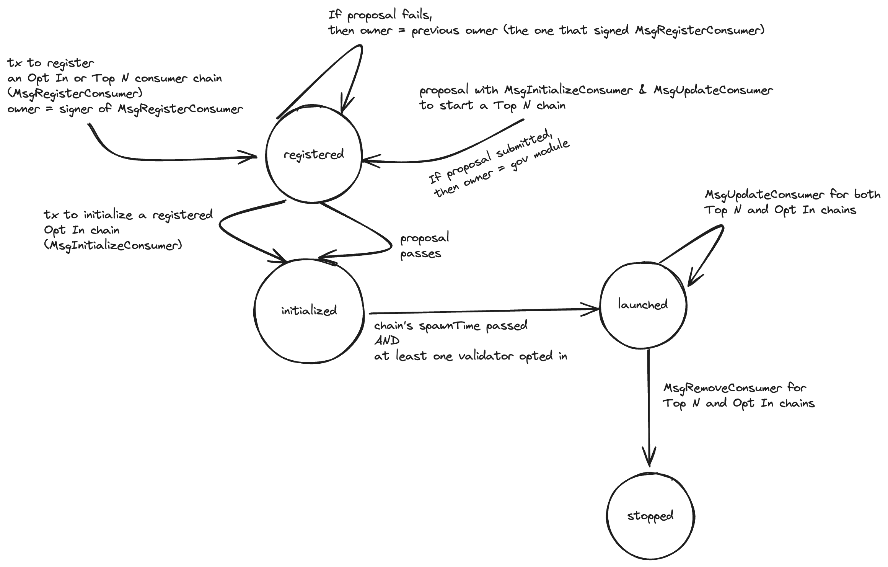

# ADR 18: Permissionless Interchain Security

## Changelog
* 27th of June, 2024: Initial draft

## Status

Proposed

## Context
Currently, a consumer chain can join _Interchain Security_ (ICS) only through a [governance proposal](../features/proposals.md).
A governance proposal was needed before the introduction of [Partial Set Security](../features/partial-set-security.md) (PSS)
because validators were required to validate a consumer chain. However, after the introduction of PSS, a consumer chain can
be either _Top N_ or _Opt In_. If a chain is an Opt In chain, then no validator is required to validate this chain unless they choose to.
Because of this, we can launch an Opt In consumer chain without going through a governance proposal.

This ADR presents _Permissionless_ ICS, a way in which an [_Opt In_](adr-015-partial-set-security.md) consumer chain can join
ICS without needing a governance proposal but by simply issuing a transaction.

## Decision

### The Phases of a Consumer Chain
In Permissionless ICS, launching an Opt In chain is **only** possible through a transaction and not through a `ConsumerAdditionProposal`.
Nevertheless, Permissionless ICS does not eliminate the `ConsumerAdditionProposal` governance proposal, as proposals are still necessary
for Top N chains. Because of this, this ADR outlines a solution that attempts to preserve as much of the governance proposal code
as possible.
Additionally, to make the distinction between governance-proposed versus transaction-launched chains clearer, in Permissionless ICS,
we can only add, modify, or remove Top N chains with governance proposals (i.e., `ConsumerAdditionProposal`, `ConsumerModificationProposal`,
and `ConsumerRemovalProposal`) and we can only add, modify, or remove Opt In chains with transactions.
In what follows, we describe changes that apply to both governance-proposed (i.e., Top N) and transaction-based (i.e., Opt In) consumer chains.

A consumer chain can reside in three phases: i) _prelaunched_, ii) _launched_, and iii) _stopped_ phase as seen
in the diagram below:



When a Top N chain is first proposed through a `ConsumerAdditionProposal` or an Opt In chain is added through a transaction,
the consumer chain resides in the _prelaunched_ phase. At this state, validators can choose to opt in on the consumer chain. Additionally,
an Opt In chain can choose to change parameters of the to-be-launched chains, such as `spawnTime`, etc. by issuing a specific transaction.
This is not the case for Top N chains, where a `ConsumerModificationProposal` can only be issued after a consumer
chain [has started](https://github.com/cosmos/interchain-security/blob/v4.3.0/x/ccv/provider/keeper/proposal.go#L150).

When the [`spawnTime`](https://github.com/cosmos/interchain-security/blob/v4.3.0/proto/interchain_security/ccv/provider/v1/provider.proto#L55)
passes and [at least one validator has opted in](https://github.com/cosmos/interchain-security/blob/v4.3.0/x/ccv/provider/keeper/proposal.go#L455)
the chain can launch and moves to the _launched_ phase. While in launched phase, a Top N consumer chain can choose to modify
its parameters through a `ConsumerModificationProposal` and an Opt In chain can change its parameters by issuing a transaction.

Lastly, a Top N chain can choose to exit ICS by issuing a `ConsumerRemovalProposal` and an Opt In chain can issue a transaction to stop the chain.
After some period of time (e.g., provider's unbonding period), all state related to the stopped consumer chain can be removed. We
keep track of the consumer chain's state for some period, so that we are able to punish validators for misbehaviour.

Note that everything described so far and everything that follows applies to standalone chains as well.

### From `chainID` to `consumerID`
A hindrance in moving to Permissionless ICS is [chain-id squatting](https://github.com/cosmos/interchain-security/pull/2001#discussion_r1663686774).
In a permissionless setting, anyone could issue a transaction to launch a consumer chain with a `chainID` that might already be used by some other consumer chain. This is a problem
because in the current design the majority of stored state for a consumer chain is indexed using the `chainID` as the key (e.g.,
see [key used to store client ids](https://github.com/cosmos/interchain-security/blob/v4.3.0/x/ccv/provider/types/keys.go#L233)).
To tackle this problem, in Permissionless ICS, we introduce the `consumerID` that defines a consumer chain and is simply
a combination of a `chainID` and an increasing counter (i.e., `len(chainID) | chainID | counter`), thus we can support multiple consumer chains with the same `chainID`.
Another way to understand this is with an analogy between consumer chains and IBC clients: Imagine having multiple IBC clients
that each point to different consumer chains, but all share the exact same `chainID`. It is then up to the user to select the
appropriate client (i.e., `clientID`) based on the actual chain they want to communicate with. Similarly, there can be multiple
consumer chains with the exact same `chainID`, and it is the responsibility of the validator to choose the one they wish
to interact with by providing the right `consumerID`.

Note, that with Permissionless ICS all interactions on a consumer chain have to use the `consumerID` instead of the `chainID`.
For example, if a validator opts in on a chain using `MsgOptIn`, the validator has to provide the `consumerID`. To also
provide the `consumerID` for Top N consumers chains, we store a mapping between `proposalID` to `consumerID`. This storing
takes place in the [`AfterProposalSubmission`](https://github.com/cosmos/cosmos-sdk/blob/v0.50.7/x/gov/keeper/proposal.go#L117) hook.
In some cases, we need the actual `chainID`. For example, when we [verify equivocation evidence](https://github.com/cosmos/interchain-security/blob/v4.3.0/x/ccv/provider/keeper/consumer_equivocation.go#L121).
To avoid having to change how [Hermes](https://github.com/informalsystems/hermes) constructs the `MsgSubmitConsumerMisbehaviour`
and `MsgSubmitConsumerDoubleVoting` messages, we just verify the evidence is valid and then go through all the chains with the `chainID`
to check on whether a validator can be slashed.


#### State
As a result of using `consumerID`, we have to migrate a substantial chunk of state to re-index it using `consumerID` as the key.
To move from using the `chainID` to the new `consumerID`, we need to revamp the consumer chains' stored state in ICS. Currently, in
ICS we have state that is indexed by a multitude of [keys](https://github.com/cosmos/interchain-security/blob/v4.3.0/x/ccv/provider/types/keys.go#L40).
In the table below, we see which ones are associated with a `chainID` and how often state under those keys gets updated.

| Key                                     |Description                                                                       |Associated with `chainID`?|How often are `chainID`-associated keys updated?                          |
|-----------------------------------------|----------------------------------------------------------------------------------|--------------------------|--------------------------------------------------------------------------|
| `PortByteKey`                           |Global `portID`                                                                   |NO                        |                                                                          |
| `MaturedUnbondingOpsByteKey`            |Deprecated together with `VSCMaturedPacket`s                                      |-                         |                                                                          |
| `ValidatorSetUpdateIdByteKey`           |Global for all consumer chains                                                    |NO                        |                                                                          |
| `SlashMeterByteKey`                     |Global for the provider                                                           |NO                        |                                                                          |
| `SlashMeterReplenishTimeCandidateByteKey`|Global for the provider                                                           |NO                        |                                                                          |
| `ChainToChannelBytePrefix`              |Stores the CCV `channelID` for a specific chain                                   |**YES**                   |Only once (during set up)                                                 |
| `ChannelToChainBytePrefix`              |Stores `chainID` for a specific channel                                           |**YES**                   |Only once (during set up)                                                 |
| `ChainToClientBytePrefix`                |Stores the `clientID` for a specific chain                                        |**YES**                   |Only once (during set up)                                                 |
| `InitTimeoutTimestampBytePrefix`         |Deprecated together with `VSCMaturedPacket`s                                      |-                         |                                                                          |
| `PendingCAPBytePrefix`                   |Stores pending consumer addition proposals                                        |**YES**                   |Only once (for successful proposal)                                       |
| `PendingCRPBytePrefix`                   |Stores pending consumer removal proposals                                         |**YES**                   |Only once (for successful proposal)                                       |
| `UnbondingOpBytePrefix`                  |Deprecated together with `VSCMaturedPacket`s                                      |-                         |                                                                          |
| `UnbondingOpIndexBytePrefix`             |Deprecated together with `VSCMaturedPacket`s                                      |-                         |                                                                          |
| `ValsetUpdateBlockHeightBytePrefix`      |Not needed anymore. Used to keep track of the infraction height.                  |NO                        |                                                                          |
| `ConsumerGenesisBytePrefix`              |Stores the consumer genesis for a specific chain                                  |**YES**                   |Only once (during set up)                                                 |
| `SlashAcksBytePrefix`                    |Stores slash acks for a specific consumer chain                                   |**YES**                   |Every time we receive a Slash packet                                      |
| `InitChainHeightBytePrefix`              |Not needed anymore. Used to keep track of the infraction height.                  |-                         |                                                                          |
| `PendingVSCsBytePrefix`                  |Stores `VSCPacket`s for a specific consumer chian                                 |**YES**                   |Every epoch                                                               |
| `VscSendTimestampBytePrefix`             |Deprecated together with `VSCMaturedPacket`s                                      |-                         |                                                                          |
| `ThrottledPacketDataSizeBytePrefix`      |Deprecated                                                                        |-                         |                                                                          |
| `ThrottledPacketDataBytePrefix`          |Deprecated                                                                        |-                         |                                                                          |
| `GlobalSlashEntryBytePrefix`             |Deprecated                                                                        |-                         |                                                                          |
| `ConsumerValidatorsBytePrefix`           |Stores consumer key per validator per consumer chain                              |**YES**                   |Every `MsgAssignConsumerKey` or `MsgOptIn`                                |
| `ValidatorsByConsumerAddrBytePrefix`     |Stores consumer to provider validator address                                     |**YES**                   |Every `MsgAssignConsumerKey` or `MsgOptIn`                                |
| `KeyAssignmentReplacementsBytePrefix`    |Deprecated                                                                        |-                         |                                                                          |
| `ConsumerAddrsToPruneBytePrefix`         |Deprecated together with `VSCMaturedPacket`s                                      |-                         |                                                                          |
| `SlashLogBytePrefix`                     |Not used                                                                          |-                         |                                                                          |
| `ConsumerRewardDenomsBytePrefix`         |Global for all consumer chains                                                    |NO                        |                                                                          |
| `VSCMaturedHandledThisBlockBytePrefix`   |Deprecated together with `VSCMaturedPacket`s                                      |-                         |                                                                          |
| `EquivocationEvidenceMinHeightBytePrefix` |Stores min height for a consumer chain                                            |**YES**                   |Only once (during set up)                                                 |
| `ProposedConsumerChainByteKey`           |Stores `proposalID` for a specific chain                                          |**YES**                   |                                                                          |
| `ConsumerValidatorBytePrefix`            |Stores consumer validators for a specific chain                                   |**YES**                   |Potentially at every [epoch](ADR on epochs)                               |
| `OptedInBytePrefix`                      |Stores opted-in validators for a specific chain                                   |**YES**                   |Potentially at every block                                                |
| `TopNBytePrefix`                         |Stores whether a consumer chain is Top N or not                                   |**YES**                   |Every parameter update                                                    |
| `ValidatorsPowerCapPrefix`               |Stores ther power cap of a chain                                                  |**YES**                   |Every parameter update                                                    |
| `ValidatorSetCapPrefix`                  |Stores the set cap of a chain                                                     |**YES**                   |Every parameter update                                                    |
| `AllowlistPrefix`                        |Stores the allowlist of a chain                                                   |**YES**                   |Every parameter update                                                    |
| `DenylistPrefix`                         |Stores the denylist of a chain                                                    |**YES**                   |Every parameter update                                                    |
| `ConsumerRewardsAllocationBytePrefix`    |Stores the ICS rewards per chain                                                  |**YES**                   |Every IBC transfer packet that sends rewards to the provider              |
| `ConsumerCommissionRatePrefix`           |Comission rate per chain per validator                                            |**YES**                   |Every `MsgSetConsumerCommissionRate` message                              |
| `MinimumPowerInTopNBytePrefix`           |Stores the minimum power needed to opt in for a chain                             |**YES**                   |Every epoch                                                               |
| `ConsumerAddrsToPruneV2BytePrefix`       |Stores consumer addresses to be pruned (as part of `VSCMaturedPacket`s deprecation)|**YES**                   |Every `MsgAssignConsumerKey` or `MsgOptIn` and later during actual pruning|

Everything stored under a key associated with a `chainID` needs to be migrated to new state under `consumerID`. 
Because we have to migrate in any case, we can also clean up a number of those keys by building a `ConsumerChainRecord`.
The `ConsumerChainRecord` contains state relevant to a consumer chain and is keyed by a `consumerID`. Although the `ConsumerChainRecord`
could contain **all** state related to a consumer chain (e.g., opted-in and consumer validators of a chain) we do not include
such fields in the `ConsumerChainRecord` because this would increase the cost of ICS-related transactions due to the [gas cost](https://github.com/cosmos/cosmos-sdk/blob/v0.50.7/store/gaskv/store.go#L40).
Furthermore, if we were to store all the opted-in or consumer validators, etc. it would be tricky to read or write those fields,
because we would need to extract the opted-in validators from the `ConsumerChainRecord` and then search through those
validators to find the one we are looking for, etc.

The `ConsumerChainRecord` contains the following:
```protobuf
message ConsumerChainRecord {
  // the owner of this consumer chain
  string owner_address;
  // client id to the consumer chain
  string client_id;
  // channel id
  string channel_id;
  // the chain-id of the consumer chain
  string chain_id;
  // consumer genesis
  interchain_security.ccv.v1.ConsumerGenesisState consumer_genesis = 5
  // First height of the consumer chain that the chain is secured for. Any infraction on the consumer chain is eligible
  // if the infraction is performed on a height >= equivocation_evidence_min_height. Unless manually set, for a completely new chain,
  // this would be 0, while for a standalone chain it would the height of when the chain converted to a consumer chain.
  uint64 equivocation_evidence_min_height;
  // maximum power (percentage-wise) a validator can have on the consumer chain
  uint32 validators_power_cap;
  // maximum number of validators that can validate a consumer chain
  uint32 validator_set_cap;
  // allowlist of provider consensus addresses of validators that are the ONLY ones that can validate the consumer chain
  repeated string allowlist;
  // denylist of provider consensus addresses of validators that are the CANNOT validate the consumer chain
  repeated string denylist;
}
```

We store the `ConsumerChainRecord`s using the `consumerID` as their key. The `owner_address` of a consumer chain corresponds
to the address that issued the `MsgLaunchConsumerChain` and the `owner_address` can be updated by issuing a `MsgUpdateConsumerChain` (see later).
Note that a `ConsumerChainRecord` is only created when a consumer chain moves from the prelaunched to the _launched_ phase.
The information needed to set up a `ConsumerChainRecord` are stored in the corresponding `ConsumerAdditionProposal` (see `MsgLaunchConsumerChain` below).

### New Messages
In what follows, we describe the new messages that Permissionless ICS introduces, and on how those can be used.
We then, describe how we can utilize those messages with our existing codebase.

#### Launch a Consumer Chain
To prepare a consumer chain for launch, we issue a `MsgLaunchConsumerChain` message that is as follows:

```protobuf
message MsgLaunchConsumerChain {
  // the title of this launch 
  string title;
  // the description of this consumer chain
  string description;
  // the chain-id of the new consumer chain
  string chain_id;
  // the proposed initial height of new consumer chain.
  ibc.core.client.v1.Height initial_height;

  ...  (all fields contained in ConsumerAdditionProposal except top_N)
  
  uint32 validators_power_cap;
  uint32 validator_set_cap;
  repeated string allowlist;
  repeated string denylist;
}
```

`MsgLaunchConsumerChain` contains everything that is contained in [`ConsumerAdditionProposal`](https://github.com/cosmos/interchain-security/blob/v4.3.0/proto/interchain_security/ccv/provider/v1/provider.proto#L29)
except the `top_N` field because we can only launch Opt In consumer chains with this message (Top N chains still need to go
through a governance proposal). Note, that an alternative format for this message could have been to include a single `ConsumerAdditionProposal` field in it,
but this confuses the semantics of `MsgLaunchConsumerChain` and that of a governance proposal. The response of this message
(i.e., `MsgLaunchConsumerChainResponse`) contains a single `string` that is the `consumerID`. The `consumerID`s corresponds
to `len(chainID) | chainID | counter` and this way we can have multiple different `consumerID`s that correspond to a chain
with the same `chainID`. By doing this, we tackle the main issue behind permissionless consumer chains, that is chain-id squatting.
Note that `consumerID` could just be a `uint64` but we choose to include `chainID` in it as well so that it is easier to see
what the consumer chain just by looking at the `consumerID`. This means that the `chainID` of a chain cannot be changed
after launching it (because the `chainID` is part of the `consumerID` key). To easily generate `consumerID`s we store
for each `len(chainID) | chainID` the latest `counter` value used for this `chainID`.

We set a to-be-decided fixed cost of a `MsgLaunchConsumerChain` to avoid getting spammed with bogus consumer chains.

To execute a `MsgLaunchConsumerChain`, we first create a `ConsumerAdditionProposal` under the hoods, with the `top_N` set to 0, and call
[`HandleConsumerAdditionProposal`](https://github.com/cosmos/interchain-security/blob/v4.3.0/x/ccv/provider/keeper/proposal.go#L30)
simulating a proposal that was already voted on and accepted. Note that we need to migrate `ConsumerAdditionProposal`s to use
the `consumerID` instead using [both](https://github.com/cosmos/interchain-security/blob/v4.3.0/x/ccv/provider/keeper/proposal.go#L382)
`chainID` and the `spawnTime` as keys. The [usual validity conditions](https://github.com/cosmos/interchain-security/blob/v4.3.0/x/ccv/provider/types/proposal.go#L114)
hold for the fields of `MsgLaunchConsumerChain`. Note however, that we intend to have a `spawnTime` upper limit as well.
For example, if you launch a consumer chain in Permissionless ICS, the `spawnTime` should not be more
than two months ahead in the future, to avoid having consumer chains lingering for too long before they get added.
This way, Opt In consumer chains that reach their `spawnTime` but have no validator opted in, get simply removed.
To do this, we keep track of when a `MsgLaunchConsumerChain` is first issued by introducing a `issuedTime` field in  
[`ConsumerAdditionProposal`](https://github.com/cosmos/interchain-security/blob/v4.3.0/proto/interchain_security/ccv/provider/v1/provider.proto#L29).
This way, even if `spawnTime` is updated through a `MsgUpdateConsumerChain` (see below), we can check on whether the
new proposed `spawnTime` is less than `issuedTime + (2 months)`. Note that Top N chains can have an arbitrary `spawnTime`
since their proposals can already be rejected by the community.

For all chains in the prelaunch phase, we keep a mapping between `consumerID` and the underlying `ConsumerAdditionProposal`.
This way, we can respond to queries that ask for all the consumer chain's parameters. For example, retrieving the
`spawn_time` of consumer chain with a given `consumerID`.

#### Modify a Consumer Chain

We introduce the `MsgUpdateConsumerChain` message so that the owner of a consumer chain can change its parameters
(e.g., `spawn_time`, PSS-related parameters, etc.) This message can only be executed by the owner of a consumer chain (see `owner_address` in the `ConsumerChainRecord`).

```protobuf
message MsgUpdateConsumerChain {
  // for which chain to change the state ...
  string consumer_id;

  // if the user intends to change the owner_address
  // the one issuing this message should be able to sign this message as well?
  string owner_address;
  
  // the chain-id of the new consumer chain
  string chain_id;
  // the proposed initial height of new consumer chain.
  ibc.core.client.v1.Height initial_height;

  ...  (all fields contained in ConsumerAdditionProposal except top_N)
  
  uint32 validators_power_cap;
  uint32 validator_set_cap;
  repeated string allowlist;
  repeated string denylist;
}
```

The `owner_address` is provided as well and hence a consumer chain can change the current owner account. Because of this,
the `MsgUpdateConsumerChain` needs to contain two signatures: one for the old and one for the new owner address.

The `initial_height`, `spawnTime`, etc. exist in `MsgUpdateConsumerChain` but can only be modified if the chain
is still in the prelaunched phase. This can be achieved by looking if there is an ongoing `ConsumerAdditionProposal` for this `consumerID`,
and then changing the fields of this proposal. The other fields such as `allowlist`, etc. can be changed at any point before or after a chain has started.

#### Stop a Consumer Chain
With the `MsgStopConsumerChain` we can stop any Opt In chain at any moment. Note that all relevant state for this consumer chain
remains on the provider's state before getting removed after one unbonding period (of the provider). This is to enable
potential slashing for any infraction that might have been caused until now. After the unbonding period, the `ConsumerChainRecord`
associated with this chain is removed. Note however that we never recycle used `consumerID`s. Naturally, this message
can only be issued by the owner of the consumer chain. Also, any remaining IBC rewards that were to be sent to the provider chain
are lost.

```protobuf
message MsgStopConsumerChain {
  // the consumerID as returned by `MsgLaunchConsumerChain`
  string consumer_id;
}
```

### Additional Modifications
We need to perform multiple migrations at this moment. One is for the `ConsumerAdditionProposal`, etc. and the other
to generate the `ConsumerChainRecord`s for the existing consumer chains, as well as deleting the old keys. Because
we only have two consumer chains at the moment, this is not going to be an expensive migration even if we have some
consumer chains that are being voted upon. Similarly, all the messages, queries, etc. would need to be changed to operate on a `consumerID`
instead of a `chainID`.

We also change `MsgOptIn` so a validator cannot opt in to two or more chains with the same `chainID`.

## Consequences

### Positive
- Easier to launch an Opt In consumer chain because no governance is required.

### Negative
- Extensive migration and overhaul of existing code base (as part of API-breaking changes) that could lead to bugs and more work for auditing this.


## References
[CHIPs Discussion phase: Permissionless ICS](https://forum.cosmos.network/t/chips-discussion-phase-permissionless-ics/13955)
[Chain-id squatting](https://forum.cosmos.network/t/pss-permissionless-vs-premissioned-lite-opt-in-consumer-chains/12984/17)