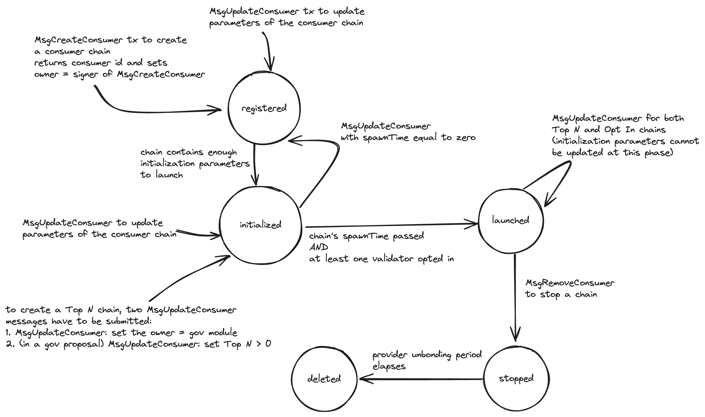

# ADR 019: Permissionless Interchain Security

## Changelog
* 27th of June, 2024: Initial draft
* 12th of September, 2024: Updated to take into account message changes, etc.

## Status

Accepted

## Context
Currently, a consumer chain can join _Interchain Security_ (ICS) only through a governance proposal.
A governance proposal was needed before the introduction of [Partial Set Security](../features/partial-set-security.md) (PSS)
because validators were required to validate a consumer chain. However, after the introduction of PSS, a consumer chain can
be either _Top N_ or _Opt In_. If a chain is an Opt In chain, then no validator is required to validate this chain unless they choose to.
Because of this, we can launch an Opt In consumer chain without going through a governance proposal.

This ADR presents _Permissionless_ ICS, a way in which an [_Opt In_](adr-015-partial-set-security.md) consumer chain can join
ICS without needing a governance proposal but by simply issuing a transaction.

## Decision
In Permissionless ICS, launching an Opt In chain can be done by issuing a transaction.
Naturally, Permissionless ICS does not eliminate governance proposals, as proposals are still necessary for Top N chains.
Nevertheless, a Top N chain can transform to an Opt In chain through a gov proposal and vice versa.

### The Phases of a Consumer Chain

We first present the notion of an _owner_ of a consumer chain before showing the specific phases of a consumer chain.

**Owner.** A consumer chain has an _owner_, which is simply an address. Only the owner can interact (i.e., launch, update, or stop)
with the chain. The owner of an Opt In chain is the one who signed the initial transaction to register a consumer chain (more on this later).
Naturally, an Opt In chain can change its owner at any point. The owner of a Top N chain is the account of the governance module.
Therefore, any changes on a Top N chain have to go through governance proposals.


A consumer chain can reside in five phases: i) _registered_, ii) _initialized_, iii) _launched_, iv) _stopped_, and
v) _deleted_ phase as seen in the diagram below:


**Registered phase.** In the _registered phase_, a consumer chain has an assigned a unique identifier, that of `consumerId` (more on this later)
that identifies a consumer chain that is used to interact with the chain (e.g., when a validator opts in on a chain, etc.).
A chain is created and resides at the registered phase through the use of a `MsgCreateConsumer` which response contains the `consumerId`.
`MsgCreateConsumer` is the first step in creating either a Top N or an Opt In consumer chain.

If all the optional initialization parameters are provided in `MsgCreateConsumer`, then an Opt In chain
can immediately move to the initialized phase (see below) and get scheduled to launch.
Note, however that a Top N chain needs at least two more `MsgUpdateConsumer` messages and one gov proposal to be able to launch.

In the registered phase, it is not yet known if the consumer chain would end up being a Top N or an Opt In chain and hence
the owner of the consumer chain at this phase is the one that signed the `MsgCreateConsumer`.

**Initialized phase.** The _initialized phase_ means that the chain has set all the needed initialization parameters
to launch but has not yet launched.
If a chain in the registered phase has not yet set the initialization parameters, it can issue a `MsgUpdateConsumer`
message to set those parameters. Additionally, `MsgUpdateConsumer` can be used to set up other parameters, such as the [power-shaping parameters](https://cosmos.github.io/interchain-security/features/power-shaping).
If a chain is in the initialized phase and `MsgUpdateConsumer` is issued with spawn time being zero, the chain moves back
to the registered phase.

In order to move a Top N chain to the initialized phase, we need to issue at least two `MsgUpdateConsumer` messages:
1. one to change the owner of the chain to be the account of the governance module; 
2. another as part of a governance proposal to set the Top N.

**Launched phase.** In the _launched phase_ the consumer chain is running and is consuming a subset of the validator set
of the provider. When the [`spawnTime`](https://github.com/cosmos/interchain-security/blob/v5.1.0/proto/interchain_security/ccv/provider/v1/provider.proto#L57)
passes and [at least one validator has opted in](https://github.com/cosmos/interchain-security/blob/v5.1.0/x/ccv/provider/keeper/proposal.go#L430)
the chain can launch and moves to the launched phase. Note that a Top N chain can launch if and only if the `spawnTime` has passed and
the proposal with the `MsgUpdateConsumer` has successfully passed. While in launched phase, a consumer chain can choose to modify
its parameters through `MsgUpdateConsumer`. Naturally, only the owner of the chain can issue `MsgUpdateConsumer`, thus
for Top N chains, the chain can be updated only through a governance proposal that contains a `MsgUpdateConsumer`.
Additionally, note that after the chain moves to the launched phase, the initialization parameters cannot be updated anymore,
but general metadata and power-shaping parameters of the chain can still be updated.

**Stopped phase.** In the _stopped phase_ the consumer chain stops receiving `VSCPacket`s.
A chain moves to the stopped phase, when the owner of the chain sends the `MsgRemoveConsumer` message.

**Deleted phase.** In the _deleted phase_ the majority of the state in relation to this consumer chain is deleted from the provider. 
A chain moves to the deleted phase after the chain has been stopped for an unbonding period.
We keep track of the state of the consumer chain for an unbonding period, so that we are able to punish validators for misbehaviors
that occurred before the consumer chain stopped.
Additionally, we do not fully delete the whole state of this chain, so that we can still query parameters a deleted chain used to have.
This is useful for front-ends, etc.

Note that everything described so far and everything that follows applies to consumer chains that transition from standalone chains as well.

### From `chainId` to `consumerId`
A hindrance in moving to Permissionless ICS is [chain-id squatting](https://forum.cosmos.network/t/pss-permissionless-vs-premissioned-lite-opt-in-consumer-chains/12984/17).
In a permissionless setting, anyone could issue a transaction to launch a consumer chain with a `chainId` that might already be used by some other consumer chain. This is a problem
because in the current design the majority of stored state for a consumer chain is indexed using the `chainId` as the key (e.g.,
see [key used to store client ids](https://github.com/cosmos/interchain-security/blob/v5.1.0/x/ccv/provider/types/keys.go#L245)).
To tackle this problem, in Permissionless ICS, we introduce the `consumerId` that defines a consumer chain and is simply
an increasing counter (i.e., `counter`), thus we can support multiple consumer chains with the same `chainId`.
Another way to understand this is with an analogy between consumer chains and IBC clients: Imagine having multiple IBC clients
that each point to different consumer chains, but all share the exact same `chainId`. It is then up to the user to select the
appropriate client (i.e., `clientId`) based on the actual chain they want to communicate with. Similarly, there can be multiple
consumer chains with the exact same `chainId`, and it is the responsibility of the validators to choose the one they wish
to interact with by providing the right `consumerId`.

Note that with Permissionless ICS, all interactions on a consumer chain have to use the `consumerId` instead of the `chainId`.
For example, if a validator opts in on a chain using `MsgOptIn`, the validator has to provide the `consumerId`.
Specifically, for the equivocation evidence, we update the `MsgSubmitConsumerMisbehaviour` and `MsgSubmitConsumerDoubleVoting`
messages to include the `consumerId`, and modify [Hermes](https://github.com/informalsystems/hermes)
to include `consumerId` in those constructed messages as well.
Hermes can find out the `consumerId` by querying the provider's `clientId` for some consumer chain (i.e., `query ccvconsumer provider-info`)
and then asking the provider chain for the `consumerId` that corresponds to this `clientId`. To do this, we store
the `clientId` to `consumerId` association on the provider and introduce a query to retrieve the `clientId` given the `consumerId`.

#### State
As a result of using `consumerId`, we have to migrate a substantial chunk of state to re-index it using `consumerId` as the key.
Currently, in ICS we have state that is indexed by a multitude of [keys](https://github.com/cosmos/interchain-security/blob/v5.1.0/x/ccv/provider/types/keys.go#L40).
In the table below, we see the ones that are associated with a `chainId` and how often state under those keys gets updated.
Additionally, for each key, the table shows whose action can lead to the setting or deletion of the state associated with that key.
An action can stem either from: i) a consumer chain (e.g., through a `MsgUpdateConsumer` message, an IBC packet sent over to the provider, etc.),
ii) a provider chain (e.g., at the end of a block some action is taken), or by iii) a validator (e.g., through a `MsgAssignConsumerKey` message)
or a combination of them.

| Key                                     | Description                                                                                                                  | Who can set this?                     | Who can delete this?                  | How often are `chainId`-associated keys updated?                                                         |
|-----------------------------------------|------------------------------------------------------------------------------------------------------------------------------|:--------------------------------:|:--------------------------------:|----------------------------------------------------------------------------------------------------------|
| `ChainToChannelBytePrefix`              | Stores the CCV `channelID` for a specific chain                                                                              | consumer chain                   | consumer chain                   | Only once (during set up)                                                                                |
| `ChannelToChainBytePrefix`              | Stores `chainId` for a specific channel                                                                                      | consumer chain                   | consumer chain                   | Only once (during set up)                                                                                |
| `ChainToClientBytePrefix`               | Stores the `clientID` for a specific chain                                                                                   | consumer chain                   | consumer chain                   | Only once (during set up)                                                                                |
| `PendingCAPBytePrefix`                  | Stores pending consumer addition proposals                                                                                   | consumer chain                   | provider chain                   | Only once (for successful proposal)                                                                      |
| `PendingCRPBytePrefix`                  | Stores pending consumer removal proposals                                                                                    | consumer chain                   | provider chain                   | Only once (for successful proposal)                                                                      |
| `ConsumerGenesisBytePrefix`             | Stores the consumer genesis for a specific chain                                                                             | consumer chain                   | consumer chain                   | Only once (during set up)                                                                                |
| `SlashAcksBytePrefix`                   | Stores slash acks for a specific consumer chain                                                                              | consumer chain                   | provider chain                   | Every time we receive a Slash packet                                                                     |
| `PendingVSCsBytePrefix`                 | Stores `VSCPacket`s for a specific consumer chain                                                                            | provider chain                   | provider chain                   | Every [epoch](https://github.com/cosmos/interchain-security/blob/v5.1.0/docs/docs/adrs/adr-014-epochs.md) |
| `ConsumerValidatorsBytePrefix`          | Stores consumer key per validator per consumer chain                                                                         | validator                        | consumer chain                   | Every `MsgAssignConsumerKey` or `MsgOptIn`                                                               |
| `ValidatorsByConsumerAddrBytePrefix`    | Stores consumer to provider validator address                                                                                | validator                        | consumer or provider chain       | Every `MsgAssignConsumerKey` or `MsgOptIn`                                                               |
| `EquivocationEvidenceMinHeightBytePrefix`| Stores min height for a consumer chain                                                                                       | consumer chain                   | consumer chain                   | Only once (during set up)                                                                                |
| `ProposedConsumerChainByteKey`          | Stores `proposalID`s for consumer chains with proposals in the voting period                                                 | not applicable for Opt In chains | not applicable for Opt In chains | Created when the proposal is submitted and deleted when the proposal's voting period ends                |
| `ConsumerValidatorBytePrefix`           | Stores consumer validators for a specific chain                                                                              | validator                        | validator or consumer chain      | Potentially at every epoch                                                                               |
| `OptedInBytePrefix`                     | Stores opted-in validators for a specific chain                                                                              | validator                        | validator or consumer chain      | Potentially at every block                                                                               |
| `TopNBytePrefix`                        | Stores whether a consumer chain is Top N or not                                                                              | not applicable for Opt In chains | not applicable for Opt In chains | Every parameter update                                                                                   |
| `ValidatorsPowerCapPrefix`              | Stores the power cap of a chain                                                                                              | consumer chain                   | consumer chain                   | Every parameter update                                                                                   |
| `ValidatorSetCapPrefix`                 | Stores the set cap of a chain                                                                                                | consumer chain                   | consumer chain                   | Every parameter update                                                                                   |
| `AllowlistPrefix`                       | Stores the allowlist of a chain                                                                                              | consumer chain                   | consumer chain                   | Every parameter update                                                                                   |
| `DenylistPrefix`                        | Stores the denylist of a chain                                                                                               | consumer chain                   | consumer chain                   | Every parameter update                                                                                   |
| `ConsumerRewardsAllocationBytePrefix`   | Stores the ICS rewards per chain                                                                                             | consumer or provider chain       | provider chain                   | Every IBC transfer packet that sends rewards to the provider                                             |
| `ConsumerCommissionRatePrefix`          | Commission rate per chain per validator                                                                                      | validator                        | consumer chain                   | Every `MsgSetConsumerCommissionRate` message                                                             |
| `MinimumPowerInTopNBytePrefix`          | Stores the minimum power needed to opt in for a chain                                                                        | not applicable for Opt In chains | not applicable for Opt In chains | Every epoch                                                                                              |
| `ConsumerAddrsToPruneV2BytePrefix`      | Stores consumer addresses to be pruned (as part of `VSCMaturedPacket`s deprecation)                                          | validator or provider chain      | provider chain                   | Every `MsgAssignConsumerKey` or `MsgOptIn` and later during actual pruning                               |

Everything stored under one of the above keys is associated with a `chainId` and has to be migrated to new state under a `consumerId`.

### New Messages
In this section, we describe the new messages (i.e., `MsgCreateConsumer`,  `MsgUpdateConsumer`, and `MsgRemoveConsumer`) that Permissionless ICS introduces.

#### Create a Consumer Chain
We first have to create a chain before launching it, irrespectively of whether it is Top N or Opt In.
This is done through the following message:
```protobuf
message MsgCreateConsumer {
  option (cosmos.msg.v1.signer) = "submitter";

  // Submitter address. If the message is successfully handled, the ownership of 
  // the consumer chain will given to this address.
  string submitter = 1 [(cosmos_proto.scalar) = "cosmos.AddressString"];

  // the chain id of the new consumer chain
  string chain_id = 2;

  ConsumerMetadata metadata = 3 [ (gogoproto.nullable) = false ];

  ConsumerInitializationParameters initialization_parameters = 4;

  PowerShapingParameters power_shaping_parameters = 5;
}
```

Note that `metadata` is a required field, while the `initialization_parameters` and `power_shaping_parameters` are optional and can later be set using `MsgUpdateConsumer`.

`metadata` is of the following type:
```protobuf
message ConsumerMetadata {
  // the name of the chain
  string name = 1;
  // the description of the chain
  string description = 2;
  // the metadata (e.g., GitHub repository URL) of the chain
  string metadata = 3;
}
```

`initialization_parameters` is of the following type and if all are provided the chain is scheduled to launch:
```protobuf
// ConsumerInitializationParameters are the parameters needed to launch a chain
message ConsumerInitializationParameters {
  // ---------- ---------- ----------
  // Following fields are used when the consumer chain launches and are not needed by the provider afterwards.
  // ---------- ---------- ----------

  // the proposed initial height of new consumer chain.
  // For a completely new chain, this will be {0,1}. However, it may be
  // different if this is a chain that is converting to a consumer chain.
  ibc.core.client.v1.Height initial_height = 1 [ (gogoproto.nullable) = false ];
  // The hash of the consumer chain genesis state without the consumer CCV
  // module genesis params. It is used for off-chain confirmation of
  // genesis.json validity by validators and other parties.
  bytes genesis_hash = 2;
  // The hash of the consumer chain binary that should be run by validators on
  // chain initialization. It is used for off-chain confirmation of binary
  // validity by validators and other parties.
  bytes binary_hash = 3;
  // spawn time is the time on the provider chain at which the consumer chain
  // genesis is finalized and all validators will be responsible for starting
  // their consumer chain validator node.
  google.protobuf.Timestamp spawn_time = 4 [ (gogoproto.nullable) = false, (gogoproto.stdtime) = true ];
  // Unbonding period for the consumer,
  // which should be smaller than that of the provider in general.
  google.protobuf.Duration unbonding_period = 5  [ (gogoproto.nullable) = false, (gogoproto.stdduration) = true ];


  // ---------- ---------- ----------
  // Following fields are used to construct the consumer genesis of the to-be-launched consumer chain
  // and are set up as params on the consumer chain. Those params can then be directly modified by the consumer chain.
  // ---------- ---------- ----------

  // Sent CCV related IBC packets will timeout after this duration
  google.protobuf.Duration ccv_timeout_period = 6  [ (gogoproto.nullable) = false, (gogoproto.stdduration) = true ];
  // Sent transfer related IBC packets will timeout after this duration
  google.protobuf.Duration transfer_timeout_period = 7 [ (gogoproto.nullable) = false, (gogoproto.stdduration) = true ];
  // The fraction of tokens allocated to the consumer redistribution address
  // during distribution events. The fraction is a string representing a
  // decimal number. For example "0.75" would represent 75%.
  string consumer_redistribution_fraction = 8;
  // BlocksPerDistributionTransmission is the number of blocks between
  // ibc-token-transfers from the consumer chain to the provider chain. On
  // sending transmission event, `consumer_redistribution_fraction` of the
  // accumulated tokens are sent to the consumer redistribution address.
  int64 blocks_per_distribution_transmission = 9;
  // The number of historical info entries to persist in store.
  // This param is a part of the cosmos sdk staking module. In the case of
  // a ccv enabled consumer chain, the ccv module acts as the staking module.
  int64 historical_entries = 10;
  // The ID of a token transfer channel used for the Reward Distribution
  // sub-protocol. If DistributionTransmissionChannel == "", a new transfer
  // channel is created on top of the same connection as the CCV channel.
  // Note that transfer_channel_id is the ID of the channel end on the consumer
  // chain. it is most relevant for chains performing a sovereign to consumer
  // changeover in order to maintain the existing ibc transfer channel
  string distribution_transmission_channel = 11;
}
```

`power_shaping_parameters` is of the following type:
```protobuf
// PowerShapingParameters contains parameters that shape the validator set that we send to the consumer chain
message PowerShapingParameters {
  // Corresponds to the percentage of validators that have to validate the chain under the Top N case.
  // For example, 53 corresponds to a Top 53% chain, meaning that the top 53% provider validators by voting power
  // have to validate the proposed consumer chain. top_N can either be 0 or any value in [50, 100].
  // A chain can join with top_N == 0 as an Opt In chain, or with top_N ∈ [50, 100] as a Top N chain.
  uint32 top_N = 1;
  // `validators_power_cap` corresponds to the maximum power (percentage-wise) a validator can have on the consumer chain.
  // For instance, if `validators_power_cap` is set to 32, no validator can have more than 32% of the total voting power of the
  // consumer chain. The power cap is intended as a safeguard against a validator having too much power on the consumer
  // chain and hence "taking over" the consumer chain.
  uint32 validators_power_cap = 2;
  // Corresponds to the maximum number of validators that can validate a consumer chain.
  // Only applicable to Opt In chains. Setting `validator_set_cap` on a Top N chain is a no-op.
  uint32 validator_set_cap = 3;
  // corresponds to a list of provider consensus addresses of validators that are the ONLY ones that can validate the consumer chain
  repeated string allowlist = 4;
  // corresponds to a list of provider consensus addresses of validators that CANNOT validate the consumer chain
  repeated string denylist = 5;
  // Corresponds to the minimal amount of (provider chain) stake required to validate on the consumer chain.
  uint64 min_stake = 6;
  // Corresponds to whether inactive validators are allowed to validate the consumer chain.
  bool allow_inactive_vals = 7;
}

```

This `MsgCreateConsumerResponse` response contains a single `string` that is the `consumerId` for this registered consumer chain

#### Update a Consumer Chain
We can issue a `MsgUpdateConsumer` at any point during the registered, initialized, or launched phase of a chain to
update parameters of the consumer chain.

The `MsgUpdateConsumer` message is as follows:

```protobuf
message MsgUpdateConsumer {
  option (cosmos.msg.v1.signer) = "owner";

  // the address of the owner of the consumer chain to be updated
  string owner = 1 [(cosmos_proto.scalar) = "cosmos.AddressString"];

  // the consumer id of the consumer chain to be updated
  string consumer_id = 2;

  // the new owner of the consumer when updated
  string new_owner_address = 3 [(cosmos_proto.scalar) = "cosmos.AddressString"];

  // the metadata of the consumer when updated
  ConsumerMetadata metadata = 4;

  // initialization parameters can only be updated before a chain has launched
  ConsumerInitializationParameters initialization_parameters = 5;

  // the power-shaping parameters of the consumer when updated
  PowerShapingParameters power_shaping_parameters = 6;
}
```

Note that we need to extensively check the fields of the provided `ConsumerInitializationParameters` to guarantee that no consumer chain launches with problematic parameters.

For all consumer chains, irrespectively of their phase (even in the deleted phase), we keep a mapping between `consumerId`
and the underlying `ConsumerMetadata`, `ConsumerInitializationParameters` and `PowerShapingParameters`.
This way, we can respond to queries that ask for all the consumer chain's parameters. For example, retrieving the `spawn_time` of consumer chain with a given `consumerId`.

`MsgUpdateConsumer` can be executed multiple times for the same Opt In consumer chain during its initialized phase
to potentially change its to-be-launched parameters (e.g., `spawnTime`).


#### Remove (Stop) a Consumer Chain
We introduce the `MsgRemoveConsumer` message so that we can stop any Opt In chain at any point in time.
Note that all relevant state for this consumer chain remains on the provider's state before getting removed after the time
of an unbonding period (of the provider) has passed. This is to enable potential slashing for any infraction that might have been incurred until now.
Note however that we never recycle previously-used `consumerId`s. Naturally, this message can only be issued by the owner of the consumer chain.

```protobuf
message MsgRemoveConsumer {
  option (cosmos.msg.v1.signer) = "owner";

  // the consumer id of the consumer chain to be stopped
  string consumer_id = 1;
  // the address of the owner of the consumer chain to be stopped
  string owner = 2 [(cosmos_proto.scalar) = "cosmos.AddressString"];
}
```

#### Examples of Launching a Consumer Chain
The figures below depict some examples of some of the phases a consumer chain resides before launching.


### Additional Modifications
We need to perform multiple migrations. All state needs to be reindexed based on a `consumerId` instead of the `chainId`.
Because we only have two consumer chains (i.e., Neutron and Stride) at the moment, this is not going to be an expensive migration even if we have some live
consumer chains that are being voted upon. Similarly, all the messages, queries, etc. would need to be changed to operate on a `consumerId` instead of a `chainId`.

It is **important** to migrate any live proposals, such as `ConsumerAdditionProposal`s and `MsgConsumerAddition`s, etc.
when we upgrade before we actually deprecate `ConsumerAdditionProposal`s, `MsgConsumerAddition`s, etc.

## Consequences

### Positive
- Easier to launch an Opt In consumer chain because no governance is required.

### Negative
- Extensive migration and overhaul of existing code base (as part of API-breaking changes) that could lead to bugs.


## References
[CHIPs Discussion phase: Permissionless ICS](https://forum.cosmos.network/t/chips-discussion-phase-permissionless-ics/13955)
[Chain-id squatting](https://forum.cosmos.network/t/pss-permissionless-vs-premissioned-lite-opt-in-consumer-chains/12984/17)