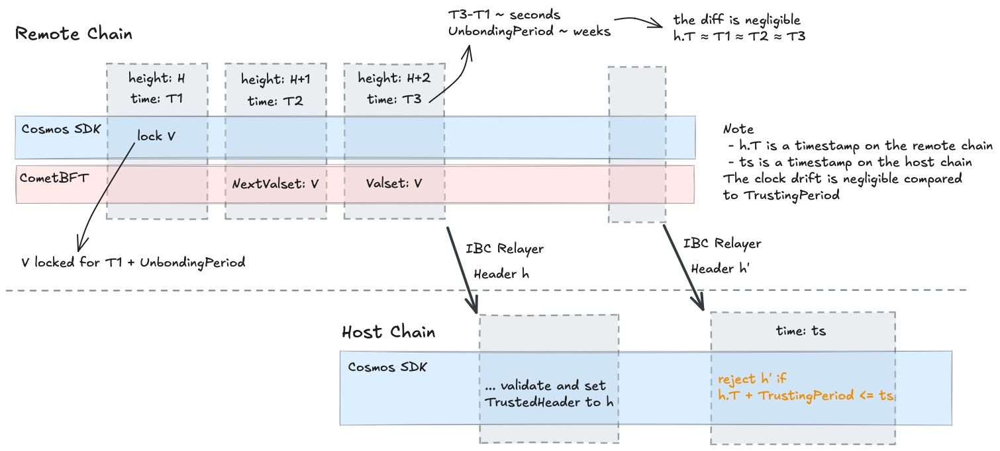
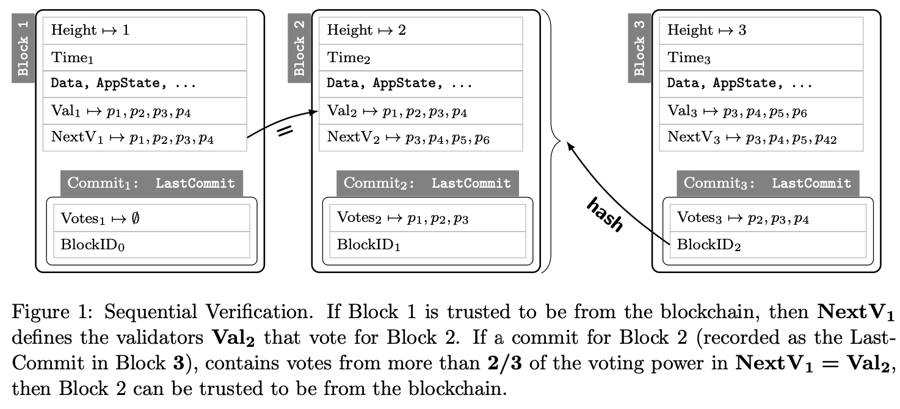
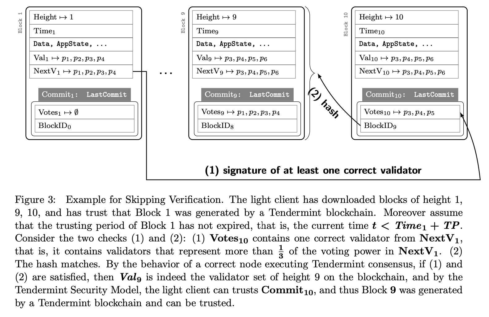
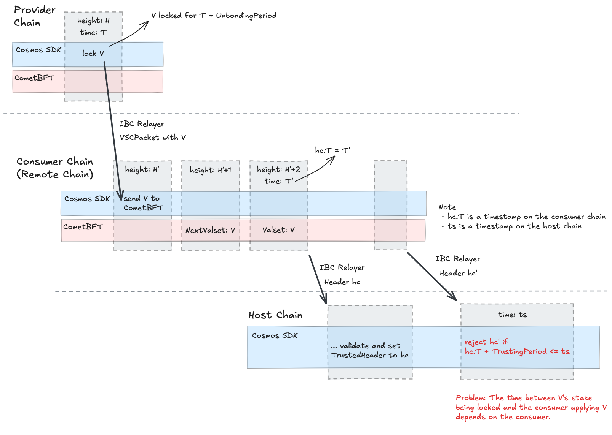

# ADR 021: Consumer Chain Clients

## Changelog
-  2024-08-14: Initial draft of ADR

## Status

Proposed

## Context

> In this document, _host_ chain and _remote_ chain are used in the following context: a light client of a remote chain is in the state of a host chain. 


### IBC Client Updates

IBC Client Updates require two pieces of information:

* A header (and a validator set) that originates from the consensus engine of the remote chain, i.e.,
    ```protobuf
    message Header {
      .tendermint.types.SignedHeader signed_header = 1
      .tendermint.types.ValidatorSet validator_set  = 2 
      ibc.core.client.v1.Height      trusted_height = 3
      .tendermint.types.ValidatorSet trusted_validators = 4
    }
    ```
    Note that the header also contain `Commit` information, i.e., the signatures that got the block committed. 
    
* The client state, that is initialized when the client is created and then maintained through client updates. 
  Two important fields of the client state are the `UnbondingPeriod` (i.e., duration of the staking unbonding period) and the `TrustingPeriod`, which must be smaller than the `UnbondingPeriod` (see the ***Tendermint Security Model*** in the [Tendermint Light Client paper](https://arxiv.org/pdf/2010.07031)). 
  The `TrustingPeriod` is _the duration, since the timestamp of the latest header the client got updated to, during which new headers are accepted for updating the client_. 
  The `UnbondingPeriod` originates from the application of the remote chain (i.e., a staking module param), which means the `TrustingPeriod` originates from the remote application as well. 
    ```golang
    if HeaderExpired(trustedHeader, trustingPeriod, now) {
    	return ErrOldHeaderExpired{trustedHeader.Time.Add(trustingPeriod), now}
    }
    	
    // HeaderExpired return true if the given header expired.
    func HeaderExpired(h *types.SignedHeader, trustingPeriod time.Duration, now time.Time) bool {
    	expirationTime := h.Time.Add(trustingPeriod)
    	return !expirationTime.After(now)
    }
    ```
  In other words, a new header received at timestamp `ts` is rejected if the following inequality holds for any trusted header `h`: 
  ```golang
  // h is a header of the remote chain
  // h.T is a timestamp on the remote chain
  // ts is a timestamp on the host chain
  h.T + TrustingPeriod <= ts
  ```
  The following figure describes the algorithm used by the host chain to reject headers outside of the `TrustingPeriod`.

  

  <details>
  <summary>Intuition behind the trusting period.</summary>
  The trusting period is there to make sure that the validators that signed for the trusted header have their collateral still locked so that in case they misbehave (i.e., light client attack), this collateral can be slashed.
  Note that the validators that signed the trusted header are responsible for the untrusted header (for both Sequential Verification and Skipping Verification). For more details, see Figure 1 and 3 in the [Tendermint Light Client paper](https://arxiv.org/pdf/2010.07031): 

  

  
  </details>

### Updating Consumers' IBC Clients

> In the context of ICS, the provider is one of the host chains and the consumers are the remote chains. Note that other third-party chains could be host chains as well. 

Consumer chains have their own consensus engine — validators that opt in need to run full nodes of the consumer chains, which consist of both consensus and application layer. 
This means that consumers produce headers and a relayer could use those headers to update the consumer’s IBC clients on other chains (the provider included).
However, consumer chains don’t have their own staking module. 

In ICS, the provider is the “staking module” of the consumer chains — validators lock collateral on the provider and as a result can produce blocks on consumer chains.
The consumer module on the consumer chains is just a representation of the provider’s staking module, i.e., it provides an _asynchronous_ view of the voting powers and indirectly of the locked collateral. 
The key word here is _asynchronous_, which means that (in theory) there is no bound on the lag between the provider’s view of stake and the consumer’s view of stake.
The reasons for this asynchrony are relaying delays and chain liveness (e.g., a consumer could be down for a long period of time without affecting the liveness of the staking module on the provider). 

The following figure describes the problem of using the same condition (based on the trusting period), i.e., 
```golang
// hc is a header of the consumer chain
// hc.T is a timestamp on the consumer chain
// ts is a timestamp on the host chain
hc.T + TrustingPeriod <= ts
```
to reject consumer headers outside of the `TrustingPeriod`. 
The issue is that the time period `hc.T` and `T` (the time at which the validator set `V` was locked on the provider) depends on the consumer chain, i.e., the consumer chain can choose an arbitrary time when to send `V` to CometBFT. 
As a result, even if `hc.T + TrustingPeriod > ts` (i.e., the header is received within the trusting period), if `hc.T - T` is large enough, then the stake of `V` could be already unlocked on the provider. 



Note that before the [removal of `VSCMaturedPackets`](./adr-018-remove-vscmatured.md), the consumers had a _partially synchronous_ view of the provider’s staking module.
Partially synchronous means that the lag between the provider’s view of stake and the consumer’s view of stake is bounded, because consumers that exceeded this lag were forcibly removed from the protocol.
The issue was that whatever attack is possible with an asynchronous view of the staking module, it is eventually possible with the partially synchronous view as well. 
For more details on this, please check out [ADR 018](./adr-018-remove-vscmatured.md).

This ADR proposes a solution to this synchrony issue -- it uses [IBC conditional clients](https://github.com/cosmos/ibc-go/issues/5112) to create a _synchronous_ view of the provider’s staking module.

## Decision

The idea is to extend the IBC light clients for ICS consumer chains to accept a new header received at timestamp `ts` only if, given any trusted header `h`, `h.ProviderTime + TrustingPeriod > ts`, where `h.ProviderTime` is the timestamp on the provider when `h.Valset` locked its stake. 

The implementation of this feature consists of three parts:

- Store `h.ProviderTime` (the timestamps when the consumer validator sets locked their stake) in the provider state.
  Note that this state can be pruned once the provider unbonding period elapses. 
- Extend the IBC light client logic on the host chains to reject headers received at timestamp `ts` if, given any trusted header `h`, 
  `h.ProviderTime + TrustingPeriod <= ts`.
  Note that this logic must existing both on the provider chain and on third party chains (including other consumer chains). 
- For cases when the host chain is different than the provider chain, enable relayers to work with [IBC conditional clients](https://github.com/cosmos/ibc-go/issues/5112).

The remainder of this section is addressing the first part and the second part for the case when the host chain is the provider chain. 
The second part for the case when the host chain is different than the provider chain and the third part are outside the scope of this ADR. 

### Store Provider Timestamps 

Currently, the provider module stores the validator set for every consumer chain. 
This is done by calling `SetConsumerValSet()` at the end of every epoch when queueing new `VSCPackets`.
This is the timestamp when the validator set locked its stake (i.e., `h.ProviderTime`).
For consumer chain clients, the provider needs to store these timestamps.

#### State 

`ConsumerValidatorTimestampKey` - Stores the latest timestamp when the validator set `V` of a consumer chain with `consumerID` locked its stake on the provider chain.
```golang
ConsumerValidatorTimestampBytePrefix | len(consumerID) | consumerID | valsetHash -> V.lockTs
```
where `valsetHash` is the hash of `V`. Note that this hash is the same as the one in the headers produced by the consumer chain validated by `V`.
Also, note that `V.lockTs` is the same as `h.ProviderTime` above.

The guarantee provided by the provider chain is that the stake of `V` will be locked until `V.lockTs + UnbondingPeriod`. 
This is sufficient information for consumer chain clients to decide whether new headers are outside the trusting period. 
This guarantee has two consequences. 
First, it is sufficient to store the latest timestamp: If a consumer chain has the same validator set `V` over multiple epochs, the only relevant information is the timestamp until when `V`'s stake will be locked on the provider and this can be derived from `V.lockTs`.
Second, this state can be pruned once the unbonding period elapses, i.e., once the provider block time exceeds `V.lockTs + UnbondingPeriod`. 

#### Query

To query the timestamps when consumer validator sets are locked on the provider, the following query is introduced:
```bash
interchain-security-pd query provider valsetLockTs $consumerID $valsetHash
```

### ICS Conditional Clients on the Provider 

If the host chain is different than the provider chain, then it needs to use [IBC conditional clients](https://github.com/cosmos/ibc-go/issues/5112) to connect to consumer chains. 
These conditional clients would need to query the provider chain before they can accept a new header from the consumer chains. 
In practice, a relayer would send all the information needed (i.e., the new header and the timestamp when the provider locked the stake corresponding to the validator set that signed the trusted header) and the conditional client will verify this information using the existing light client of the provider chain. 
Note that this is also the case for consumer chains acting as host chain and connecting to other consumer chains. 

This section focuses though on the case when the host chain is the provider chain. 
As the additional information needed is already on the host chain, there is no need for a conditional client. 
Instead, the provider module needs to act as a "middleware" for all IBC ClientUpdate messages coming from consumer chains and reject headers that were signed by validators outside of the trusting period. 

## Consequences

### Positive

* Improve the security of IBC communication with consumer chains.

### Negative

* The liveness of consumer chains IBC channels depends on the liveness of the provider. Note though that as long as the provider client on the third-party chain is not expiring, the IBC channels of the consumer chains will remain live.
* For IBC to work, third-party chains need to have conditional clients of the consumer chains. This includes also other consumer chains. 
* Additional state is needed on the provider chain to store previous consumer validator sets. This state can be pruned once the unbonding period elapses. 

### Neutral

* N/A

## References

* [ADR 018: Remove VSCMatured Packets](./adr-018-remove-vscmatured.md)
* [IBC conditional clients](https://github.com/cosmos/ibc-go/issues/5112)
* [Querier Approach for Conditional Clients](https://github.com/cosmos/ibc-go/issues/5310)
* [Original conditional client idea in the IBC specs](https://github.com/cosmos/ibc/pull/939)
