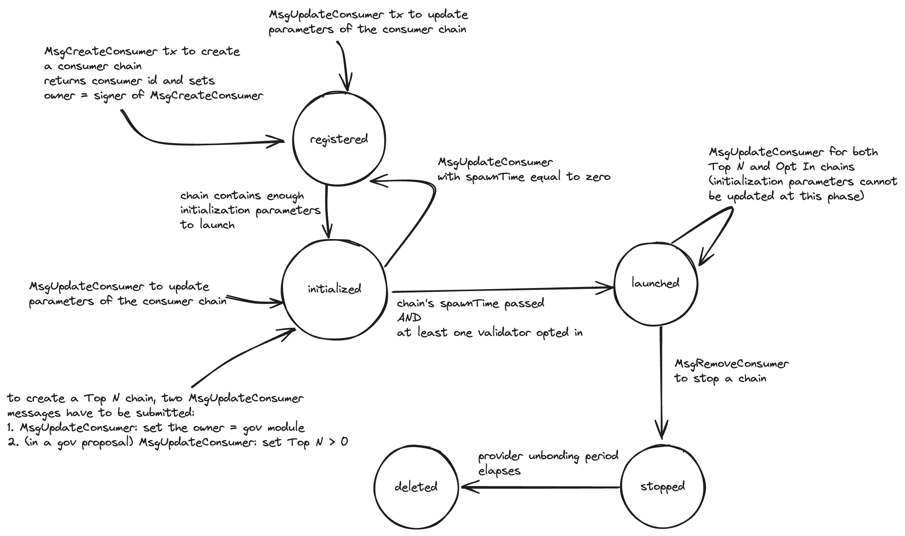

# x/ccv/provider

## Overview

The ICS provider module enables a proof-of-stake chain (known as the provider chain) 
to share (parts of) its security with other chains (known as consumer chains).
This basically mean that consumer chains can run as proof-of-stake chains using 
(parts of) the stake locked on the provider as collateral.  

The provider module has the following functionalities:

- The permissionless creation of consumer chains.
- The customization of the consumer chains validator sets. 
- The option for validators to opt in to validate the consumer chains they want.
- The distribution of rewards from consumer chains to the opted in validators.
- The slashing and jailing of validators commiting infractions on consumer chains based on cryptographic evidence.

## State 

For clarity, the description of the the provider module state is split into features.
For a more accurate description, check out the `x/ccv/provider/types/keys.go` file, which contains the definitions of all the keys. 

### Consumer Lifecycle

#### ConsumerId

`ConsumerId` is the consumer ID of the next consumer chain to be created.

Format: `byte(43) -> uint64`

#### ConsumerIdToChainId

`ConsumerIdToChainId` is the chain ID of a given consumer chain. 

Format: `byte(44) | len(consumerId) | []byte(consumerId) -> string`

#### ConsumerIdToOwnerAddress

`ConsumerIdToOwnerAddress` is the account address of the owner of a given consumer chain. 

Format: `byte(45) | len(consumerId) | []byte(consumerId) -> string`

#### ConsumerIdToMetadataKey

`ConsumerIdToMetadataKey` is the metadata of a given consumer chain. 

Format: `byte(46) | len(consumerId) | []byte(consumerId) -> ConsumerMetadata`

#### ConsumerIdToPhase

`ConsumerIdToPhase` is the phase of a given consumer chain. 

Format: `byte(49) | len(consumerId) | []byte(consumerId) -> ConsumerPhase`, where `ConsumerPhase` is defined as 

```proto
enum ConsumerPhase {
  option (gogoproto.goproto_enum_prefix) = false;

  // UNSPECIFIED defines an empty phase.
  CONSUMER_PHASE_UNSPECIFIED = 0;
  // REGISTERED defines the phase in which a consumer chain has been assigned a unique consumer id.
  // A chain in this phase cannot yet launch.
  CONSUMER_PHASE_REGISTERED = 1;
  // INITIALIZED defines the phase in which a consumer chain has set all the needed parameters to launch but
  // has not yet launched (e.g., because the `spawnTime` of the consumer chain has not yet been reached).
  CONSUMER_PHASE_INITIALIZED = 2;
  // LAUNCHED defines the phase in which a consumer chain is running and consuming a subset of the validator
  // set of the provider.
  CONSUMER_PHASE_LAUNCHED = 3;
  // STOPPED defines the phase in which a previously-launched chain has stopped.
  CONSUMER_PHASE_STOPPED = 4;
  // DELETED defines the phase in which the state of a stopped chain has been deleted.
  CONSUMER_PHASE_DELETED = 5;
}
```

#### ConsumerIdToRemovalTime

`ConsumerIdToRemovalTime` is the removal time of a given consumer chain in the stopped phase. 

Format: `byte(50) | len(consumerId) | []byte(consumerId) -> time.Time`

#### SpawnTimeToConsumerIds

`SpawnTimeToConsumerIds` are the IDs of initialized consumer chains ready to be launched at a timestamp `ts`. 

Format: `byte(51) | ts -> ConsumerIds`, where `ConsumerIds` is defined as 

```proto
message ConsumerIds { 
  repeated string ids = 1; 
}
```

#### RemovalTimeToConsumerIds

`RemovalTimeToConsumerIds` are the IDs of stopped consumer chains ready to be removed at a timestamp `ts`. 

Format: `byte(52) | ts -> ConsumerIds`, where `ConsumerIds` is defined as 

### Consumer Launch

#### ConsumerIdToInitializationParameters

`ConsumerIdToInitializationParameters` are the initialization parameters of a given consumer chain. 

Format: `byte(47) | len(consumerId) | []byte(consumerId) -> ConsumerInitializationParameters`

#### ConsumerIdToChannelId

`ConsumerIdToChannelId` is the ID of the CCV channel associated with a consumer chain. 

Format: `byte(5) | []byte(consumerId) -> string`

#### ChannelIdToConsumerId

`ChannelIdToConsumerId` is the consumer ID associated with a CCV channel. 

Format: `byte(6) | []byte(channelId) -> string`

#### ConsumerIdToClientId

`ConsumerIdToClientId` is the ID of the client associated with a consumer chain. 
This is the underlying client of the corresponding CCV channel.

Format: `byte(7) | []byte(consumerId) -> string`

#### ClientIdToConsumerId

`ClientIdToConsumerId` is the consumer ID associated with an IBC client (i.e., the underlying client of the corresponding CCV channel).

Format: `byte(53) | len(clientId) | []byte(clientId) -> string`

#### ConsumerGenesis

`ConsumerGenesis` is the genesis state of the consumer module associated with a consumer chain.

Format: `byte(14) | []byte(consumerId) -> ConsumerGenesisState`


### Key Assingment

#### ConsumerValidators

> TODO: `ConsumerValidators` and `ConsumerValidator` are too similar. 

`ConsumerValidators` is the public key assigned by a given validator with `addr` as its provider consensus address (i.e., `sdk.ConsAddress`) on a given consumer chain.

Format: `byte(22) | len(consumerId) | []byte(consumerId) | addr -> crypto.PublicKey`, where `crypto` is `"github.com/cometbft/cometbft/proto/tendermint/crypto"`.

#### ValidatorsByConsumerAddr

`ValidatorsByConsumerAddr` is the consensus address on the provider chain of a validator with `addr` as its consensus address on a given consumer chain.

Format: `byte(23) | len(consumerId) | []byte(consumerId) | addr -> sdk.ConsAddress`.

#### ConsumerAddrsToPruneV2

`ConsumerAddrsToPruneV2` stores the list of consumer consensus addresses that can be prunned at a timestamp `ts` as they are no longer needed.

Format: `byte(40) | len(consumerId) | []byte(consumerId) | ts -> AddressList`, where `AddressList` is defined as 

```proto
message AddressList { 
  repeated bytes addresses = 1; 
}
```

### Power Shaping

#### ConsumerIdToPowerShapingParameters

`ConsumerIdToPowerShapingParameters` are the power-shaping parameters of a given consumer chain. 

Format: `byte(48) | len(consumerId) | []byte(consumerId) -> PowerShapingParameters`

#### ConsumerValidator

`ConsumerValidator` is the `ConsensusValidator` record of a provider validator on a given consumer chain, i.e., 

```proto
message ConsensusValidator {
  // validator's consensus address on the provider chain
  bytes provider_cons_addr = 1;
  // voting power the validator has during this epoch
  int64 power = 2;
  // public key the validator uses on the consumer chain during this epoch
  tendermint.crypto.PublicKey public_key = 3;
  // height the validator had when it FIRST became a consumer validator
  int64 join_height = 4;
}
```

Format: `byte(31) | len(consumerId) | []byte(consumerId) | addr -> ConsensusValidator`, with `addr` the validator's consensus address on the provider chain.

#### OptedIn

`OptedIn` is the list of provider validators that opted in to validate on a given consumer chain. 
Note that opting in doesn't guarantee a spot in the consumer validator set.

Format: `byte(32) | len(consumerId) | []byte(consumerId) | addr -> []byte{}`, with `addr` the validator's consensus address on the provider chain.

#### Allowlist

`Allowlist` is the list of provider validators that are eligible to validate a given consumer chain.

Format: `byte(36) | len(consumerId) | []byte(consumerId) | addr -> []byte{}`, with `addr` the validator's consensus address on the provider chain.

#### Denylist

`Denylist` is the list of provider validators that are not eligible to validate a given consumer chain. 
Note that validator can opt in regardless of whether they are eligible or not.

Format: `byte(37) | len(consumerId) | []byte(consumerId) | addr -> []byte{}`, with `addr` the validator's consensus address on the provider chain.

#### MinimumPowerInTopN

`MinimumPowerInTopN` is the minimum voting power a provider validator must have to be required to validate a given TopN consumer chain. 

Format: `byte(40) | len(consumerId) | []byte(consumerId) -> uint64`

#### Prioritylist

`Prioritylist` is the list of provider validators that have priority to validate a given consumer chain.

Format: `byte(56) | len(consumerId) | []byte(consumerId) | addr -> []byte{}`, with `addr` the validator's consensus address on the provider chain.

### Validator Set Updates

#### ValidatorSetUpdateId

`ValidatorSetUpdateId` is an incrementing sequence number that is used as a unique identifier for validator set updates sent to the consumer chains. 
The validator set update ID is incremented every epoch. 

Format: `byte(2) -> uint64`

#### PendingVSCs

`PendingVSCs` is the list of `VSCPackets` that are queued to be sent to a given consumer chain. 

Format: `byte(17) | []byte(consumerId) -> ValidatorSetChangePackets`, where `ValidatorSetChangePackets` is defined as 

```proto
message ValidatorSetChangePackets {
  repeated ValidatorSetChangePacketData list = 1
      [ (gogoproto.nullable) = false ];
}
```

#### LastProviderConsensusVals

`LastProviderConsensusVals` is the last validator set sent to the consensus engine of the provider chain.

Format: `byte(42) | addr -> ConsensusValidator`, with `addr` the validator's consensus address on the provider chain and `ConsensusValidator` defined as

```proto
message ConsensusValidator {
  // validator's consensus address on the provider chain
  bytes provider_cons_addr = 1;
  // voting power the validator has during this epoch
  int64 power = 2;
  // public key the validator uses on the consumer chain during this epoch
  tendermint.crypto.PublicKey public_key = 3;
  // height the validator had when it FIRST became a consumer validator
  int64 join_height = 4;
}
```

### Reward Distribution

#### ConsumerRewardDenoms

`ConsumerRewardDenoms` is storing the list of whitelisted denoms that are accepted as ICS rewards. 
Note that denoms that are not whitelisted can still be transfer to the `consumer_rewards_pool` account on the provider module, but they will not be distributed to validators and their delegators. 

Format: `byte(27) | []byte(denom) -> []byte{}`

#### ConsumerRewardsAllocation

`ConsumerRewardsAllocation` is the allocation of ICS rewards for a given consumer chain. 
This is used to distribute ICS rewards only to the validators that are part of the consumer chain validator set. 

Format: `byte(38) | []byte(consumerId) -> ConsumerRewardsAllocation`, where `ConsumerRewardsAllocation` is defined as 

```proto
message ConsumerRewardsAllocation {
  repeated cosmos.base.v1beta1.DecCoin rewards = 1 [
    (gogoproto.nullable)     = false,
    (amino.dont_omitempty)   = true,
    (gogoproto.castrepeated) = "github.com/cosmos/cosmos-sdk/types.DecCoins"
  ];
}
```

####  ConsumerCommissionRate

`ConsumerCommissionRate` is the commission rate set by a provider validator for a given consumer chain. 

Format: `byte(39) | len(consumerId) | []byte(consumerId) | addr -> math.LegacyDec`, with `addr` the validator's consensus address on the provider chain and `math` is `"cosmossdk.io/math"`.

### Consumer Infractions

#### SlashMeter

`SlashMeter` is the meter used for the throttling mechanism as the allowance of voting power that can be jailed over time. 
It is decremented by the amount of voting power jailed whenever a validator is jailed for downtime, and periodically replenished as decided by on-chain params. 
See [ADR 002](../../adrs/adr-002-throttle.md) for more details.

Format: `byte(3) -> math.Int` 

#### SlashMeterReplenishTimeCandidate

`SlashMeterReplenishTimeCandidate` is the next UTC time the `SlashMeter` could potentially be replenished. 
Note that this value is the next time the `SlashMeter` will be replenished if and only if the `SlashMeter` is not full. 
Otherwise this value will be updated in every future block until the slash meter becomes not full.

Format: `byte(4) -> time.Time`

#### ValsetUpdateBlockHeight

`ValsetUpdateBlockHeight` is the block height associated with a validator set update ID `vscId`. 
This is used for mapping infraction heights on consumer chains to heights on the provider chain via the validator set update IDs (together with [InitChainHeight](#initchainheight)). 

Format: `byte(13) | vscId -> uint64`

#### InitChainHeight

`InitChainHeight` is the block height on the provider when the CCV channel of a given consumer chain was established (i.e., the channel opening handshake was completed).
This is used for mapping infraction heights on consumer chains to heights on the provider chain (together with [ValsetUpdateBlockHeight](#valsetupdateblockheight)). 

Format: `byte(16) | []byte(consumerId) -> uint64`

#### SlashAcks

`SlashAcks` are addresses of validators for which `SlashPackets` for downtime infractions received from a given consumer chain were handled.
These addresses are sent together with the validator updates to the consumer chain as confirmation that the downtime infractions were dealt with. 

Format: `byte(15) | []byte(consumerId) -> SlashAcks`, where `SlashAcks` is defined as

```proto
message SlashAcks { 
  repeated string addresses = 1; 
}
```

#### EquivocationEvidenceMinHeight

`EquivocationEvidenceMinHeight` is the minimum height of a valid evidence of equivocation on a given consumer chain. 

Format: `byte(29) | []byte(consumerId) -> uint64`

## State Transitions

### Consumer chain phases

The following diagram describes the phases of a consumer chain from the perspective of the provider module:



## IBC Callbacks

The consumer module is an IBC application that implements the [IBC module callback](https://ibc.cosmos.network/v8/ibc/apps/apps/#create-a-custom-ibc-application-module).

### OnChanOpenInit

`OnChanOpenInit` returns an error. `MsgChannelOpenInit` should be sent to the consumer. 

### OnChanOpenTry

`OnChanOpenTry` validates the parameters of the _CCV channel_ -- an ordered IBC channel connected on the `provider` port 
and with the counterparty port set to `consumer` -- and asserts that the counterparty version matches the expected version 
(only verions `1` is supported).

If the validation passes, the provider module verifies that the underlying client is the expected client of the consumer chain 
(i.e., the client created during the consumer chain launch) and that no other CCV channel exists for this consumer chain.

Finally, it sets the [ProviderFeePoolAddr](./03-consumer.md#providerfeepooladdrstr) as part of the metadata.

### OnChanOpenAck

`OnChanOpenAck` returns an error. `MsgChannelOpenAck` should be sent to the consumer. 

### OnChanOpenConfirm

`OnChanOpenConfirm` first verifies that no other CCV channel exists for this consumer chain. Note that this is a sanity check.
Then, it sets the channel mapping in the state.

### OnChanCloseInit

`OnChanCloseInit` returns an error. `MsgChannelCloseInit` should be sent to the consumer. 

### OnChanCloseConfirm

`OnChanCloseConfirm` is a no-op.

### OnRecvPacket

`OnRecvPacket` unmarshals the IBC packet data into a `SlashPacketData` struct (see below) and executes the handling logic.

- Validate the fields in `SlashPacketData`:
  - `validator` has a valid address and a non-zero power;
  - `infraction` is either downtime or double-singing;
  - the provider has in state a mapping from `valset_update_id` to a block height.
- If it is a double-signing infraction, then just log it and return.
- Verify that the consumer chain is launched and the validator is opted in. 
- Update the meter used for jail throttling. 
- Jail the validator on the provider chain. 
- Store in state the ACK that the downtime infraction was handled. 
  This will be sent to the consumer with the next validator updates to enable it 
  to send other downtime infractions for this validator.

```proto
message SlashPacketData {
  tendermint.abci.Validator validator = 1 [
    (gogoproto.nullable) = false,
    (gogoproto.moretags) = "yaml:\"validator\""
  ];
  // map to the infraction block height on the provider
  uint64 valset_update_id = 2;
  // tell if the slashing is for a downtime or a double-signing infraction
  cosmos.staking.v1beta1.Infraction infraction = 3;
}
```

Note that IBC packets with `VSCMaturedPacketData` data are dropped. For more details, check out [ADR 018](../../adrs/adr-018-remove-vscmatured.md).

### OnAcknowledgementPacket

`OnAcknowledgementPacket` stops and eventually removes the consumer chain associated with the channel on which the `MsgAcknowledgement` message was received.

### OnTimeoutPacket

`OnTimeoutPacket` stops and eventually removes the consumer chain associated with the channel on which the `MsgTimeout` message was received.

## Messages

### MsgUpdateParams

`MsgUpdateParams` updates the [provider module parameters](#parameters). 
The params are updated through a governance proposal where the signer is the gov module account address.

```proto
message MsgUpdateParams {
  option (cosmos.msg.v1.signer) = "authority";

  // authority is the address of the governance account.
  string authority = 1 [(cosmos_proto.scalar) = "cosmos.AddressString"];

  // params defines the x/provider parameters to update.
  Params params = 2 [(gogoproto.nullable) = false];
}
```

### MsgChangeRewardDenoms

`MsgChangeRewardDenoms` updates the list of whitelisted denoms accepted by the provider as ICS rewards. 
The list of accepted denoms is updated through a governance proposal where the signer is the gov module account address.

Note that this message replaces `ChangeRewardDenomsProposal`, which is deprecated. 

```proto
message MsgChangeRewardDenoms {
  option (cosmos.msg.v1.signer) = "authority";

  // the list of consumer reward denoms to add
  repeated string denoms_to_add = 1;
  // the list of consumer reward denoms to remove
  repeated string denoms_to_remove = 2;
  // signer address
  string authority = 3 [(cosmos_proto.scalar) = "cosmos.AddressString"];
}
```

### MsgCreateConsumer

`MsgCreateConsumer` enables a user to create a consumer chain. 

Both the `chain_id` and `metadata` fields are mandatory. 
The `initialization_parameters`, `power_shaping_parameters`, and `allowlisted_reward_denoms` fields are optional. 
The parameters not provided are set to their zero value.

The owner of the created consumer chain is the submitter of the message.
This message cannot be submitted as part of a governance proposal, i.e., the submitter cannot be the gov module account address.
As a result, if the `power_shaping_parameters` are provided, then `power_shaping_parameters.top_N` must be set to zero (i.e., opt-in consumer chain).

To create a top-n consumer chain, the following steps are require:

- Create a opt-in consumer chain (via `MsgCreateConsumer`).
- Change the ownership of the consuemr chain to the gov module account address (via `MsgUpdateConsumer`).
- Change `power_shaping_parameters.top_N` to a value in `[50, 100]` trough a governance proposal with a `MsgUpdateConsumer` message.

If the `initialization_parameters` field is set and `initialization_parameters.spawn_time > 0`, then the consumer chain will be scheduled to launch at `spawn_time`.

```proto
message MsgCreateConsumer {
  option (cosmos.msg.v1.signer) = "submitter";

  // Submitter address. If the message is successfully handled, the ownership of 
  // the consumer chain will given to this address.
  string submitter = 1 [(cosmos_proto.scalar) = "cosmos.AddressString"];

  // the chain id of the new consumer chain
  string chain_id = 2;

  ConsumerMetadata metadata = 3 [ (gogoproto.nullable) = false ];

  ConsumerInitializationParameters initialization_parameters = 4;

  PowerShapingParameters power_shaping_parameters = 5;

  // allowlisted reward denoms by the consumer chain
  AllowlistedRewardDenoms allowlisted_reward_denoms = 6;
}
```

### MsgUpdateConsumer

`MsgUpdateConsumer` enables the owner of a consumer chain to update its parameters (e.g., set a new owner). 

Note that only the `owner` (i.e., signer) and `consumer_id` fields are mandatory. 
The others field are optional. Not providing one of them will leave the existing values unchanged. 
Providing one of `metadata`, `initialization_parameters`, `power_shaping_parameters`, or `allowlisted_reward_denoms`
will update all the containing fields. 
If one of the containing fields is missing, it will be set to its zero value.
For example, updating the `initialization_parameters` without specifying the `spawn_time`, will set the `spawn_time` to zero.

If the `initialization_parameters` field is set and `initialization_parameters.spawn_time > 0`, then the consumer chain will be scheduled to launch at `spawn_time`.
Updating the `spawn_time` from a positive value to zero will remove the consumer chain from the list of scheduled to launch chains. 
If the consumer chain is already launched, updating the `initialization_parameters` is no longer possible.

If the `power_shaping_parameters` field is set and `power_shaping_parameters.top_N` is positive, then the owner needs to be the gov module account address.

If the `new_owner_address` field is set to a value different than the gov module account address, then `top_N` needs to be zero.

```proto
message MsgUpdateConsumer {
  option (cosmos.msg.v1.signer) = "owner";

  // the address of the owner of the consumer chain to be updated
  string owner = 1 [(cosmos_proto.scalar) = "cosmos.AddressString"];

  // the consumer id of the consumer chain to be updated
  string consumer_id = 2;

  // the new owner of the consumer when updated
  string new_owner_address = 3 [(cosmos_proto.scalar) = "cosmos.AddressString"];

  // the metadata of the consumer when updated
  ConsumerMetadata metadata = 4;

  // initialization parameters can only be updated before a chain has launched
  ConsumerInitializationParameters initialization_parameters = 5;

  // the power-shaping parameters of the consumer when updated
  PowerShapingParameters power_shaping_parameters = 6;

  // allowlisted reward denoms by the consumer chain
  AllowlistedRewardDenoms allowlisted_reward_denoms = 7;
}
```

### MsgRemoveConsumer

`MsgRemoveConsumer` enables the owner of a _launched_ consumer chain to remove it from the provider chain. 
The message will first stop the consumer chain, which means the provider will stop sending it validator updates over IBC.
Then, once the unbonding period elapses, the consumer chain is removed from the provider state. 

```proto
message MsgRemoveConsumer {
  option (cosmos.msg.v1.signer) = "owner";

  // the consumer id of the consumer chain to be stopped
  string consumer_id = 1;
  // the address of the owner of the consumer chain to be stopped
  string owner = 2 [(cosmos_proto.scalar) = "cosmos.AddressString"];
}
```

### MsgOptIn

`MsgOptIn` enables a validator to opt in to validate a consumer chain. 
Note that _validators can opt in to validate consumer chains that are not launched yet_.
The signer of the message needs to match the validator address on the provider.

Note that opting in doesn't guarantee a spot in the consumer chain's validator set. 
Use the `has-to-validate` query to check if the validator is part of the consumer chain's validator set.
For more details, check out the [validator guide to Partial Set Security](../../validators/partial-set-security-for-validators.md).

Note that since the introduction of the 
[Permissionless ICS feature](https://cosmos.github.io/interchain-security/adrs/adr-019-permissionless-ics) 
the `chain_id` field is deprecated. 
Users should use `consumer_id` instead. 
You can use the `list-consumer-chains` query to get the list of all consumer chains and their consumer IDs.

The `consumer_key` field is optional. 
It enables the validator to set the consensus public key to use on the consumer chain.
The validator can assing (or re-assing) this key also later via [MsgAssignConsumerKey](#msgassignconsumerkey).

:::warning
Validators are strongly recommended to assign a separate key for each consumer chain
and **not** reuse the provider key across consumer chains for security reasons.

This is especially important since the introduction of the 
[Permissionless ICS feature](https://cosmos.github.io/interchain-security/adrs/adr-019-permissionless-ics) 
that allows multiple consumer chains to have the same chain ID. 
A validator using the same consensus key to validate on two chains with the same chain ID might get slashed for double signing. 
:::

```proto
message MsgOptIn {
  option (gogoproto.equal) = false;
  option (gogoproto.goproto_getters) = false;
  option (cosmos.msg.v1.signer) = "signer";

  // [DEPRECATED] use `consumer_id` instead
  string chain_id = 1 [deprecated = true];
  // the validator address on the provider
  string provider_addr = 2 [ (gogoproto.moretags) = "yaml:\"address\"" ];
  // (optional) The consensus public key to use on the consumer in json string format corresponding to proto-any,
  // for example `{"@type":"/cosmos.crypto.ed25519.PubKey","key":"Ui5Gf1+mtWUdH8u3xlmzdKID+F3PK0sfXZ73GZ6q6is="}`.
  // This field is optional and can remain empty (i.e., `consumer_key = ""`). A validator can always change the
  // consumer public key at a later stage by issuing a `MsgAssignConsumerKey` message.
  string consumer_key = 3;
  // submitter address
  string signer = 4 [(cosmos_proto.scalar) = "cosmos.AddressString"];
  // the consumer id of the consumer chain to opt in to
  string consumer_id = 5;
}
```

### MsgAssignConsumerKey

`MsgAssignConsumerKey` enables a validator to assign the consensus public key to use on a consumer chain.
Without assigning a specific key, the validator will need to use the same key as on the provider chain. 

:::warning
Validators are strongly recommended to assign a separate key for each consumer chain
and **not** reuse the provider key across consumer chains for security reasons.

This is especially important since the introduction of the 
[Permissionless ICS feature](https://cosmos.github.io/interchain-security/adrs/adr-019-permissionless-ics) 
that allows multiple consumer chains to have the same chain ID. 
A validator using the same consensus key to validate on two chains with the same chain ID might get slashed for double signing. 
:::

The signer of the message needs to match the validator address on the provider. 

Note that since the introduction of the 
[Permissionless ICS feature](https://cosmos.github.io/interchain-security/adrs/adr-019-permissionless-ics) 
the `chain_id` field is deprecated. 
Users should use `consumer_id` instead. 
You can use the `list-consumer-chains` query to get the list of all consumer chains and their consumer IDs.

For more details, check out the [description of the Key Assignment feature](../../features/key-assignment.md).

```proto
message MsgAssignConsumerKey {
  option (cosmos.msg.v1.signer) = "signer";
  option (gogoproto.equal) = false;
  option (gogoproto.goproto_getters) = false;


  // [DEPRECATED] use `consumer_id` instead
  string chain_id = 1 [deprecated = true];
  // The validator address on the provider
  string provider_addr = 2 [ (gogoproto.moretags) = "yaml:\"address\"" ];
  // The consensus public key to use on the consumer.
  // in json string format corresponding to proto-any, ex:
  // `{"@type":"/cosmos.crypto.ed25519.PubKey","key":"Ui5Gf1+mtWUdH8u3xlmzdKID+F3PK0sfXZ73GZ6q6is="}`
  string consumer_key = 3;

  string signer = 4 [(cosmos_proto.scalar) = "cosmos.AddressString"];

  // the consumer id of the consumer chain to assign a consensus public key to
  string consumer_id = 5;
}
```
### MsgOptOut

`MsgOptOut` enables a validator to opt out from validating a launched consumer chain. 
The signer of the message needs to match the validator address on the provider. 

Note that since the introduction of the 
[Permissionless ICS feature](https://cosmos.github.io/interchain-security/adrs/adr-019-permissionless-ics) 
the `chain_id` field is deprecated. 
Users should use `consumer_id` instead. 
You can use the `list-consumer-chains` query to get the list of all consumer chains and their consumer IDs.

For more details on optin out, check out the [validator guide to Partial Set Security](../../validators/partial-set-security-for-validators.md).

```proto
message MsgOptOut {
  option (gogoproto.equal) = false;
  option (gogoproto.goproto_getters) = false;
  option (cosmos.msg.v1.signer) = "signer";

  // [DEPRECATED] use `consumer_id` instead
  string chain_id = 1 [deprecated = true];
  // the validator address on the provider
  string provider_addr = 2 [ (gogoproto.moretags) = "yaml:\"address\"" ];
  // submitter address
  string signer = 3 [(cosmos_proto.scalar) = "cosmos.AddressString"];
  // the consumer id of the consumer chain to opt out from
  string consumer_id = 4;
}
```

### MsgSetConsumerCommissionRate

`MsgSetConsumerCommissionRate` enables validators to set a per-consumer chain commission rate. 
The `rate` is a decimal in `[minRate, 1]`, with `minRate` corresponding to the minimum commission rate set on the
provider chain (see `min_commission_rate` in `interchain-security-pd query staking params`).

The signer of the message needs to match the validator address on the provider. 

Note that since the introduction of the 
[Permissionless ICS feature](https://cosmos.github.io/interchain-security/adrs/adr-019-permissionless-ics) 
the `chain_id` field is deprecated. 
Users should use `consumer_id` instead. 
You can use the `list-consumer-chains` query to get the list of all consumer chains and their consumer IDs.

For more details on setting per-consumer chain commission rates, check out the [validator guide to Partial Set Security](../../validators/partial-set-security-for-validators.md).

```proto
message MsgSetConsumerCommissionRate {
  option (gogoproto.equal) = false;
  option (gogoproto.goproto_getters) = false;
  option (cosmos.msg.v1.signer) = "signer";

  // The validator address on the provider
  string provider_addr = 1 [ (gogoproto.moretags) = "yaml:\"address\"" ];
  // [DEPRECATED] use `consumer_id` instead
  string chain_id = 2 [deprecated = true];
  // The rate to charge delegators on the consumer chain, as a fraction
  string rate = 3 [
    (cosmos_proto.scalar)  = "cosmos.Dec",
    (gogoproto.customtype) = "cosmossdk.io/math.LegacyDec",
    (gogoproto.nullable)   = false
    ];
  // submitter address
  string signer = 4 [(cosmos_proto.scalar) = "cosmos.AddressString"];
  // the consumer id of the consumer chain to set the commission rate
  string consumer_id = 5;
}
```

### MsgSubmitConsumerMisbehaviour

`MsgSubmitConsumerMisbehaviour` enables users to submit to the provider evidence of a light client attack that occured on a consumer chain. 
This message can be submitted directly by users, e.g., via the CLI command `tx provider submit-consumer-misbehaviour`, 
or by a relayer that can be set to automatically detect consumer chain misbehaviors, e.g., [Hermes](https://github.com/informalsystems/hermes).

Note that since the introduction of the 
[Permissionless ICS feature](https://cosmos.github.io/interchain-security/adrs/adr-019-permissionless-ics) 
the `chain_id` field is deprecated. 
Users should use `consumer_id` instead. 
You can use the `list-consumer-chains` query to get the list of all consumer chains and their consumer IDs.

For more details on reporting light client attacks that occured on consumer chains, check out the [guide on equivocation infractions](../../features/slashing.md#equivocation-infractions).

```proto
message MsgSubmitConsumerMisbehaviour {
  option (cosmos.msg.v1.signer) = "submitter";
  option (gogoproto.equal) = false;
  option (gogoproto.goproto_getters) = false;

  string submitter = 1 [(cosmos_proto.scalar) = "cosmos.AddressString"];
  // The Misbehaviour of the consumer chain wrapping
  // two conflicting IBC headers
  ibc.lightclients.tendermint.v1.Misbehaviour misbehaviour = 2;
  // the consumer id of the consumer chain where the misbehaviour occurred
  string consumer_id = 3;
}
```

### MsgSubmitConsumerDoubleVoting

`MsgSubmitConsumerDoubleVoting` enables users to submit to the provider evidence of a double signing infraction that occured on a consumer chain. 
This message can be submitted directly by users, e.g., via the CLI command `tx provider submit-consumer-double-voting`, 
or by a relayer that can be set to automatically detect consumer chain misbehaviors, e.g., [Hermes](https://github.com/informalsystems/hermes).

Note that since the introduction of the 
[Permissionless ICS feature](https://cosmos.github.io/interchain-security/adrs/adr-019-permissionless-ics) 
the `chain_id` field is deprecated. 
Users should use `consumer_id` instead. 
You can use the `list-consumer-chains` query to get the list of all consumer chains and their consumer IDs.

For more details on reporting double signing infractions that occured on consumer chains, check out the [guide on equivocation infractions](../../features/slashing.md#equivocation-infractions).

```proto
message MsgSubmitConsumerDoubleVoting {
  option (cosmos.msg.v1.signer) = "submitter";
  option (gogoproto.equal) = false;
  option (gogoproto.goproto_getters) = false;

  string submitter = 1 [(cosmos_proto.scalar) = "cosmos.AddressString"];
  // The equivocation of the consumer chain wrapping
  // an evidence of a validator that signed two conflicting votes
  tendermint.types.DuplicateVoteEvidence duplicate_vote_evidence = 2;
  // The light client header of the infraction block
  ibc.lightclients.tendermint.v1.Header infraction_block_header = 3;
  // the consumer id of the consumer chain where the double-voting took place
  string consumer_id = 4;
}
```

## BeginBlock

In the `BeginBlock` of the provider module the following actions are performed:

- Launch every consumer chain that has a spawn time that already passed. 
  - Compute the initial validator set.
  - Create the genesis state for the consumer module. 
    Note that the genesis state contains the [consumer module parameters](./03-consumer.md#parameters) and 
    both the client state and consensus state needed for creating a provider client on the consumer chain.
  - Create a consumer client.
- Remove every stopped consumer chain for which the removal time has passed.
- Replenish the throttling meter if necessary.
- Distribute ICS rewards to the opted in validators.  

Note that for every consumer chain, the computation of its initial validator set is based on the consumer's [power shaping parameters](../../features/power-shaping.md)
and the [validators that opted in on that consumer](../../features/partial-set-security.md).

## EndBlock

In the `EndBlock` of the provider module the following actions are performed:

- Store in state the VSC id to block height mapping needed for determining the height of infractions on consumer chains.
- Prune the no-longer needed public keys assigned by validators to use when validating on consumer chains.
- Send validator updates to the consensus engine. 
  The maximum number of validators is set through the [MaxProviderConsensusValidators](#maxproviderconsensusvalidators) param.
- At the begining of every epoch, 
  - for every launched consumer chain, compute the next consumer validator set and send it to the consumer chain via an IBC packet;
  - increment the VSC id.

Note that for every consumer chain, the computation of its validator set is based on the consumer's [power shaping parameters](../../features/power-shaping.md)
and the [validators that opted in on that consumer](../../features/partial-set-security.md).

## Hooks

> TBA

## Events

> TBA

## Parameters

The provider module contains the following parameters.

### `TemplateClient`

`TemplateClient` is a template of an IBC `ClientState` used for launching consumer chains. 

### TrustingPeriodFraction

| Type   | Default value |
| ------ | ------------- |
| string | "0.66"        |

`TrustingPeriodFraction` is used to used to compute the trusting period of IBC clients 
(for both provider and consumer chains) as `UnbondingPeriod / TrustingPeriodFraction`.
Note that a light clients must be updated within the trusting period in order to avoid being frozen.

The param is set as a string, and converted to a `sdk.Dec` when used.

### CcvTimeoutPeriod

| Type          | Default value      |
| ------------- | ------------------ |
| time.Duration | 2419200s (4 weeks) |

`CcvTimeoutPeriod` is the period used to compute the timeout timestamp when sending IBC packets. 
For more details, see the [IBC specification of Channel & Packet Semantics](https://github.com/cosmos/ibc/blob/main/spec/core/ics-004-channel-and-packet-semantics/README.md#sending-packets).

:::warning
If a sent packet is not relayed within this period, then the packet times out. The CCV channel used by the interchain security protocol is closed, and the corresponding consumer is removed.
:::

`CcvTimeoutPeriod` may have different values on the provider and consumer chains.
`CcvTimeoutPeriod` on the provider **must** be larger than consumer unbonding period.

### SlashMeterReplenishPeriod

| Type          | Default value  |
| ------------- | -------------- |
| time.Duration | 3600s (1 hour) |

`SlashMeterReplenishPeriod` is the time interval at which the meter for [jail throttling](https://cosmos.github.io/interchain-security/adrs/adr-008-throttle-retries) is replenished. 
The meter is replenished to an amount equal to the allowance for that block, or `SlashMeterReplenishFraction * CurrentTotalVotingPower`.

### SlashMeterReplenishFraction

| Type   | Default value |
| ------ | ------------- |
| string | "0.05"        |

`SlashMeterReplenishFraction` is the fraction (in range `[0, 1]`) of total voting power that is replenished to the slash meter when a replenishment occurs.
This param also serves as a maximum fraction of total voting power that the slash meter can hold.

The param is set as a string, and converted to a `sdk.Dec` when used.

### ConsumerRewardDenomRegistrationFee

`ConsumerRewardDenomRegistrationFee` is deprecated. 

### BlocksPerEpoch

| Type  | Default value |
| ----- | ------------- |
| int64 | 600           |

`BlocksPerEpoch` is the number of blocks in an ICS epoch. 
The provider sends validator updates to the consumer chains only once per epoch.

:::warning
It is recommended for the length of an ICS epoch to not exceed a day. 
Large epochs would lead to delays in validator updates sent to the consumer chains, 
which might impact the security of the consumer chains. 
:::

### NumberOfEpochsToStartReceivingRewards

| Type  | Default value |
| ----- | ------------- |
| int64 | 24            |

`NumberOfEpochsToStartReceivingRewards` is the number of ICS epochs that a validator 
needs to wait after opting in on a consumer chain before being eligible to ICS reawards 
from that consumer.

### MaxProviderConsensusValidators

| Type  | Default value |
| ----- | ------------- |
| int64 | 180           |

`MaxProviderConsensusValidators` is the maximum number of validators sent to 
the provider consensus enginer. 
This was introduced with the [Inactive Provider Validators feature](https://cosmos.github.io/interchain-security/adrs/adr-017-allowing-inactive-validators) 
and it replaces the `MaxValidators` staking module parameter.  
As a result, the provider chain can differentiate between 
_bonded validators_, i.e., validators that have stake locked on the provider chain, 
and _active validator_, i.e., validators that participate actively in the provider chain's consensus. 

## Client

### CLI

A user can interact with the `provider` module using the CLI.

#### Query

The `query` commands allow users to query `provider` state.

```bash
interchain-security-pd query provider --help
```

##### Consumer Genesis

The `consumer-genesis` command allows to query for consumer chain genesis state by consumer id.

```bash
interchain-security-pd query provider consumer-genesis [consumer-id] [flags]
```

<details>
  <summary>Example</summary>

```bash
interchain-security-pd query provider consumer-genesis 0
```

Output:

```bash
new_chain: true
params:
  blocks_per_distribution_transmission: "1000"
  ccv_timeout_period: 2419200s
  consumer_id: "0"
  consumer_redistribution_fraction: "0.75"
  distribution_transmission_channel: ""
  enabled: true
  historical_entries: "10000"
  provider_fee_pool_addr_str: ""
  provider_reward_denoms: []
  retry_delay_period: 3600s
  reward_denoms: []
  soft_opt_out_threshold: "0"
  transfer_timeout_period: 3600s
  unbonding_period: 1209600s
provider:
  client_state:
    allow_update_after_expiry: false
    allow_update_after_misbehaviour: false
    chain_id: provider
    frozen_height:
      revision_height: "0"
      revision_number: "0"
    latest_height:
      revision_height: "25"
      revision_number: "0"
    max_clock_drift: 10s
    proof_specs:
    - inner_spec:
        child_order:
        - 0
        - 1
        child_size: 33
        empty_child: null
        hash: SHA256
        max_prefix_length: 12
        min_prefix_length: 4
      leaf_spec:
        hash: SHA256
        length: VAR_PROTO
        prefix: AA==
        prehash_key: NO_HASH
        prehash_value: SHA256
      max_depth: 0
      min_depth: 0
      prehash_key_before_comparison: false
    - inner_spec:
        child_order:
        - 0
        - 1
        child_size: 32
        empty_child: null
        hash: SHA256
        max_prefix_length: 1
        min_prefix_length: 1
      leaf_spec:
        hash: SHA256
        length: VAR_PROTO
        prefix: AA==
        prehash_key: NO_HASH
        prehash_value: SHA256
      max_depth: 0
      min_depth: 0
      prehash_key_before_comparison: false
    trust_level:
      denominator: "3"
      numerator: "1"
    trusting_period: 1197504s
    unbonding_period: 1814400s
    upgrade_path:
    - upgrade
    - upgradedIBCState
  consensus_state:
    next_validators_hash: 632730A03DEF630F77B61DF4092629007AE020B789713158FABCB104962FA54F
    root:
      hash: Jcck4b/HHJOcjcVjTdMi8qHB4SeCpWpfLiN9DtB99oA=
    timestamp: "2024-09-25T09:18:40.262655625Z"
  initial_val_set:
  - power: "500"
    pub_key:
      ed25519: RrclQz9bIhkIy/gfL485g3PYMeiIku4qeo495787X10=
  - power: "500"
    pub_key:
      ed25519: Ui5Gf1+mtWUdH8u3xlmzdKID+F3PK0sfXZ73GZ6q6is=
  - power: "500"
    pub_key:
      ed25519: mAN6RXYxSM4MNGSIriYiS7pHuwAcOHDQAy9/wnlSzOI=
```

</details>

##### List Consumer Chains

The `list-consumer-chains` command allows to query consumer chains supported by the provider chain.
An optional integer parameter can be passed for phase filtering of consumer chains, (Registered=1|Initialized=2|Launched=3|Stopped=4|Deleted=5).`

```bash
interchain-security-pd query provider list-consumer-chains [phase] [limit] [flags]
```

<details>
  <summary>Example</summary>

```bash
interchain-security-pd query provider list-consumer-chains 3
```

Output:

```bash
chains:
- allow_inactive_vals: true
  allowlist: []
  prioritylist: []
  chain_id: pion-1
  client_id: 07-tendermint-0
  consumer_id: "0"
  denylist: ["cosmosvalcons1ezyrq65s3gshhx5585w6mpusq3xsj3ayzf4uv6"]
  metadata:
    description: description of your chain and all other relevant information
    metadata: some metadata about your chain
    name: pion-1
  min_power_in_top_N: "500"
  min_stake: "0"
  phase: CONSUMER_PHASE_LAUNCHED
  top_N: 60
  validator_set_cap: 0
  validators_power_cap: 0
pagination:
  next_key: null
  total: "1"
```

</details>

##### Validator Consumer Key Assignment

The `validator-consumer-key` command allows to query assigned validator consensus public key for a consumer chain.

```bash
interchain-security-pd query provider validator-consumer-key [consumer-id] [provider-validator-address] [flags]
```

<details>
  <summary>Example</summary>

```bash
interchain-security-pd query provider validator-consumer-key 0 cosmosvalcons1ezyrq65s3gshhx5585w6mpusq3xsj3ayzf4uv6
```

Output:
 
 ```bash
consumer_address: cosmosvalcons1kswr5sq599365kcjmhgufevfps9njf43e4lwdk
 ```

</details>

##### Validator Provider Key

The `validator-provider-key` command allows to query validator consensus public key for the provider chain.


```bash
interchain-security-pd query provider validator-provider-key [consumer-id] [consumer-validator-address] [flags]
```

<details>
  <summary>Example</summary>

```bash
interchain-security-pd query provider validator-provider-key 0 cosmosvalcons1kswr5sq599365kcjmhgufevfps9njf43e4lwdk
```

Output:
 
 ```bash
provider_address: cosmosvalcons1h7zs5nwruzvhyzkktvhwypfuxlch6nrrw4jjmj
```

</details>

##### Throttle State

The `throttle-state` command allows to query on-chain state relevant to slash packet throttling.


```bash
interchain-security-pd query provider throttle-state [flags]
```

<details>
  <summary>Example</summary>

```bash
interchain-security-pd query provider throttle-state
```

Output:

```bash
next_replenish_candidate: "2024-09-26T07:59:51.336971970Z"
slash_meter: "1500"
slash_meter_allowance: "1511"
```

</details>

##### Registered Consumer Reward Denoms

The `registered-consumer-reward-denoms` command allows to query registered consumer reward denoms.

```bash
interchain-security-pd query provider registered-consumer-reward-denoms [flags]
```

<details>
  <summary>Example</summary>

```bash
interchain-security-pd query provider registered-consumer-reward-denoms
```

Output:

```bash
denoms:
- ibc/3C3D7B3BE4ECC85A0E5B52A3AEC3B7DFC2AA9CA47C37821E57020D6807043BE9
- ibc/D549749C93524DA1831A4B3C850DFC1BA9060261BEDFB224B3B0B4744CD77A70
```

</details>

##### All Pairs Valconsensus Address

The `all-pairs-valconsensus-address` command allows to query all pairs of valconsensus address by consumer id.

```bash
interchain-security-pd query provider all-pairs-valconsensus-address [consumer-id] [flags]
```

<details>
  <summary>Example</summary>

```bash
interchain-security-pd query provider all-pairs-valconsensus-address 0
```

Output:

```bash
pair_val_con_addr:
- consumer_address: cosmosvalcons1kswr5sq599365kcjmhgufevfps9njf43e4lwdk
  consumer_key:
    ed25519: Ui5Gf1+mtWUdH8u3xlmzdKID+F3PK0sfXZ73GZ6q6is=
  provider_address: cosmosvalcons1ezyrq65s3gshhx5585w6mpusq3xsj3ayzf4uv6
```

</details>

##### Provider Parameters

The `params` command allows to query provider parameters information.

```bash
interchain-security-pd query provider params [flags]
```

<details>
  <summary>Example</summary>

```bash
interchain-security-pd query provider params
```

Output:

```bash
blocks_per_epoch: "3"
ccv_timeout_period: 2419200s
consumer_reward_denom_registration_fee:
  amount: "10000000"
  denom: stake
max_provider_consensus_validators: "180"
number_of_epochs_to_start_receiving_rewards: "24"
slash_meter_replenish_fraction: "1.0"
slash_meter_replenish_period: 3600s
template_client:
  allow_update_after_expiry: false
  allow_update_after_misbehaviour: false
  chain_id: ""
  frozen_height:
    revision_height: "0"
    revision_number: "0"
  latest_height:
    revision_height: "0"
    revision_number: "0"
  max_clock_drift: 10s
  proof_specs:
  - inner_spec:
      child_order:
      - 0
      - 1
      child_size: 33
      empty_child: null
      hash: SHA256
      max_prefix_length: 12
      min_prefix_length: 4
    leaf_spec:
      hash: SHA256
      length: VAR_PROTO
      prefix: AA==
      prehash_key: NO_HASH
      prehash_value: SHA256
    max_depth: 0
    min_depth: 0
    prehash_key_before_comparison: false
  - inner_spec:
      child_order:
      - 0
      - 1
      child_size: 32
      empty_child: null
      hash: SHA256
      max_prefix_length: 1
      min_prefix_length: 1
    leaf_spec:
      hash: SHA256
      length: VAR_PROTO
      prefix: AA==
      prehash_key: NO_HASH
      prehash_value: SHA256
    max_depth: 0
    min_depth: 0
    prehash_key_before_comparison: false
  trust_level:
    denominator: "3"
    numerator: "1"
  trusting_period: 0s
  unbonding_period: 0s
  upgrade_path:
  - upgrade
  - upgradedIBCState
trusting_period_fraction: "0.66"
```

</details>

##### Consumer Opted In Validators

The `consumer-opted-in-validators` command allows to query opted-in validators for a given consumer chain.

```bash
interchain-security-pd query provider consumer-opted-in-validators [consumer-id] [flags]
```

<details>
  <summary>Example</summary>

```bash
interchain-security-pd query provider consumer-opted-in-validators 0
```

Output:

```bash
validators_provider_addresses:
- cosmosvalcons1qmq08eruchr5sf5s3rwz7djpr5a25f7xw4mceq
- cosmosvalcons1nx7n5uh0ztxsynn4sje6eyq2ud6rc6klc96w39
- cosmosvalcons1ezyrq65s3gshhx5585w6mpusq3xsj3ayzf4uv6
```

</details>

##### Consumer Validators

The `consumer-validators` command allows to query the last set consumer-validator set for a given consumer chain.

```bash
interchain-security-pd query provider consumer-validators [consumer-id] [flags]
```

<details>
  <summary>Example</summary>

```bash
interchain-security-pd query provider consumer-validators 0
```

Output:

```bash
validators:
- consumer_commission_rate: "0.100000000000000000"
  consumer_key:
    ed25519: RrclQz9bIhkIy/gfL485g3PYMeiIku4qeo495787X10=
  consumer_power: "511"
  description:
    details: ""
    identity: ""
    moniker: validatoralice
    security_contact: ""
    website: ""
  jailed: false
  power: "0"
  provider_address: cosmosvalcons1qmq08eruchr5sf5s3rwz7djpr5a25f7xw4mceq
  provider_commission_rate: "0.100000000000000000"
  provider_operator_address: cosmosvaloper19pe9pg5dv9k5fzgzmsrgnw9rl9asf7ddtrgtng
  provider_power: "511"
  provider_tokens: "511000000"
  rate: "0.000000000000000000"
  status: BOND_STATUS_BONDED
  validates_current_epoch: true
- consumer_commission_rate: "0.100000000000000000"
  consumer_key:
    ed25519: mAN6RXYxSM4MNGSIriYiS7pHuwAcOHDQAy9/wnlSzOI=
  consumer_power: "500"
  description:
    details: ""
    identity: ""
    moniker: validatorbob
    security_contact: ""
    website: ""
  jailed: false
  power: "0"
  provider_address: cosmosvalcons1nx7n5uh0ztxsynn4sje6eyq2ud6rc6klc96w39
  provider_commission_rate: "0.100000000000000000"
  provider_operator_address: cosmosvaloper1dkas8mu4kyhl5jrh4nzvm65qz588hy9qakmjnw
  provider_power: "500"
  provider_tokens: "500000000"
  rate: "0.000000000000000000"
  status: BOND_STATUS_BONDED
  validates_current_epoch: true
```

</details>

##### Has to Validate

The `has-to-validate` command allows to query the consumer chains list a given validator has to validate.

```bash
interchain-security-pd query provider has-to-validate [provider-validator-address] [flags]
```

<details>
  <summary>Example</summary>

```bash
interchain-security-pd query provider has-to-validate cosmoscons1gghjut3ccd8ay0zduzj64hwre2fxs9ldmqhffj
```

Output:

```bash
consumer_ids:
- "0"
- "2"
```

</details>

##### Validator Consumer Commission Rate

The `validator-consumer-commission-rate` command allows to query the consumer commission rate a validator charges on a consumer chain.

```bash
interchain-security-pd query provider validator-consumer-commission-rate [consumer-id] [provider-validator-address] [flags]
```

<details>
  <summary>Example</summary>

```bash
interchain-security-pd query provider validator-consumer-commission-rate 0 cosmoscons1gghjut3ccd8ay0zduzj64hwre2fxs9ldmqhffj
```

Output:

```bash
rate: "0.750000000000000000"
```

</details>

##### Blocks Until Next Epoch

The `blocks-until-next-epoch` command allows to query the number of blocks until the next epoch begins and validator updates are sent to consumer chains

```bash
interchain-security-pd query provider blocks-until-next-epoch [flags]
```

<details>
  <summary>Example</summary>

```bash
interchain-security-pd query provider blocks-until-next-epoch
```

Output:

```bash
blocks_until_next_epoch: "286"
```

</details>

##### Consumer Id From Client Id

The `consumer-id-from-client-id` command allows to query the consumer id of the chain associated with the provided client id.

```bash
interchain-security-pd query provider consumer-id-from-client-id [client-id] [flags]
```

<details>
  <summary>Example</summary>

```bash
interchain-security-pd query provider consumer-id-from-client-id 07-tendermint-0
```

Output:

```bash
consumer_id: "0"
```

</details>

##### Consumer Chain

The `consumer-chain` command allows to query the consumer chain associated with the consumer id.

```bash
interchain-security-pd query provider consumer-chain [consumer-id] [flags]
```

<details>
  <summary>Example</summary>

```bash
interchain-security-pd query provider consumer-chain 0
```

Output: 

```bash
chain_id: pion-1
consumer_id: "0"
init_params:
  binary_hash: YmluX2hhc2g=
  blocks_per_distribution_transmission: "1000"
  ccv_timeout_period: 2419200s
  consumer_redistribution_fraction: "0.75"
  distribution_transmission_channel: ""
  genesis_hash: Z2VuX2hhc2g=
  historical_entries: "10000"
  initial_height:
    revision_height: "1"
    revision_number: "0"
  spawn_time: "2024-09-26T06:55:14.616054Z"
  transfer_timeout_period: 3600s
  unbonding_period: 1209600s
metadata:
    description: description of your chain and all other relevant information
    metadata: some metadata about your chain
    name: pion-1
owner_address: cosmos10d07y265gmmuvt4z0w9aw880jnsr700j6zn9kn
phase: CONSUMER_PHASE_LAUNCHED
power_shaping_params:
  allow_inactive_vals: false
  allowlist: []
  denylist: []
  min_stake: 0
  top_N: 100
  validator_set_cap: 0
  validators_power_cap: 0
  prioritylist: []
```

</details>

##### Consumer Genesis Time

The `consumer-genesis-time` command allows to query the genesis time of the consumer chain associated with the consumer id.

```bash
interchain-security-pd query provider consumer-genesis-time [consumer-id] [flags]
```

<details>
  <summary>Example</summary>

```bash
interchain-security-pd query provider consumer-genesis-time 0
```

Output: 

```bash
genesis_time: "2024-10-18T08:13:23.507178095Z"
```

</details>

#### Transactions

The `tx` commands allows users to interact with the `provider` module.

```bash
interchain-security-pd tx provider --help
```

##### Assign Consumer Key

The `assign-consensus-key` command allows to assign a consensus public key to use for a consumer chain.

```bash
interchain-security-pd tx provider assign-consensus-key [consumer-id] [consumer-pubkey] [flags]
```

<details>
  <summary>Example</summary>

```bash
interchain-security-pd tx provider assign-consensus-key 0 \
  '{"@type":"/cosmos.crypto.ed25519.PubKey","key":"Ui5Gf1+mtWUdH8u3xlmzdKID+F3PK0sfXZ73GZ6q6is="}' \
  --chain-id provider  \
  --from mykey \
  --gas="auto" \
  --gas-adjustment="1.2" \
  --gas-prices="0.025stake" \
```

</details>

Note that the consumer pubkey can be obtained by using `interchain-security-cd tendermint show-validator` command.

##### Create Consumer

The `create-consumer` command allows to create a consumer chain.

```bash
interchain-security-pd tx provider create-consumer [consumer-parameters] [flags]
```

<details>
  <summary>Example</summary>

```bash
interchain-security-pd tx provider create-consumer path/to/create-consumer-msg.json \
  --chain-id provider  \
  --from mykey \
  --gas="auto" \
  --gas-adjustment="1.2" \
  --gas-prices="0.025stake" \
```

where `create-consumer-msg.json` contains:

```json
{
	"chain_id" : "pion-1",                  
	"metadata": {
        "name": "pion-1",
        "description":"description of your chain and all other relevant information",
        "metadata": "{\"forge_json_url\": \"...\", \"stage\": \"mainnet\"}"
    }
}
```

</details>

##### Update Consumer

The `update-consumer` command allows to update a consumer chain.

```bash
interchain-security-pd tx provider update-consumer [consumer-parameters] [flags]
```

<details>
  <summary>Example</summary>

```bash
interchain-security-pd tx provider update-consumer path/to/update-consumer.json \
  --chain-id provider  \
  --from mykey \
   --gas="auto" \
  --gas-adjustment="1.2" \
  --gas-prices="0.025stake" \
```

where `update-consumer-msg.json` contains:

```json
{
	"consumer_id" : "0",
  "owner_address": "cosmos1p3ucd3ptpw902fluyjzhq3ffgq4ntddac9sa3s",                  
	"metadata": {
        "name": "pion-1",
        "description":"description of your chain and all other relevant information",
        "metadata": "{\"forge_json_url\": \"...\", \"stage\": \"mainnet\"}"
    },
  "initialization_parameters":{
      "initial_height":{
          "revision_number": 1,
          "revision_height": 1
          },
      "genesis_hash": "",
      "binary_hash": "",
      "spawn_time": "2024-09-29T12:57:43Z",
      "unbonding_period": 1728000000000000,
      "ccv_timeout_period": 2419200000000000,
      "transfer_timeout_period": 1800000000000,
      "consumer_redistribution_fraction": "0.75",
      "blocks_per_distribution_transmission": "1500",
      "historical_entries": "1000",
      "distribution_transmission_channel": ""
  },
  "power_shaping_parameters":{
      "top_N": 0,
      "validators_power_cap": 10,
      "validator_set_cap": 50,
      "allowlist":["cosmosvalcons1l9qq4m300z8c5ez86ak2mp8znftewkwgjlxh88"],
      "denylist":[],
      "min_stake": "1000",
      "allow_inactive_vals":true,
      "prioritylist":[]
  },
  "allowlisted_reward_denoms": {
    "denoms": ["ibc/0025F8A87464A471E66B234C4F93AEC5B4DA3D42D7986451A059273426290DD5"]
  }
}
```

</details>

##### Remove Consumer

The `remove-consumer` command allows to remove a consumer chain.

```bash
interchain-security-pd tx provider remove-consumer [consumer-id] [flags]
```

<details>
  <summary>Example</summary>

```bash
interchain-security-pd tx provider remove-consumer 0
```

</details>

##### Opt In

The `opt-in` command allows a validator to opt in to a consumer chain and optionally set a consensus public key.

```bash
interchain-security-pd tx provider opt-in [consumer-id] [consumer-pubkey] [flags]
```

<details>
  <summary>Example</summary>

```bash
interchain-security-pd tx provider opt-in 0 \
  '{"@type":"/cosmos.crypto.ed25519.PubKey","key":"Ui5Gf1+mtWUdH8u3xlmzdKID+F3PK0sfXZ73GZ6q6is="}' \
  --chain-id provider  \
  --from mykey \
  --gas="auto" \
  --gas-adjustment="1.2" \
  --gas-prices="0.025stake" \
```

</details>

##### Opt Out

The `opt-out` command allows validators to opt out from consumer chains.

```bash
interchain-security-pd tx provider opt-out [consumer-id] [flags]
```

<details>
  <summary>Example</summary>

```bash
interchain-security-pd tx provider opt-out 0 \
  --chain-id provider  \
  --from mykey \
   --gas="auto" \
  --gas-adjustment="1.2" \
  --gas-prices="0.025stake" \
```

</details>

##### Set Consumer Commission Rate

The `set-consumer-commission-rate` command allows to set a per-consumer chain commission rate.

```bash
interchain-security-pd tx provider set-consumer-commission-rate [consumer-id] [commission-rate] [flags]
```

<details>
  <summary>Example</summary>

```bash
interchain-security-pd tx provider set-consumer-commission-rate 0 0.5 \
  --chain-id provider  \
  --from mykey \
   --gas="auto" \
  --gas-adjustment="1.2" \
  --gas-prices="0.025stake" \
```

</details>

##### Submit Consumer Double Voting

The `submit-consumer-double-voting` command allows to submit a double voting evidence for a consumer chain.

```bash
interchain-security-pd tx provider submit-consumer-double-voting [consumer-id] [evidence] [infraction_header] [flags]
```

<details>
  <summary>Example</summary>

```bash
interchain-security-pd tx provider submit-consumer-double-voting 0 path/to/evidence.json path/to/infraction_header.json \
  --chain-id provider  \
  --from mykey \
   --gas="auto" \
  --gas-adjustment="1.2" \
  --gas-prices="0.025stake" \
```

where `evidence.json` contains:

```json
{
  "vote_a": {
    "type": "SIGNED_MSG_TYPE_PREVOTE",
    "height": "59",
    "round": 0,
    "block_id": {
      "hash": "paTPgLrLCZmw5ctQWlaMLJhXLckafakKN9skJbTiCHA=",
      "part_set_header": {
        "total": 1,
        "hash": "pVOTT8MO00rk0HAeVQgzdP3wjIOzN5X5tfPLTtXIn2g="
      }
    },
    "timestamp": "2024-09-26T09:34:47.146234009Z",
    "validator_address": "mb06cu8SzQJOdYSzrJAK43Q8at8=",
    "validator_index": 1,
    "signature": "Z9C1oU5AEyFqXVmQ0LKNlaVa+tGh++95EB5HYe0i61PlREOmo/OTLlWedr8kuAThBu/1CpaLz446hYjISAKqBQ==",
    "extension": null,
    "extension_signature": null
  },
  "vote_b": {
    "type": "SIGNED_MSG_TYPE_PREVOTE",
    "height": "59",
    "round": 0,
    "block_id": {
      "hash": "07tksQsQ0gVBphgP4eeyGII9tEaLUuCauQcmwar9ktk=",
      "part_set_header": {
        "total": 1,
        "hash": "nND/ClxCtoSJ9fC7Jyy884ab+nDh+PnHwI28T2fELCE="
      }
    },
    "timestamp": "2024-09-26T09:34:47.051976301Z",
    "validator_address": "mb06cu8SzQJOdYSzrJAK43Q8at8=",
    "validator_index": 1,
    "signature": "QscqC9ilH4gL7+3GPqLMWly+UkO+p0JgcinDZtfHOM4fYosZhx+TzhLrrXNExYpwX3D8qQHmJlLCcXLqbo7aCA==",
    "extension": null,
    "extension_signature": null
  },
  "total_voting_power": "1500",
  "validator_power": "500",
  "timestamp": "2024-09-26T09:34:45.945436342Z"
}
```

and `infraction_header.json` contains:

```json
{
  "signed_header": {
    "header": {
      "version": {
        "block": "11",
        "app": "0"
      },
      "chain_id": "pion-1",
      "height": "59",
      "time": "2024-09-26T09:34:45.945436342Z",
      "last_block_id": {
        "hash": "t8HcmkQbchpGE1CxqdhcogoT+yD5VIm+cRGLcosTtxE=",
        "part_set_header": {
          "total": 1,
          "hash": "fTediSh8XttUUoxWJLPIxO6iWecqdMMsegD2svBtR5E="
        }
      },
      "last_commit_hash": "2U4mFcB6+FffQeFPUaHkd+eBtEV5/5d3Zy0Lk58dwIs=",
      "data_hash": "47DEQpj8HBSa+/TImW+5JCeuQeRkm5NMpJWZG3hSuFU=",
      "validators_hash": "D26N3CL1zQt7yn+JUQ8Dcb2vCYG7QmHMiMfY+nGxhts=",
      "next_validators_hash": "D26N3CL1zQt7yn+JUQ8Dcb2vCYG7QmHMiMfY+nGxhts=",
      "consensus_hash": "BICRvH3cKD93v7+R1zxE2ljD34qcvIZ0Bdi389qtoi8=",
      "app_hash": "k/RW/WMOYCS89VBhKMHIRYb30a30JkZ+puyp9ESTBiA=",
      "last_results_hash": "47DEQpj8HBSa+/TImW+5JCeuQeRkm5NMpJWZG3hSuFU=",
      "evidence_hash": "47DEQpj8HBSa+/TImW+5JCeuQeRkm5NMpJWZG3hSuFU=",
      "proposer_address": "mb06cu8SzQJOdYSzrJAK43Q8at8="
    },
    "commit": {
      "height": "59",
      "round": 0,
      "block_id": {
        "hash": "07tksQsQ0gVBphgP4eeyGII9tEaLUuCauQcmwar9ktk=",
        "part_set_header": {
          "total": 1,
          "hash": "nND/ClxCtoSJ9fC7Jyy884ab+nDh+PnHwI28T2fELCE="
        }
      },
      "signatures": [
        {
          "block_id_flag": "BLOCK_ID_FLAG_COMMIT",
          "validator_address": "BsDz5HzFx0gmkIjcLzZBHTqqJ8Y=",
          "timestamp": "2024-09-26T09:34:47.271500717Z",
          "signature": "bXA2WgQVVlHAkn9mGIfoUvgn3C+EJCzNGTAjnhoQJwLkh1Okg3oYmwZRz+UGbc95kXyVO7kQSXhavt0ZPcJ4AA=="
        },
        {
          "block_id_flag": "BLOCK_ID_FLAG_COMMIT",
          "validator_address": "mb06cu8SzQJOdYSzrJAK43Q8at8=",
          "timestamp": "2024-09-26T09:34:47.305955426Z",
          "signature": "YG1OcUhpTKFz+Uo8halNmkw0s6n333+m53laZvyQSHM5gqOG4h8jzij2u9sU4H404OJMgdj+1GTxuHmQ8jWFBg=="
        },
        {
          "block_id_flag": "BLOCK_ID_FLAG_COMMIT",
          "validator_address": "tBw6QBQpY6pbEt3RxOWJDAs5JrE=",
          "timestamp": "2024-09-26T09:34:47.255694467Z",
          "signature": "EYOC/yo+RaosEVhwBy0bZFjVwHCR7rRZo/FmTRWpAIXZHBVrIiX3iVzRUwn78lsfbaoT97TsqRX61bAiJDM6BA=="
        }
      ]
    }
  },
  "validator_set": {
    "validators": [
      {
        "address": "BsDz5HzFx0gmkIjcLzZBHTqqJ8Y=",
        "pub_key": {
          "ed25519": "RrclQz9bIhkIy/gfL485g3PYMeiIku4qeo495787X10="
        },
        "voting_power": "500",
        "proposer_priority": "-1000"
      },
      {
        "address": "mb06cu8SzQJOdYSzrJAK43Q8at8=",
        "pub_key": {
          "ed25519": "mAN6RXYxSM4MNGSIriYiS7pHuwAcOHDQAy9/wnlSzOI="
        },
        "voting_power": "500",
        "proposer_priority": "500"
      },
      {
        "address": "tBw6QBQpY6pbEt3RxOWJDAs5JrE=",
        "pub_key": {
          "ed25519": "Ui5Gf1+mtWUdH8u3xlmzdKID+F3PK0sfXZ73GZ6q6is="
        },
        "voting_power": "500",
        "proposer_priority": "500"
      }
    ],
    "proposer": {
      "address": "BsDz5HzFx0gmkIjcLzZBHTqqJ8Y=",
      "pub_key": {
        "ed25519": "RrclQz9bIhkIy/gfL485g3PYMeiIku4qeo495787X10="
      },
      "voting_power": "500",
      "proposer_priority": "-1000"
    },
    "total_voting_power": "0"
  },
  "trusted_height": {
    "revision_number": "0",
    "revision_height": "0"
  },
  "trusted_validators": null
}
```

</details>

##### Submit Consumer Misbehaviour

The `submit-consumer-misbehaviour` command allows to submit an IBC misbehaviour for a consumer chain.

```bash
interchain-security-pd tx provider submit-consumer-misbehaviour [consumer-id] [misbehaviour] [flags]
```

<details>
  <summary>Example</summary>

```bash
interchain-security-pd tx provider submit-consumer-misbehaviour 0 path/to/consumer-misbehaviour.json
  --chain-id provider  \
  --from mykey \
   --gas="auto" \
  --gas-adjustment="1.2" \
  --gas-prices="0.025stake" \
```

where `consumer-misbehaviour.json` contains:

```json
{
  "client_id": "07-tendermint-0",
  "header_1": {
    "signed_header": {
      "header": {
        "version": {
          "block": "11",
          "app": "0"
        },
        "chain_id": "pion-1",
        "height": "95",
        "time": "2024-09-26T09:15:52.845591095Z",
        "last_block_id": {
          "hash": "PUph0B9N9X+LdrstqOoGf+W+OS6oHetQUa+0fpcRnF8=",
          "part_set_header": {
            "total": 1,
            "hash": "SlVkAlM1uq3DjgTk0NbZftLlFwOEJrau1Wnhg3jEH3A="
          }
        },
        "last_commit_hash": "Hxe4aLTULJ7qxJ10XsQfluKyU1Rn+d+cgDeTm2AATqU=",
        "data_hash": "47DEQpj8HBSa+/TImW+5JCeuQeRkm5NMpJWZG3hSuFU=",
        "validators_hash": "+003y0s55+pbijWbJyVVgfNnquSaGGnQmC1hGRUIIjk=",
        "next_validators_hash": "+003y0s55+pbijWbJyVVgfNnquSaGGnQmC1hGRUIIjk=",
        "consensus_hash": "BICRvH3cKD93v7+R1zxE2ljD34qcvIZ0Bdi389qtoi8=",
        "app_hash": "uGHlqLiNp+ZCjE889JDFKnrNkRpZ5xZ5OOamXrCNcOc=",
        "last_results_hash": "47DEQpj8HBSa+/TImW+5JCeuQeRkm5NMpJWZG3hSuFU=",
        "evidence_hash": "47DEQpj8HBSa+/TImW+5JCeuQeRkm5NMpJWZG3hSuFU=",
        "proposer_address": "3wkKSIC1TNV7KnnmTZ6Wm9dRSwk="
      },
      "commit": {
        "height": "95",
        "round": 0,
        "block_id": {
          "hash": "hkUUob+4UVRE4uJW53fY9UYViGTs2v6P5Sb/hUFYyak=",
          "part_set_header": {
            "total": 1,
            "hash": "0tx9pRIzYJ3vwrYyOgMC8zxf/sSJUtNVm9DBKM8Yxo0="
          }
        },
        "signatures": [
          {
            "block_id_flag": "BLOCK_ID_FLAG_COMMIT",
            "validator_address": "3wkKSIC1TNV7KnnmTZ6Wm9dRSwk=",
            "timestamp": "2024-09-26T09:15:53.852414554Z",
            "signature": "iiQCCxsCOoNVb2smAVmDO62o9HLf+I4rWk8o86uA1ZoFun/lk1bwrocaMp1It1SjVo/szYsX6Hp5rP1IwcAjDg=="
          }
        ]
      }
    },
    "validator_set": {
      "validators": [
        {
          "address": "3wkKSIC1TNV7KnnmTZ6Wm9dRSwk=",
          "pub_key": {
            "ed25519": "ujY14AgopV907IYgPAk/5x8c9267S4fQf89nyeCPTes="
          },
          "voting_power": "511",
          "proposer_priority": "0"
        }
      ],
      "proposer": {
        "address": "3wkKSIC1TNV7KnnmTZ6Wm9dRSwk=",
        "pub_key": {
          "ed25519": "ujY14AgopV907IYgPAk/5x8c9267S4fQf89nyeCPTes="
        },
        "voting_power": "511",
        "proposer_priority": "0"
      },
      "total_voting_power": "0"
    },
    "trusted_height": {
      "revision_number": "0",
      "revision_height": "20"
    },
    "trusted_validators": {
      "validators": [
        {
          "address": "3wkKSIC1TNV7KnnmTZ6Wm9dRSwk=",
          "pub_key": {
            "ed25519": "ujY14AgopV907IYgPAk/5x8c9267S4fQf89nyeCPTes="
          },
          "voting_power": "500",
          "proposer_priority": "0"
        }
      ],
      "proposer": {
        "address": "3wkKSIC1TNV7KnnmTZ6Wm9dRSwk=",
        "pub_key": {
          "ed25519": "ujY14AgopV907IYgPAk/5x8c9267S4fQf89nyeCPTes="
        },
        "voting_power": "500",
        "proposer_priority": "0"
      },
      "total_voting_power": "0"
    }
  },
  "header_2": {
    "signed_header": {
      "header": {
        "version": {
          "block": "11",
          "app": "0"
        },
        "chain_id": "consu",
        "height": "95",
        "time": "2024-09-26T09:15:54.044450012Z",
        "last_block_id": {
          "hash": "MG9B1h4R9Xb4GRjvaNydD5NSqT37OOjGDcatCZpBlco=",
          "part_set_header": {
            "total": 1,
            "hash": "3jQh26/9EuNAAEL6v2tRuGhKtkotoyTqGtduOOn++vk="
          }
        },
        "last_commit_hash": "s1hUy5e7i+GrH5IGW1ck4YHK2CDTY4fjnSiNMInJBWc=",
        "data_hash": "47DEQpj8HBSa+/TImW+5JCeuQeRkm5NMpJWZG3hSuFU=",
        "validators_hash": "+003y0s55+pbijWbJyVVgfNnquSaGGnQmC1hGRUIIjk=",
        "next_validators_hash": "+003y0s55+pbijWbJyVVgfNnquSaGGnQmC1hGRUIIjk=",
        "consensus_hash": "BICRvH3cKD93v7+R1zxE2ljD34qcvIZ0Bdi389qtoi8=",
        "app_hash": "bWRmShMthwEAB3lIVMgB673gH5vTdoqfn223M3Xrk6Q=",
        "last_results_hash": "47DEQpj8HBSa+/TImW+5JCeuQeRkm5NMpJWZG3hSuFU=",
        "evidence_hash": "47DEQpj8HBSa+/TImW+5JCeuQeRkm5NMpJWZG3hSuFU=",
        "proposer_address": "3wkKSIC1TNV7KnnmTZ6Wm9dRSwk="
      },
      "commit": {
        "height": "95",
        "round": 0,
        "block_id": {
          "hash": "z3MJTCXppRYoIEPOrneYzw/U0CSiYF3zsUv67ynxM6Q=",
          "part_set_header": {
            "total": 1,
            "hash": "BFSlw7bqXxBHl9O5O9sCUB01nbe0T0KGOmv7yyr8KYU="
          }
        },
        "signatures": [
          {
            "block_id_flag": "BLOCK_ID_FLAG_COMMIT",
            "validator_address": "3wkKSIC1TNV7KnnmTZ6Wm9dRSwk=",
            "timestamp": "2024-09-26T09:15:55.054809888Z",
            "signature": "oi+TQ0yoDEeXyBchFIql9AGxbufnx3FzDKsCp4B8tx42ropD8tyotKOjk0OMuZQC5aMMRndRfKiYYsWiOrcpAg=="
          }
        ]
      }
    },
    "validator_set": {
      "validators": [
        {
          "address": "3wkKSIC1TNV7KnnmTZ6Wm9dRSwk=",
          "pub_key": {
            "ed25519": "ujY14AgopV907IYgPAk/5x8c9267S4fQf89nyeCPTes="
          },
          "voting_power": "511",
          "proposer_priority": "0"
        }
      ],
      "proposer": {
        "address": "3wkKSIC1TNV7KnnmTZ6Wm9dRSwk=",
        "pub_key": {
          "ed25519": "ujY14AgopV907IYgPAk/5x8c9267S4fQf89nyeCPTes="
        },
        "voting_power": "511",
        "proposer_priority": "0"
      },
      "total_voting_power": "0"
    },
    "trusted_height": {
      "revision_number": "0",
      "revision_height": "20"
    },
    "trusted_validators": {
      "validators": [
        {
          "address": "3wkKSIC1TNV7KnnmTZ6Wm9dRSwk=",
          "pub_key": {
            "ed25519": "ujY14AgopV907IYgPAk/5x8c9267S4fQf89nyeCPTes="
          },
          "voting_power": "500",
          "proposer_priority": "0"
        }
      ],
      "proposer": {
        "address": "3wkKSIC1TNV7KnnmTZ6Wm9dRSwk=",
        "pub_key": {
          "ed25519": "ujY14AgopV907IYgPAk/5x8c9267S4fQf89nyeCPTes="
        },
        "voting_power": "500",
        "proposer_priority": "0"
      },
      "total_voting_power": "0"
    }
  }
}
```

</details>

### gRPC

A user can query the `provider` module using gRPC endpoints.

#### Consumer Genesis

The `QueryConsumerGenesis` endpoint queries a consumer chain genesis state by consumer id.

```bash
interchain_security.ccv.provider.v1.Query/QueryConsumerGenesis
```

<details>
  <summary>Example</summary>

```bash
grpcurl -plaintext -d '{"consumer_id": "0"}' localhost:9090 \
  interchain_security.ccv.provider.v1.Query/QueryConsumerGenesis 
```

Output:


```json
{
    "genesisState": {
        "params": {
            "enabled": true,
            "blocksPerDistributionTransmission": "1500",
            "ccvTimeoutPeriod": "2419200s",
            "transferTimeoutPeriod": "3600s",
            "consumerRedistributionFraction": "0.75",
            "historicalEntries": "1000",
            "unbondingPeriod": "2419200s",
            "softOptOutThreshold": "0",
            "retryDelayPeriod": "3600s"
        },
        "provider": {
            "clientState": {
                "chainId": "provider",
                "trustLevel": {
                    "numerator": "1",
                    "denominator": "3"
                },
                "trustingPeriod": "57024s",
                "unbondingPeriod": "86400s",
                "maxClockDrift": "10s",
                "frozenHeight": {},
                "latestHeight": {
                    "revisionHeight": "10"
                },
                "proofSpecs": [
                    {
                        "leafSpec": {
                            "hash": "SHA256",
                            "prehashValue": "SHA256",
                            "length": "VAR_PROTO",
                            "prefix": "AA=="
                        },
                        "innerSpec": {
                            "childOrder": [
                                0,
                                1
                            ],
                            "childSize": 33,
                            "minPrefixLength": 4,
                            "maxPrefixLength": 12,
                            "hash": "SHA256"
                        }
                    },
                    {
                        "leafSpec": {
                            "hash": "SHA256",
                            "prehashValue": "SHA256",
                            "length": "VAR_PROTO",
                            "prefix": "AA=="
                        },
                        "innerSpec": {
                            "childOrder": [
                                0,
                                1
                            ],
                            "childSize": 32,
                            "minPrefixLength": 1,
                            "maxPrefixLength": 1,
                            "hash": "SHA256"
                        }
                    }
                ],
                "upgradePath": [
                    "upgrade",
                    "upgradedIBCState"
                ]
            },
            "consensusState": {
                "timestamp": "2024-09-26T08:19:42.708111Z",
                "root": {
                    "hash": "xbZV/9QyM3PYzY/HyJAsNogaaJVJtyAGROTcXuqxHas="
                },
                "nextValidatorsHash": "/zLB6RSu9omrO5L0tnDK03hCOUibwl/7eeVC3hTP7so="
            },
            "initialValSet": [
                {
                    "pubKey": {
                        "ed25519": "E9bJ6bi7X9MG9s3djQ4MmBxshis9W15y7UzXCxp2Yuk="
                    },
                    "power": "100"
                },
                {
                    "pubKey": {
                        "ed25519": "+9BFckSNCI1o/+S85HLjG3pYp1FIzmfYWVKmUH2njxs="
                    },
                    "power": "100"
                },
                {
                    "pubKey": {
                        "ed25519": "62d2CCgWXYZHmlsCon2lzVgnu9gfubep2XRPlZKuLAQ="
                    },
                    "power": "100"
                }
            ]
        },
        "newChain": true
    }
}
```

</details>

#### List Consumer Chains

The `QueryConsumerChains` endpoint queries consumer chains supported by the provider chain.
An optional integer parameter can be passed for phase filtering of consumer chains, (Registered=1|Initialized=2|Launched=3|Stopped=4|Deleted=5).`

```bash
interchain_security.ccv.provider.v1.Query/QueryConsumerChains
```

<details>
  <summary>Example</summary>

```bash
grpcurl -plaintext -d '{"phase": "1"}' localhost:9090 interchain_security.ccv.provider.v1.Query/QueryConsumerChains
```

Output:

```json
{
  "chains": [
    {
      "chainId": "pion-1",
      "minPowerInTopN": "-1",
      "phase": "CONSUMER_PHASE_REGISTERED",
      "metadata": {
        "name": "pion-1",
         "description":"description of your chain and all other relevant information",
        "metadata": "some metadata about your chain"
      },
      "consumerId": "2"
    },
    {
      "chainId": "dash-2",
      "minPowerInTopN": "-1",
      "phase": "CONSUMER_PHASE_REGISTERED",
      "metadata": {
        "name": "dash-2",
         "description":"description of your chain and all other relevant information",
        "metadata": "some metadata about your chain"
      },
      "consumerId": "4"
    },
  ],
  "pagination": {
    "total": "6"
  }
}
```

</details>

#### Validator Consumer Key Assignment

The `QueryValidatorConsumerAddr` endpoint queries the address assigned by a validator for a consumer chain.


```bash
interchain_security.ccv.provider.v1.Query/QueryValidatorConsumerAddr
```

<details>
  <summary>Example</summary>

```bash
grpcurl -plaintext -d '{"consumer_id": "0", "provider_address": "cosmosvalcons1h7zs5nwruzvhyzkktvhwypfuxlch6nrrw4jjmj"}' localhost:9090 interchain_security.ccv.provider.v1.Query/QueryValidatorConsumerAddr
```

Output:

```json
{
  "consumerAddress": "cosmosvalcons1kswr5sq599365kcjmhgufevfps9njf43e4lwdk"
}
```

</details>

#### Validator Provider Key

The `QueryValidatorProviderAddr` endpoint queries the provider chain address given a consumer chain validator address.

```bash
interchain_security.ccv.provider.v1.Query/QueryValidatorProviderAddr
```

<details>
  <summary>Example</summary>

```bash
grpcurl -plaintext -d '{"consumer_id": "0", "provider_address": "cosmosvalcons1h7zs5nwruzvhyzkktvhwypfuxlch6nrrw4jjmj"}' localhost:9090 interchain_security.ccv.provider.v1.Query/QueryValidatorProviderAddr
```

Output:

```json
{
  "consumerAddress": "cosmosvalcons1kswr5sq599365kcjmhgufevfps9njf43e4lwdk"
  }
```
</details>

#### Throttle State

The `QueryThrottleState` endpoint queries the main on-chain state relevant to slash packet throttling.

```bash
interchain_security.ccv.provider.v1.Query/QueryThrottleState
```

<details>
  <summary>Example</summary>

```bash
grpcurl -plaintext localhost:9090 interchain_security.ccv.provider.v1.Query/QueryThrottleState
```

Output:

```json
{
  "slashMeter": "15",
  "slashMeterAllowance": "15",
  "nextReplenishCandidate": "2024-09-26T14:27:38.066958Z"
}
```

</details>

##### Registered Consumer Reward Denoms

The `QueryRegisteredConsumerRewardDenoms` command allows to query registered consumer reward denoms

```bash
interchain_security.ccv.provider.v1.Query/QueryRegisteredConsumerRewardDenoms
```

<details>
  <summary>Example</summary>

```bash
grpcurl -plaintext localhost:9090 interchain_security.ccv.provider.v1.Query/QueryRegisteredConsumerRewardDenoms
```

Output:

```json
{
  "denoms": [
    "ibc/0025F8A87464A471E66B234C4F93AEC5B4DA3D42D7986451A059273426290DD5",
    "ibc/054892D6BB43AF8B93AAC28AA5FD7019D2C59A15DAFD6F45C1FA2BF9BDA22454",
    "uatom"
  ]
}
```

</details>

#### All Pairs Valconsensus Address

The `QueryAllPairsValConsAddrByConsumer` endpoint queries the list of pair valconsensus address between provider and consumer chain.

```bash
interchain_security.ccv.provider.v1.Query/QueryAllPairsValConsAddrByConsumer
```

<details>
  <summary>Example</summary>

```bash
grpcurl -plaintext -d '{"consumer_id": "0"}' localhost:9090 interchain_security.ccv.provider.v1.Query/QueryAllPairsValConsAddrByConsumer
```

Output:

```json
{
  "pairValConAddr": [
    {
      "providerAddress": "cosmosvalcons1ezyrq65s3gshhx5585w6mpusq3xsj3ayzf4uv6",
      "consumerAddress": "cosmosvalcons1kswr5sq599365kcjmhgufevfps9njf43e4lwdk",
      "consumerKey": {
        "ed25519": "Ui5Gf1+mtWUdH8u3xlmzdKID+F3PK0sfXZ73GZ6q6is="
      }
    }
  ]
}
```

</details>

#### Provider Parameters

The `QueryParams` endpoint queries all current values of provider parameters.

```bash
interchain_security.ccv.provider.v1.Query/QueryParams
```

<details>
  <summary>Example</summary>

```bash
grpcurl -plaintext localhost:9090 interchain_security.ccv.provider.v1.Query/QueryParams
```

Output:

```json
{
  "params": {
    "templateClient": {
      "trustLevel": {
        "numerator": "1",
        "denominator": "3"
      },
      "trustingPeriod": "0s",
      "unbondingPeriod": "0s",
      "maxClockDrift": "10s",
      "frozenHeight": {},
      "latestHeight": {},
      "proofSpecs": [
        {
          "leafSpec": {
            "hash": "SHA256",
            "prehashValue": "SHA256",
            "length": "VAR_PROTO",
            "prefix": "AA=="
          },
          "innerSpec": {
            "childOrder": [
              0,
              1
            ],
            "childSize": 33,
            "minPrefixLength": 4,
            "maxPrefixLength": 12,
            "hash": "SHA256"
          }
        },
        {
          "leafSpec": {
            "hash": "SHA256",
            "prehashValue": "SHA256",
            "length": "VAR_PROTO",
            "prefix": "AA=="
          },
          "innerSpec": {
            "childOrder": [
              0,
              1
            ],
            "childSize": 32,
            "minPrefixLength": 1,
            "maxPrefixLength": 1,
            "hash": "SHA256"
          }
        }
      ],
      "upgradePath": [
        "upgrade",
        "upgradedIBCState"
      ]
    },
    "trustingPeriodFraction": "0.66",
    "ccvTimeoutPeriod": "2419200s",
    "slashMeterReplenishPeriod": "3600s",
    "slashMeterReplenishFraction": "0.05",
    "consumerRewardDenomRegistrationFee": {
      "denom": "stake",
      "amount": "10000000"
    },
    "blocksPerEpoch": "5",
    "numberOfEpochsToStartReceivingRewards": "24",
    "maxProviderConsensusValidators": "180"
  }
}
```

</details>

#### Consumer Opted In Validators

The `QueryConsumerChainOptedInValidators` endpoint queries opted-in validators for a given consumer chain.

```bash
interchain_security.ccv.provider.v1.Query/QueryConsumerChainOptedInValidators
```

<details>
  <summary>Example</summary>

```bash
 grpcurl -plaintext -d '{"consumer_id": "0"}' localhost:9090 interchain_security.ccv.provider.v1.Query/QueryConsumerChainOptedInValidators
```

Output:

```json
{
  "validatorsProviderAddresses": [
    "cosmosvalcons1znhu88l6dsvexunfem4u0392kwqyvdkrj66wph",
    "cosmosvalcons1jnq3j55qe4f946qj8499w0tntxwz90atx26p4q",
    "cosmosvalcons1h7zs5nwruzvhyzkktvhwypfuxlch6nrrw4jjmj"
  ]
}
```

</details>

#### Consumer Validators

The `QueryConsumerValidators` endpoint queries the latest set consumer-validator set for a given consumer ID.
Note that this does not necessarily mean that the consumer chain is using this validator set at this exact moment because a VSCPacket could be delayed to be delivered on the consumer chain.

```bash
interchain_security.ccv.provider.v1.Query/QueryConsumerValidators
```

<details>
  <summary>Example</summary>

```bash
grpcurl -plaintext -d '{"consumer_id": "0"}' localhost:9090 interchain_security.ccv.provider.v1.Query/QueryConsumerValidators
```

Output:

```json
{
  "validators": [
    {
      "providerAddress": "cosmosvalcons1znhu88l6dsvexunfem4u0392kwqyvdkrj66wph",
      "consumerKey": {
        "ed25519": "62d2CCgWXYZHmlsCon2lzVgnu9gfubep2XRPlZKuLAQ="
      },
      "rate": "0",
      "consumerPower": "101",
      "consumerCommissionRate": "100000000000000000",
      "providerCommissionRate": "100000000000000000",
      "description": {
        "moniker": "bob"
      },
      "providerOperatorAddress": "cosmosvaloper1a7u5k6f54ua3tptl9yn6u82yrvayet6sxn9ywn",
      "status": "BOND_STATUS_BONDED",
      "providerTokens": "101000000",
      "providerPower": "101",
      "validatesCurrentEpoch": true
    },
    {
      "providerAddress": "cosmosvalcons1jnq3j55qe4f946qj8499w0tntxwz90atx26p4q",
      "consumerKey": {
        "ed25519": "+9BFckSNCI1o/+S85HLjG3pYp1FIzmfYWVKmUH2njxs="
      },
      "rate": "0",
      "consumerPower": "100",
      "consumerCommissionRate": "100000000000000000",
      "providerCommissionRate": "100000000000000000",
      "description": {
        "moniker": "coordinator"
      },
      "providerOperatorAddress": "cosmosvaloper1jk2pp655zxy2gazhxj50s8jk3750y8np6wz4lm",
      "status": "BOND_STATUS_BONDED",
      "providerTokens": "100000000",
      "providerPower": "100",
      "validatesCurrentEpoch": true
    },
    {
      "providerAddress": "cosmosvalcons1h7zs5nwruzvhyzkktvhwypfuxlch6nrrw4jjmj",
      "consumerKey": {
        "ed25519": "Ui5Gf1+mtWUdH8u3xlmzdKID+F3PK0sfXZ73GZ6q6is="
      },
      "rate": "0",
      "consumerPower": "100",
      "consumerCommissionRate": "100000000000000000",
      "providerCommissionRate": "100000000000000000",
      "description": {
        "moniker": "alice"
      },
      "providerOperatorAddress": "cosmosvaloper19vfen9jn3uk3e6rrkt3pxansunujnlm40wpdvg",
      "status": "BOND_STATUS_BONDED",
      "providerTokens": "100000000",
      "providerPower": "100",
      "validatesCurrentEpoch": true
    }
  ]
}
```

</details>

#### Has to Validate

The `QueryConsumerChainsValidatorHasToValidate` endpoint queries a list of consumer chains that a given validator must validate.

```bash
interchain_security.ccv.provider.v1.Query/QueryConsumerChainsValidatorHasToValidate
```

<details>
  <summary>Example</summary>

```bash
grpcurl -plaintext -d '{"provider_address": "cosmosvalcons1h7zs5nwruzvhyzkktvhwypfuxlch6nrrw4jjmj"}' localhost:9090 interchain_security.ccv.provider.v1.Query/QueryConsumerChainsValidatorHasToValidate
```

Output:

```json
{
  "consumerIds": [
    "0",
    "2"
  ]
}
```

</details>

#### Validator Consumer Commission Rate

The `QueryValidatorConsumerCommissionRate` endpoint queries the consumer commission rate a validator charges on a consumer chain.

```bash
interchain_security.ccv.provider.v1.Query/QueryValidatorConsumerCommissionRate
```

<details>
  <summary>Example</summary>

```bash
grpcurl -plaintext -d '{"consumer_id": "0", "provider_address": "cosmosvalcons1h7zs5nwruzvhyzkktvhwypfuxlch6nrrw4jjmj"}' localhost:9090 interchain_security.ccv.provider.v1.Query/QueryValidatorConsumerCommissionRate
```

Output:

```json
{
  "rate": "750000000000000000"
}
```

</details>

#### Blocks Until Next Epoch

The `QueryBlocksUntilNextEpoch` endpoint allows to query the number of blocks until the next epoch begins and validator updates are sent to consumer chains.

```bash
interchain_security.ccv.provider.v1.Query/QueryBlocksUntilNextEpoch
```

<details>
  <summary>Example</summary>

```bash
grpcurl -plaintext localhost:9090 interchain_security.ccv.provider.v1.Query/QueryBlocksUntilNextEpoch
```

Output:

```json
{
  "blocks_until_next_epoch":"4"
}
```

</details>

#### Consumer Id From Client Id

The `QueryConsumerIdFromClientId` endpoint allows to query the consumer id of the chain associated with the provided client id.

```bash
interchain_security.ccv.provider.v1.Query/QueryConsumerIdFromClientId
```

<details>
  <summary>Example</summary>

```bash
grpcurl -plaintext -d '{"client_id":"07-tendermint-0"}' localhost:9090 interchain_security.ccv.provider.v1.Query/QueryConsumerIdFromClientId
```

Output:

```bash
{
  "consumerId": "0"
}
```

</details>

#### Consumer Chain

The `QueryConsumerChain` endpoint allows to query the consumer chain associated with the consumer id.

```bash
interchain_security.ccv.provider.v1.Query/QueryConsumerChain
```

<details>
  <summary>Example</summary>

```bash
grpcurl -plaintext -d '{"consumer_id": "0"}' localhost:9090 interchain_security.ccv.provider.v1.Query/QueryConsumerChain
```

```json
{
  "consumerId": "0",
  "chainId": "pion-1",
  "ownerAddress": "cosmos10d07y265gmmuvt4z0w9aw880jnsr700j6zn9kn",
  "phase": "CONSUMER_PHASE_LAUNCHED",
  "metadata": {
    "name": "description of your chain and all other relevant information",
    "description": "some metadata about your chain",
    "metadata": "pion-1"
  },
  "initParams": {
    "initialHeight": {
      "revisionHeight": "1"
    },
    "genesisHash": "2D5C2110941DA54BE07CBB9FACD7E4A2E3253E79BE7BE3E5A1A7BDA518BAA4BE",
    "binaryHash": "2D5C2110941DA54BE07CBB9FACD7E4A2E3253E79BE7BE3E5A1A7BDA518BAA4BE",
    "spawnTime": "2023-03-11T17:02:14.718477Z",
    "unbondingPeriod": "2419200s",
    "ccvTimeoutPeriod": "2419200s",
    "transferTimeoutPeriod": "3600s",
    "consumerRedistributionFraction": "0.75",
    "blocksPerDistributionTransmission": "1500",
    "historicalEntries": "1000"
  },
  "powerShapingParams": {
    "topN": 100,
    "validatorSetCap": 50,
    "minStake": "1000",
    "allowInactiveVals": true
  }
}
```

</details>

#### Consumer Genesis Time

The `QueryConsumerGenesisTime` endpoint allows to query the genesis time of the consumer chain associated with the consumer id.

```bash
interchain_security.ccv.provider.v1.Query/QueryConsumerGenesisTime
```

<details>
  <summary>Example</summary>

```bash
grpcurl -plaintext -d '{"consumer_id": "0"}' localhost:9090 interchain_security.ccv.provider.v1.Query/QueryConsumerGenesisTime
```

```json
{
  "genesisTime": "2024-10-18T08:13:23.507178095Z"
}
```

</details>

### REST

A user can query the `provider` module using REST endpoints.


#### Consumer Genesis

The `consumer_genesis` endpoint queries a consumer chain genesis state by consumer id.

```bash
interchain_security/ccv/provider/consumer_genesis/{consumer_id}
```

<details>
  <summary>Example</summary>

```bash
curl http://localhost:1317/interchain_security/ccv/provider/consumer_genesis/0
```

Output:

```json
{
    "genesisState": {
        "params": {
            "enabled": true,
            "blocksPerDistributionTransmission": "1500",
            "ccvTimeoutPeriod": "2419200s",
            "transferTimeoutPeriod": "3600s",
            "consumerRedistributionFraction": "0.75",
            "historicalEntries": "1000",
            "unbondingPeriod": "2419200s",
            "softOptOutThreshold": "0",
            "retryDelayPeriod": "3600s"
        },
        "provider": {
            "clientState": {
                "chainId": "provider",
                "trustLevel": {
                    "numerator": "1",
                    "denominator": "3"
                },
                "trustingPeriod": "57024s",
                "unbondingPeriod": "86400s",
                "maxClockDrift": "10s",
                "frozenHeight": {},
                "latestHeight": {
                    "revisionHeight": "10"
                },
                "proofSpecs": [
                    {
                        "leafSpec": {
                            "hash": "SHA256",
                            "prehashValue": "SHA256",
                            "length": "VAR_PROTO",
                            "prefix": "AA=="
                        },
                        "innerSpec": {
                            "childOrder": [
                                0,
                                1
                            ],
                            "childSize": 33,
                            "minPrefixLength": 4,
                            "maxPrefixLength": 12,
                            "hash": "SHA256"
                        }
                    },
                    {
                        "leafSpec": {
                            "hash": "SHA256",
                            "prehashValue": "SHA256",
                            "length": "VAR_PROTO",
                            "prefix": "AA=="
                        },
                        "innerSpec": {
                            "childOrder": [
                                0,
                                1
                            ],
                            "childSize": 32,
                            "minPrefixLength": 1,
                            "maxPrefixLength": 1,
                            "hash": "SHA256"
                        }
                    }
                ],
                "upgradePath": [
                    "upgrade",
                    "upgradedIBCState"
                ]
            },
            "consensusState": {
                "timestamp": "2024-09-26T08:19:42.708111Z",
                "root": {
                    "hash": "xbZV/9QyM3PYzY/HyJAsNogaaJVJtyAGROTcXuqxHas="
                },
                "nextValidatorsHash": "/zLB6RSu9omrO5L0tnDK03hCOUibwl/7eeVC3hTP7so="
            },
            "initialValSet": [
                {
                    "pubKey": {
                        "ed25519": "E9bJ6bi7X9MG9s3djQ4MmBxshis9W15y7UzXCxp2Yuk="
                    },
                    "power": "100"
                },
                {
                    "pubKey": {
                        "ed25519": "+9BFckSNCI1o/+S85HLjG3pYp1FIzmfYWVKmUH2njxs="
                    },
                    "power": "100"
                },
                {
                    "pubKey": {
                        "ed25519": "62d2CCgWXYZHmlsCon2lzVgnu9gfubep2XRPlZKuLAQ="
                    },
                    "power": "100"
                }
            ]
        },
        "newChain": true
    }
}
```

</details>

#### List Consumer Chains

The `consumer_chains` endpoint queries consumer chains supported by the provider chain.
An optional integer parameter can be passed for phase filtering of consumer chains, (Registered=1|Initialized=2|Launched=3|Stopped=4|Deleted=5).`

```bash
interchain_security/ccv/provider/consumer_chains/{phase}
```

<details>
  <summary>Example</summary>

```bash
curl http://localhost:1317/interchain_security/ccv/provider/consumer_chains/3
```

Output:

```json
{
  "chains": [
    {
      "chainId": "pion-1",
      "minPowerInTopN": "-1",
      "phase": "CONSUMER_PHASE_REGISTERED",
      "metadata": {
        "name": "pion-1",
         "description":"description of your chain and all other relevant information",
        "metadata": "some metadata about your chain"
      },
      "consumerId": "2"
    },
    {
      "chainId": "dash-2",
      "minPowerInTopN": "-1",
      "phase": "CONSUMER_PHASE_REGISTERED",
      "metadata": {
        "name": "dash-2",
         "description":"description of your chain and all other relevant information",
        "metadata": "some metadata about your chain"
      },
      "consumerId": "4"
    },
  ],
  "pagination": {
    "total": "6"
  }
}
```

</details>

#### Validator Consumer Key Assignment

The `validator_consumer_addr` endpoint queries the address assigned by a validator for a consumer chain.

```bash
/interchain_security/ccv/provider/validator_consumer_addr/{consumer_id}/{provider_address}
```

<details>
  <summary>Example</summary>

```bash
curl http://localhost:1317/interchain_security/ccv/provider/validator_consumer_addr/0/cosmosvalcons1h7zs5nwruzvhyzkktvhwypfuxlch6nrrw4jjmj
```

Output:

```json
{
  "consumerAddress": "cosmosvalcons1kswr5sq599365kcjmhgufevfps9njf43e4lwdk"
}
```

</details>

#### Validator Provider Key

The `validator_provider_addr` endpoint queries the provider chain address given a consumer chain validator address.

```bash
/interchain_security/ccv/provider/validator_provider_addr/{consumer_id}/{consumer_address}
```

<details>
  <summary>Example</summary>

```bash
curl http://localhost:1317/interchain_security/ccv/provider/validator_provider_addr/0/cosmosvalcons1kswr5sq599365kcjmhgufevfps9njf43e4lwdk
```

Output:

```json
{
  "providerAddress": "cosmosvalcons1h7zs5nwruzvhyzkktvhwypfuxlch6nrrw4jjmj"
}
```

</details>

#### Throttle State

The `throttle_state` queries the main on-chain state relevant to slash packet throttling.

```bash
"/interchain_security/ccv/provider/throttle_state"
```

<details>
  <summary>Example</summary>

```bash
curl http://localhost:1317/interchain_security/ccv/provider/throttle_state
```

Output:

```json
{
  "slashMeter": "15",
  "slashMeterAllowance": "15",
  "nextReplenishCandidate": "2024-09-26T14:27:38.066958Z"
}
```

</details>

#### Registered Consumer Reward Denoms

The `registered_consumer_reward_denoms` endpoint allows to query registered consumer reward denoms

```bash
interchain_security/ccv/provider/registered_consumer_reward_denoms
```

<details>
  <summary>Example</summary>

```bash
curl http://localhost:1317/interchain_security/ccv/provider/registered_consumer_reward_denoms
```

Output:

```json
{
  "denoms": [
    "ibc/0025F8A87464A471E66B234C4F93AEC5B4DA3D42D7986451A059273426290DD5",
    "ibc/054892D6BB43AF8B93AAC28AA5FD7019D2C59A15DAFD6F45C1FA2BF9BDA22454",
    "uatom"
  ]
}
```

</details>

#### All Pairs Valconsensus Address

The `address_pairs` endpoint queries the list of pair valconsensus address between provider and consumer chain.

```bash
interchain_security/ccv/provider/address_pairs/{consumer_id}
```

<details>
  <summary>Example</summary>

```bash
curl http://localhost:1317/interchain_security/ccv/provider/address_pairs/0
```

Output:

```json
{
  "pairValConAddr": [
    {
      "providerAddress": "cosmosvalcons1ezyrq65s3gshhx5585w6mpusq3xsj3ayzf4uv6",
      "consumerAddress": "cosmosvalcons1kswr5sq599365kcjmhgufevfps9njf43e4lwdk",
      "consumerKey": {
        "ed25519": "Ui5Gf1+mtWUdH8u3xlmzdKID+F3PK0sfXZ73GZ6q6is="
      }
    }
  ]
}
```

</details>

#### Provider Parameters

The `params` endpoint queries all current values of provider parameters

```bash
interchain_security/ccv/provider/params
```

<details>
  <summary>Example</summary>

```bash
curl http://localhost:1317/interchain_security/ccv/provider/params   
```

Output:

```json
{
  "params": {
    "templateClient": {
      "trustLevel": {
        "numerator": "1",
        "denominator": "3"
      },
      "trustingPeriod": "0s",
      "unbondingPeriod": "0s",
      "maxClockDrift": "10s",
      "frozenHeight": {},
      "latestHeight": {},
      "proofSpecs": [
        {
          "leafSpec": {
            "hash": "SHA256",
            "prehashValue": "SHA256",
            "length": "VAR_PROTO",
            "prefix": "AA=="
          },
          "innerSpec": {
            "childOrder": [
              0,
              1
            ],
            "childSize": 33,
            "minPrefixLength": 4,
            "maxPrefixLength": 12,
            "hash": "SHA256"
          }
        },
        {
          "leafSpec": {
            "hash": "SHA256",
            "prehashValue": "SHA256",
            "length": "VAR_PROTO",
            "prefix": "AA=="
          },
          "innerSpec": {
            "childOrder": [
              0,
              1
            ],
            "childSize": 32,
            "minPrefixLength": 1,
            "maxPrefixLength": 1,
            "hash": "SHA256"
          }
        }
      ],
      "upgradePath": [
        "upgrade",
        "upgradedIBCState"
      ]
    },
    "trustingPeriodFraction": "0.66",
    "ccvTimeoutPeriod": "2419200s",
    "slashMeterReplenishPeriod": "3600s",
    "slashMeterReplenishFraction": "0.05",
    "consumerRewardDenomRegistrationFee": {
      "denom": "stake",
      "amount": "10000000"
    },
    "blocksPerEpoch": "5",
    "numberOfEpochsToStartReceivingRewards": "24",
    "maxProviderConsensusValidators": "180"
  }
}
```

</details>

#### Consumer Opted In Validators

The `opted_in_validators` endpoint queries opted-in validators for a given consumer chain

```bash
/interchain_security/ccv/provider/opted_in_validators/{consumer_id}
```

<details>
  <summary>Example</summary>

```bash
curl http://localhost:1317/interchain_security/ccv/provider/opted_in_validators/0
```

Output:

```json
{
  "validatorsProviderAddresses": [
    "cosmosvalcons1znhu88l6dsvexunfem4u0392kwqyvdkrj66wph",
    "cosmosvalcons1jnq3j55qe4f946qj8499w0tntxwz90atx26p4q",
    "cosmosvalcons1h7zs5nwruzvhyzkktvhwypfuxlch6nrrw4jjmj"
  ]
}
```

</details>

#### Consumer Validators

The `consumer_validators` endpoint queries the latest set consumer-validator set for a given consumer ID
Note that this does not necessarily mean that the consumer chain is using this validator set at this exact moment because a VSCPacket could be delayed to be delivered on the consumer chain.

```bash
/interchain_security/ccv/provider/consumer_validators/{consumer_id}
```

<details>
  <summary>Example</summary>

```bash
curl http://localhost:1317/interchain_security/ccv/provider/consumer_validators/0
```

Output:

```json
{
  "validators": [
    {
      "providerAddress": "cosmosvalcons1znhu88l6dsvexunfem4u0392kwqyvdkrj66wph",
      "consumerKey": {
        "ed25519": "62d2CCgWXYZHmlsCon2lzVgnu9gfubep2XRPlZKuLAQ="
      },
      "rate": "0",
      "consumerPower": "101",
      "consumerCommissionRate": "100000000000000000",
      "providerCommissionRate": "100000000000000000",
      "description": {
        "moniker": "bob"
      },
      "providerOperatorAddress": "cosmosvaloper1a7u5k6f54ua3tptl9yn6u82yrvayet6sxn9ywn",
      "status": "BOND_STATUS_BONDED",
      "providerTokens": "101000000",
      "providerPower": "101",
      "validatesCurrentEpoch": true
    },
    {
      "providerAddress": "cosmosvalcons1jnq3j55qe4f946qj8499w0tntxwz90atx26p4q",
      "consumerKey": {
        "ed25519": "+9BFckSNCI1o/+S85HLjG3pYp1FIzmfYWVKmUH2njxs="
      },
      "rate": "0",
      "consumerPower": "100",
      "consumerCommissionRate": "100000000000000000",
      "providerCommissionRate": "100000000000000000",
      "description": {
        "moniker": "coordinator"
      },
      "providerOperatorAddress": "cosmosvaloper1jk2pp655zxy2gazhxj50s8jk3750y8np6wz4lm",
      "status": "BOND_STATUS_BONDED",
      "providerTokens": "100000000",
      "providerPower": "100",
      "validatesCurrentEpoch": true
    },
    {
      "providerAddress": "cosmosvalcons1h7zs5nwruzvhyzkktvhwypfuxlch6nrrw4jjmj",
      "consumerKey": {
        "ed25519": "Ui5Gf1+mtWUdH8u3xlmzdKID+F3PK0sfXZ73GZ6q6is="
      },
      "rate": "0",
      "consumerPower": "100",
      "consumerCommissionRate": "100000000000000000",
      "providerCommissionRate": "100000000000000000",
      "description": {
        "moniker": "alice"
      },
      "providerOperatorAddress": "cosmosvaloper19vfen9jn3uk3e6rrkt3pxansunujnlm40wpdvg",
      "status": "BOND_STATUS_BONDED",
      "providerTokens": "100000000",
      "providerPower": "100",
      "validatesCurrentEpoch": true
    }
  ]
}
```

</details>

#### Has to Validate

The `consumer_chains_per_validator` endpoint queries a list of consumer chains that a given validator must validate.

```bash
interchain_security/ccv/provider/consumer_chains_per_validator/{provider_address}
```

<details>
  <summary>Example</summary>

```bash
curl http://localhost:1317/interchain_security/ccv/provider/consumer_chains_per_validator/cosmosvalcons1znhu88l6dsvexunfem4u0392kwqyvdkrj66wph
```

Output:

```json
{
  "consumerIds": [
    "0",
    "2"
  ]
}
```

</details>

#### Validator Consumer Commission Rate

The `consumer_commission_rate` endpoint queries the consumer commission rate a validator charges on a consumer chain.

```bash
/interchain_security/ccv/provider/consumer_commission_rate/{consumer_id}/{provider_address}
```

<details>
  <summary>Example</summary>

```bash
curl http://localhost:1317/interchain_security/ccv/provider/consumer_commission_rate/0/cosmosvalcons1znhu88l6dsvexunfem4u0392kwqyvdkrj66wph
```

Output:

```json
{
  "rate": "0.100000000000000000"
}
```

</details>

#### Blocks Until Next Epoch

The `blocks_until_next_epoch` endpoint allows to query the number of blocks until the next epoch begins and validator updates are sent to consumer chains

```bash
interchain_security/ccv/provider/blocks_until_next_epoch
```

<details>
  <summary>Example</summary>

```bash
curl http://localhost:1317/interchain_security/ccv/provider/blocks_until_next_epoch
```

Output:

```json
{
  "blocks_until_next_epoch":"3"
}
```

</details>

#### Consumer Id From Client Id

The `consumer_id` endpoint allows to query the consumer id of the chain associated with the provided client id

```bash
/interchain_security/ccv/provider/consumer_id/{client_id}
```

<details>
  <summary>Example</summary>

```bash
curl http://localhost:1317/interchain_security/ccv/provider/consumer_id/07-tendermint-0
```

Output:

```json
{
  "consumer_id":"0"
}
```

</details>

#### Consumer Chain

The `consumer_chain` endpoint allows to query the consumer chain associated with the consumer id.

```bash
interchain_security/ccv/provider/consumer_chain/{consumer_id}
```

<details>
  <summary>Example</summary>

```bash
curl http://localhost:1317/interchain_security/ccv/provider/consumer_chain/0
```

Output:

```json
{
  "consumerId": "0",
  "chainId": "pion-1",
  "ownerAddress": "cosmos10d07y265gmmuvt4z0w9aw880jnsr700j6zn9kn",
  "phase": "CONSUMER_PHASE_LAUNCHED",
  "metadata": {
    "name": "description of your chain and all other relevant information",
    "description": "some metadata about your chain",
    "metadata": "pion-1"
  },
  "initParams": {
    "initialHeight": {
      "revisionHeight": "1"
    },
    "genesisHash": "2D5C2110941DA54BE07CBB9FACD7E4A2E3253E79BE7BE3E5A1A7BDA518BAA4BE",
    "binaryHash": "2D5C2110941DA54BE07CBB9FACD7E4A2E3253E79BE7BE3E5A1A7BDA518BAA4BE",
    "spawnTime": "2023-03-11T17:02:14.718477Z",
    "unbondingPeriod": "2419200s",
    "ccvTimeoutPeriod": "2419200s",
    "transferTimeoutPeriod": "3600s",
    "consumerRedistributionFraction": "0.75",
    "blocksPerDistributionTransmission": "1500",
    "historicalEntries": "1000"
  },
  "powerShapingParams": {
    "topN": 100,
    "validatorSetCap": 50,
    "minStake": "1000",
    "allowInactiveVals": true
  }
}
```

</details>

#### Consumer Genesis Time

The `consumer_genesis_time` endpoint allows to query the genesis time of the consumer chain associated with the consumer id.

```bash
interchain_security/ccv/provider/consumer_genesis_time/{consumer_id}
```

<details>
  <summary>Example</summary>

```bash
curl http://localhost:1317/interchain_security/ccv/provider/consumer_genesis_time/0
```

Output:

```json
{
  "genesis_time":"2024-10-18T08:29:46.153234Z"
}
```

</details>
