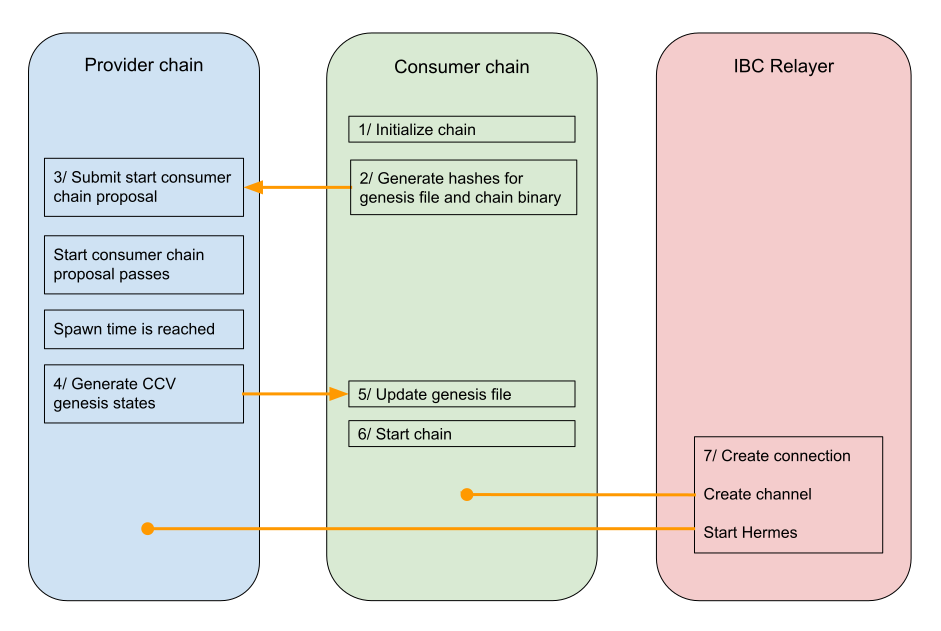

# Overview
:::tip
We advise that you join the [Replicated Security testnet](https://github.com/cosmos/testnets/tree/master/replicated-security) to gain hands-on experience with running consumer chains.
:::

At present, replicated security requires all validators of the provider chain (ie. Cosmos Hub) to run validator nodes for all governance-approved consumer chains.

Once a `ConsumerAdditionProposal` passes, validators need to prepare to run the consumer chain binaries (these will be linked in their proposals) and set up validator nodes on governance-approved consumer chains.

Provider chain and consumer chains represent standalone chains that only share the validator set ie. the same validator operators are tasked with running all chains.

:::info
To validate a consumer chain and be eligible for rewards validators are required to be in the active set of the provider chain (first 180 validators for Cosmos Hub).
:::

## Startup sequence overview
Consumer chains cannot start and be secured by the validator set of the provider unless a `ConsumerAdditionProposal` is passed.
Each proposal contains defines a `spawn_time` - the timestamp when the consumer chain genesis is finalized and the consumer chain clients get initialized on the provider.

:::tip
Validators are required to run consumer chain binaries only after `spawn_time` has passed.
:::

Please note that any additional instructions pertaining to specific consumer chain launches will be available before spawn time. The chain start will be stewarded by the Cosmos Hub team and the teams developing their respective consumer chains.

The image below illustrates the startup sequence


### 1. Consumer Chain init + 2. Genesis generation
Consumer chain team initializes the chain genesis.json and prepares binaries which will be listed in the `ConsumerAdditionProposal`

### 3. Submit Proposal
Consumer chain team (or their advocates) submits a `ConsumerAdditionProposal`.
The most important parameters for validators are:
- `spawn_time` - the time after which the consumer chain must be started
- `genesis_hash` - hash of the pre-ccv genesis.json; the file does not contain any validator info -> the information is available only after the proposal is passed and `spawn_time` is reached
- `binary_hash` - hash of the consumer chain binary used to validate the software builds

### 4. CCV Genesis state generation
After reaching `spawn_time` the provider chain will automatically create the CCV validator states that will be used to populate the corresponding fields in the consumer chain `genesis.json`. The CCV validator set consists of the validator set on the provider at `spawn_time`.

The state can be queried on the provider chain (in this case the Cosmos Hub):
```bash
 gaiad query provider consumer-genesis <consumer chain ID> -o json > ccvconsumer_genesis.json
```

This is used by the launch coordinator to create the final `genesis.json` that will be distributed to validators in step 5.

### 5. Updating the genesis file
Upon reaching the `spawn_time` the initial validator set state will become available on the provider chain. The initial validator set is included in the **final genesis.json** of the consumer chain.

### 6. Chain start
:::info
The consumer chain will start producing blocks as soon as 66.67% of the provider chain's voting power comes online (on the consumer chain). The relayer should be started after block production commences.
:::

The new `genesis.json` containing the initial validator set will be distributed to validators by the consumer chain team (launch coordinator). Each validator should use the provided `genesis.json` to start their consumer chain node.

:::tip
Please pay attention to any onboarding repositories provided by the consumer chain teams.
Recommendations are available in [Consumer Onboarding Checklist](../consumer-development/onboarding.md).
Another comprehensive guide is available in the [Replicated Security testnet repo](https://github.com/cosmos/testnets/blob/master/replicated-security/CONSUMER_LAUNCH_GUIDE.md).
:::

### 7. Creating IBC connections
Finally, to fully establish replicated security an IBC relayer is used to establish connections and create the required channels.

:::warning
The relayer can establish the connection only after the consumer chain starts producing blocks.
:::

```bash
hermes create connection --a-chain <consumer chain ID> --a-client 07-tendermint-0 --b-client <client assigned by provider chain> 
hermes create channel --a-chain <consumer chain ID> --a-port consumer --b-port provider --order ordered --a-connection connection-0 --channel-version 1
hermes start
```

## Downtime Infractions
At present, the consumer chain can report evidence about downtime infractions to the provider chain. The `min_signed_per_window` and `signed_blocks_window` can be different on each consumer chain and are subject to changes via consumer chain governance.

:::info
Causing a downtime infraction on any consumer chain will not incur a slash penalty. Instead, the offending validator will be jailed on the provider chain and consequently on all consumer chains.

To unjail, the validator must wait for the jailing period to elapse on the provider chain and [submit an unjail transaction](https://hub.cosmos.network/main/validators/validator-setup.html#unjail-validator) on the provider chain. After unjailing on the provider, the validator will be unjailed on all consumer chains.

More information is available in [Downtime Slashing documentation](../features/slashing.md#downtime-infractions)
:::

## Double-signing Infractions
To learn more about equivocation handling in replicated security check out the [Slashing](../features/slashing.md) documentation section.

## Key assignment
Validators can use different consensus keys on the provider and each of the consumer chains. The consumer chain consensus key must be registered on the provider before use.

For more information check our the [Key assignment overview and guide](../features/key-assignment.md)

## References:
- [Cosmos Hub Validators FAQ](https://hub.cosmos.network/main/validators/validator-faq.html)
- [Cosmos Hub Running a validator](https://hub.cosmos.network/main/validators/validator-setup.html)
- [Startup Sequence](https://github.com/cosmos/testnets/blob/master/replicated-security/CONSUMER_LAUNCH_GUIDE.md#chain-launch)
- [Submit Unjailing Transaction](https://hub.cosmos.network/main/validators/validator-setup.html#unjail-validator)
