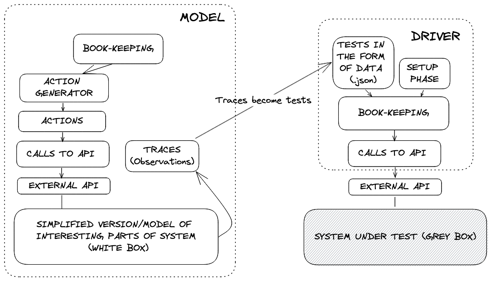

# Method

Contains information about the differential/difference testing method in general and how it impacts the project.

## Motivation

The goal is to find more, deeper, bugs in the long run life of the project in a more cost effective way than can be done by other testing methods (unit, full node, integration, model based testing).

Each of the traditional methods has draw backs

- unit\
Finds shallow bugs.
- full node\
Expensive to setup and run, hard to debug, slow.
- integration\
Limited to isolated parts of system so cannot find logic bugs across systems.
- model based\
Exhaustive model checkers do not scale well to large systems. Esoteric languages hard to onboard and maintain.

Diff testing should be

- Able to find deep bugs (and shallow ones)\
Complicated systems *may* have tricky, deep bugs which are caused by specific interleavings of API calls with specific params. We want a way to try to find these.
- Maintainable\
If the requirements change or a major piece of the system API changes it should be possible to modify existing test code to handle the new system, without having to scrap everything.
- Scalable\
Everything should run in memory, cheaply. It should be possible to use the debugger to step through failed tests.

Diff testing does not

- Try to find every bug\
Diff testing is based on randomness and heuristics and these can only get you so far in finding bugs. More on this in [Limitations](#limitations).

## Concepts

Here we use terminology as it is already used in the project, we do **not** use academic parlance.

We have a system under test (SUT) and we want to test that it satisfies all our design properties (e.g. Validator Set Replication). Diff testing works by making a simplified implementation of the business logic of our system, observing executions of the simplified implementation, and then checking that those observations 'match' what is happening in the real system.



We have three major components, a model and driver, and the SUT. The creation of each part could go something like

1. Figure out what parts of the system state you need to observe to know that your system is working. E.g. token balances, voting powers.
2. Figure out which API calls influence that state.
3. Create the simplest possible implementation of those API calls that results in the correct state. This is the raw model.
4. Randomly make API calls against your model. You might need some heuristics or bespoke logic to make sure these random calls result in good coverage (see [Limitations](#limitations)).
5. Record the random API calls made ('actions') and observations of the state made at regular intervals. Together this data forms a trace. Repeated many times from the zero state you obtain *traces*.
6. Create a 'driver': some code that wraps the API of the SUT and can interpret traces and 'test' those traces against the SUT. For each tested trace, setup the SUT to a suitable zero state, and make each API call as in the trace. For each state observation in the trace, check that the SUT state corresponds.

## Benefits

- You know that the system behavior matches the model behavior.
- The model should be much simpler and easier to check properties for. It will have clear boundaries.
- A well written model can be the specification.
- You can instrument the model with arbitrary code to make sure that your random API calls get good coverage. This can go well beyond statement/branch coverage.
- Based on my anecdotal experience, the ratio of confidence gained per line of code written and maintained can be much much higher for this kind of testing than for unit tests, integration tests, full node tests.
- You can find deep bugs because the random exploration will find many cases that humans won't think of.

## Limitations

- You have to maintain a model and all the surrounding framework.
- If you want to make a major change to your system you will have to change the model and the SUT.\
NOTE: Change the model first, and THEN change the SUT. This is TDD.

and...

The biggest limitation is that random exploration can be severely limited. This warrants more explanation:

### Random exploration

It's easy to find example programs where random exploration will have very poor results. Consider

```go
func foo(x uint64) {
    if x = 123456 {
        // BUG
    } else {
        // NO BUG
    }
}
```

By testing foo with uniformly randomly chosen x's 80 million times per second you will never find the bug. This is a contrived example, but it illustrates the point that you cannot rely on randomness.

## Influences

In creating diff testing I was influenced ideas from Model Based Testing (see [section](#comparison-to-model-based-testing)). Both methods share the notions of model, driver, and trace but the way the model is written and the traces are generated is different.

## Other

### Random exploration good or bad?

While you shouldn't rely on random exploration for good coverage it proves to be practical and useful in many real life systems. You should definitely measure the coverage of your exploration. With measurements, you can freely experiment with adding heuristic rules to restrict the randomness in particular ways. You can also look at qualities of your particular system and try to make combinatorial or probabilistic arguments for coverage.

### Usage of model as the spec

The model could be the spec, if you want it to be. All the dependencies should be abstracted away behind contract satisfying interfaces, and any implementation detail related to performance or environment boilerplate can be omitted.

### Creating many implementations from a single model

The same model can be used to create drivers for, and test, many different implementations of the system in any language, environment etc

## Comparison to Model Based Testing

Informal Systems uses the term model based testing to refer to, essentially diff testing, with two major differences

- The model is written in a formal specification language with semantics and properties that make it amenable to formal verification and automated reasoning techniques.\
Example languages: [TLA+](https://en.wikipedia.org/wiki/TLA%2B), [Quint](https://github.com/informalsystems/quint). Example semantic: [Temporal Logic of Actions](https://en.wikipedia.org/wiki/Temporal_logic_of_actions). Example techniques: [SAT Solving](https://en.wikipedia.org/wiki/SAT_solver), [Symbolic Model Checking](https://blog.acolyer.org/2019/11/29/tla-model-checking-made-symbolic/), [State Enumerating Model Checking](https://en.wikipedia.org/wiki/State_space_enumeration). Example tools: [TLC](https://github.com/tlaplus/tlaplus), [Apalache](https://apalache.informal.systems/).
- The model is explored not by randomness and heuristics but by using a [*model checker*](https://en.wikipedia.org/wiki/Model_checking). Model checkers pull on a massive field of research and they're about applying efficient techniques for exploring program behaviors. While modern model checkers are highly optimized and capable, they are not silver bullets, as they all suffer from the [State Space Explosion Problem](https://en.wikipedia.org/wiki/Combinatorial_explosion). See [this wiki page](https://en.wikipedia.org/wiki/Model_checking#Techniques) for more info.

Why not use model checking? They require expert knowledge which is hard to onboard, the State Space Explosion Problem can be very real in practice, and the tooling e.g TLA+ is generally not industrial strength in terms of maintainability etc.

Note that the Apalache team at Informal is working hard to make MBT a powerful practical tool. They have made leaps and bounds in the last year since diff testing began in April 2022. In particular they have created a new programming language called Quint which should be an industrial strength formal specification language. They have also added powerful exploration capabilities (see [::simulate](https://apalache.informal.systems/docs/apalache/running.html?highlight=simulate#running-the-tool)) which combines random exploration with optimized model checker based exploration.

 I recommend checking out [Apalache](https://github.com/informalsystems/apalache) and [Quint](https://github.com/informalsystems/quint) and consulting with Igor.

## Comparison to Property Based Testing

Property Based Testing is a loose term for testing properties of your system. Generally the idea is to make API calls using random heuristics and known tricks, and check that the result satisfies properties. Please see [this page](https://github.com/cosmos/interchain-security/blob/danwt/pbt-prototype/tests/pbt/tutorial.md) for a full tutorial on using a golang PBT library.

~~Why not use property based testing?~~ I suggest using it. See next section.

## Recommendation going forward

In the long run I suggest scrapping the existing model and trace, and using property based testing instead. The existing driver can easily be adapted to take input from a property based testing library like [golang's Rapid](https://github.com/flyingmutant/rapid). The properties from `properties.ts` can easily be written in go and tested in go. A model will not be needed at all, only the action generation heuristics. I think PBT will be able to achieve the same or better results without having to maintain the model.

In the long run I **also** suggest incorporating Informals tools [Apalache](https://github.com/informalsystems/apalache) and [Quint](https://github.com/informalsystems/quint). Please consult with Igor on this.
